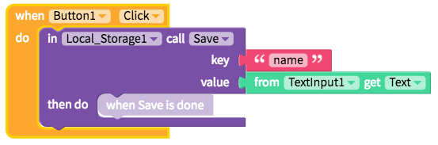
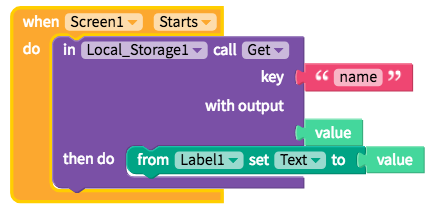

# Local Storage

This storage option is useful for saving simple info on the device, especially helpful for remembering user's setting from a previous session.


You can now use [stored variables](variables.md#app-stored-and-cloud-variables) instead of adding a Local Storage component. This will work the same way in the background but will save you a lot of blocks.


## Save data

To save data locally to your phone, simple name a `key` to store a `value` under. If you have a previous `value` in your `key`, saving it will override that `value`

## Get data

