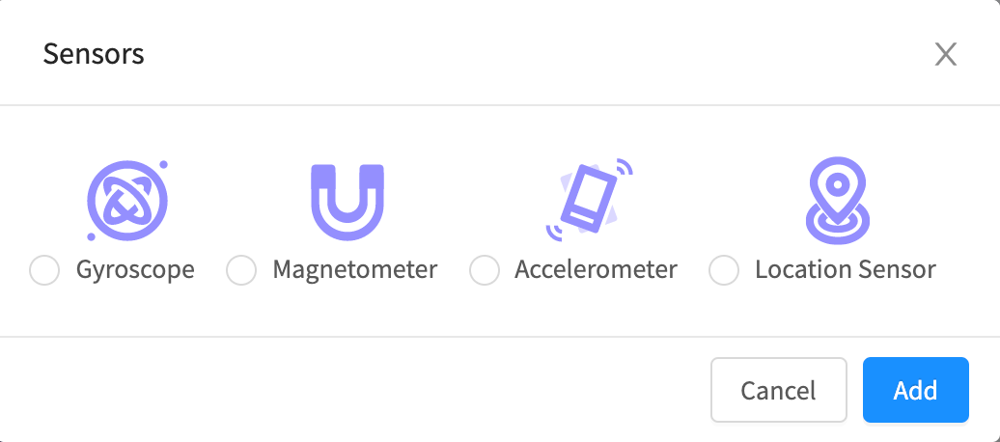

# Location Sensor

## Adding a Location Sensor to your app

To add a Location Sensor to your app:

1. Navigate to the **Blocks** tab of your project.
2. Under the App Features heading, locate **Sensors**.&#x20;
3. Click the ⊕ symbol next to Sensor.
4. Select **Location Sensor** from the provided menu.
5. Click **Add**.

You will see a settings panel where you can set the properties of the Location Sensor before clicking Submit.

## Properties

| Property           | Description                                                                                                      | Data Type  |
| ------------------ | ---------------------------------------------------------------------------------------------------------------- | ---------- |
| EnableHighAccuracy | Enables network provider that uses Google Play services to improve location accuracy and location-based services | True/False |
| Timeout            | How long the Lotion Sensor will look for the user's location before quitting, in milliseconds                    | Number     |
| Maximum Age        | How long a previously fetched location will remain valid, in milliseconds                                        | Number     |

## Blocks

### Functions

#### Get Current Location

#### Properties

| Event / Property     | Description                                                                                                                                                                                                                                                              |
| -------------------- | ------------------------------------------------------------------------------------------------------------------------------------------------------------------------------------------------------------------------------------------------------------------------ |
| Get Current Location | Returns a user's location in  `latitude` and `longitude` degrees; also includes additional information in a location object including i) estimated location `accuracy` in meters,  ii) `altitude` in meters, iii)  `speed` in meters/second and iv) `heading` in degrees |

#### Example

The Location Sensor returns a user's current location in `latitude` and `longitude` as well as a `location` object which includes additional properties like `accuracy`, `altitude`, `speed` and `heading` (or direction) which you have to retrieve with the object blocks above

### Properties

#### Enable High Accuracy&#x20;

#### Maximum Age&#x20;

.png>)

