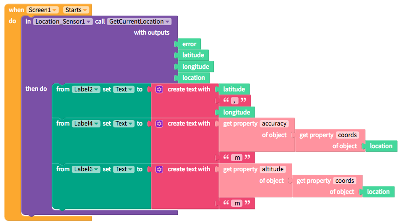

# Location Sensor

* [Get user's current location](location-sensor.md#get-users-current-location-and-other-related-information)

## Get User's Current Location

The Location Sensor returns a user's current location in `latitude` and `longitude` as well as a `location` object which includes additional properties like `accuracy`, `altitude`, `speed` and `heading` \(or direction\) which you have to retrieve with the object blocks above

| Event / Property | Description |
| :--- | :--- |
| Get Current Location | Returns a user's location in  `latitude` and `longitude` degrees; also includes additional information in a location object including i\) estimated location `accuracy` in meters,  ii\) `altitude` in meters, iii\)  `speed` in meters/second and iv\) `heading` in degrees |

