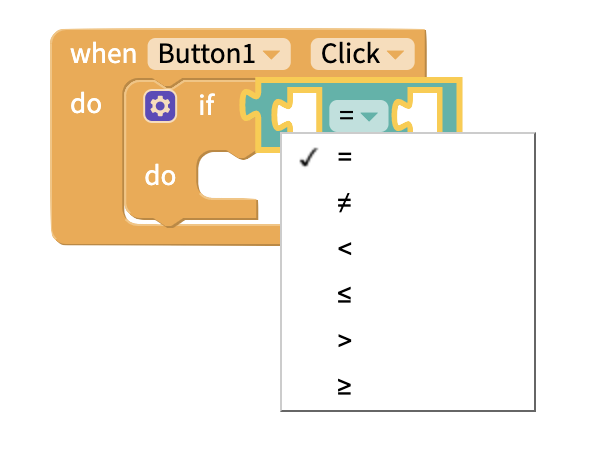

# Logic

## Video Tutorial

You can find a video that explains all of the Logic blocks below:



## Comparison Blocks

[If `then`, do `that`](control.md#if-this-do-that) blocks are often paired with statement blocks that test whether a condition is met

The comparison blocks will compare two values and return **true** or **false** based on whether the condition is met.

## And/Or blocks

You can compare multiple conditions at once.

The **and** block will return **true** if both statements are true, **false** otherwise.

The **or** block will return **true** if either statement is true, and **false** if neither statement is true.

## Not

Inverts the value of a true/false statement.

Can also be used to check if a value is not `null`.

## True/False/Null

Value blocks can be used to set the value of a variable. They can be used in conjunction with any of the above blocks.

