# Looks

## Sprite Visibility 

### Set Visibility

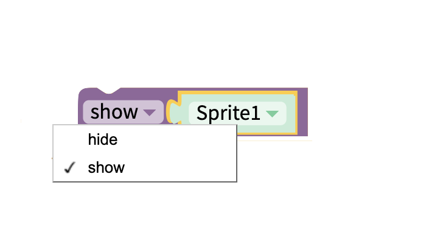

Show the selected sprite or hide the selected sprite on the canvas.

### Get Visibility

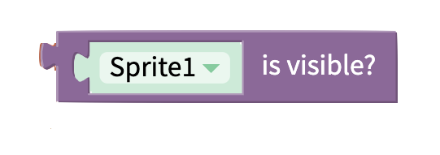

Returns true if the sprite is visible, and false if it is hidden

## Sprite Image

### Next or Previous Image

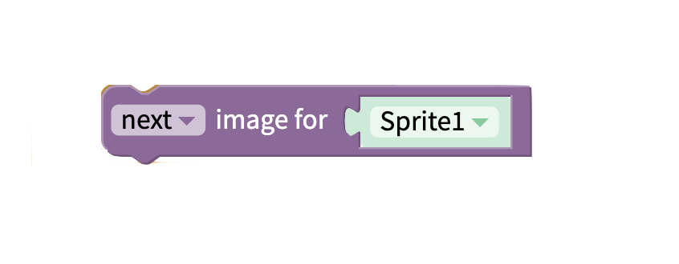

Set the sprite's image to the next or previous image in the sprite type's [picture list](sprites.md#sprite-type-properties).

### Set Image Number

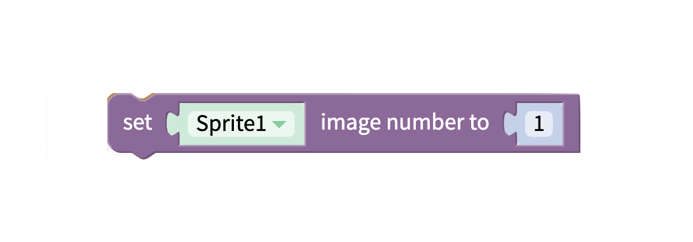

Set the sprite's image to an image in the sprite type's [picture list](sprites.md#sprite-type-properties).

## Sprite Dimensions 

### Set Height or Width to

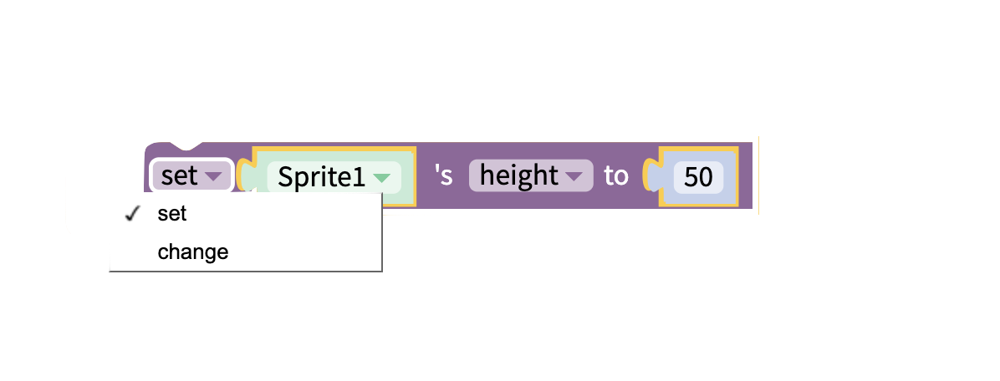

Set the Sprite's height or width.

### Change Height or Width by

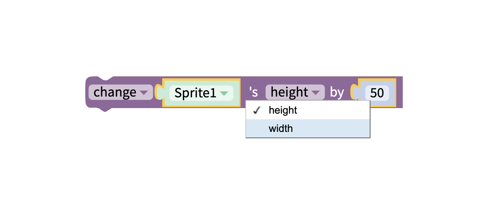

Change the sprite's height or width.

### Get Height or Width

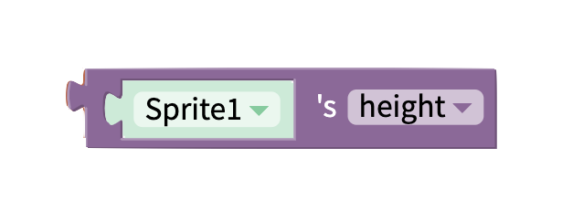

Get the sprite's height or width.

## Flip Sprite

Flip Sprite along a specified axis.

## Freeze Frame 

### Stamp

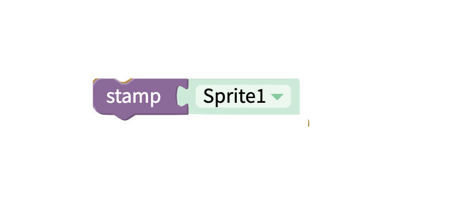

Add freeze frame of sprite in current position.

## Drawing 

### Draw Line

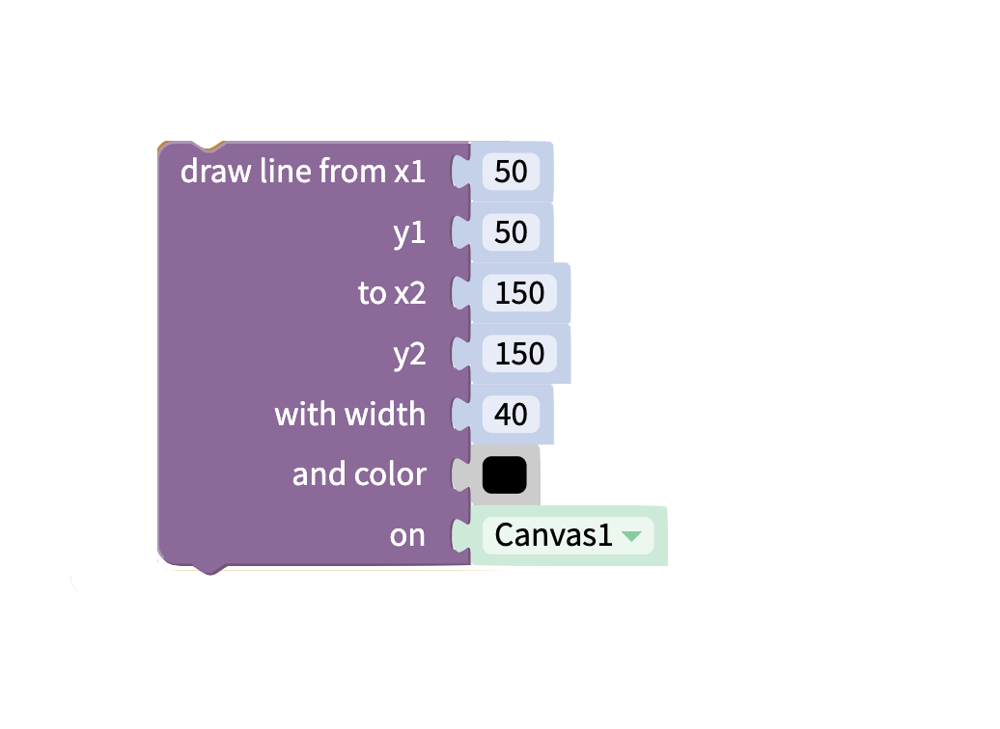

Draw line between two points with specified width and color.

### Draw Circle

Draw circle outline at specified point with a given radius.

### Draw Filled Circle

Draw filled circle at specified point with a given radius.

### Draw Polygon

Draw a polygon outline at a specified point. The number of sides, length of sides, and angle of rotation \(measured in degrees\) can be specified.

### Draw Filled Polygon

Draw a filled polygon at a specified point. The number of sides, length of sides, and angle of rotation \(measured in degrees\) can be specified.

### Clear Drawings

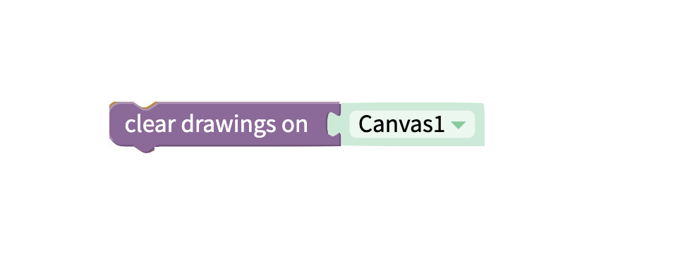

Clear all the drawings on the specified canvas.

## Make Image

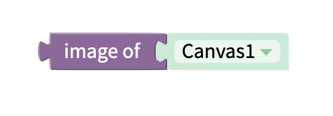

Get an image of the specified canvas. Returns a base 64 encoded image. 

