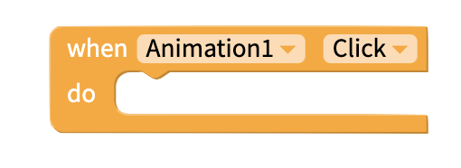

# Animation by Lottie

## Animation Overview

The Animation component powered by [Lottie ](https://airbnb.design/lottie/)makes adding animations as easy as adding images. For designers, animations can be created in [Adobe After Effects](https://www.adobe.com/products/aftereffects.html) or [Haiku](https://www.haiku.ai/) and imported as a `.json` file.

For the rest of us, there is a large and growing community of designers who have [created free and editable animations](https://www.lottiefiles.com/community) that you can easily add to your app.

## Getting Started

| Property | Description |
| :--- | :--- |
| Animation | Please upload and reference your After Effects `.json` animations to your app project.  You can create your own or find a library of open sourced ones from [sites like this](https://www.lottiefiles.com/community) |
| Loop | If `true`, animation will run as a loop |

## Edit size and position

You can drag and drop your component into position, and set its size.   
You can set exact values for the component's Height and Width, and X and Y coordinates, in its properties.

**Height:** Height of Button in pixels  
**Width:** Width of Button in pixels

**X:** position of top left corner of Button on X-axis  
**Y:** position of top right corner of component on Y-axis

## Events

You can trigger some action to happen when the animation is clicked using the 'when Animation Click' event.

