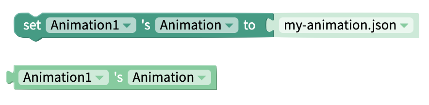

# Animation by Lottie

## Animation Overview

The Animation component powered by [Lottie ](https://airbnb.design/lottie/)makes adding animations as easy as adding images. For designers, animations can be created in [Adobe After Effects](https://www.adobe.com/products/aftereffects.html) or [Haiku](https://www.haiku.ai/) and imported as a `.json` file.

For the rest of us, there is a large and growing community of designers who have [created free and editable animations](https://www.lottiefiles.com/community) that you can easily add to your app.

## Video Tutorial

See a video tutorial for using Animations in your Thunkable project here:



## Properties

### Animation

| Property  | Description                                      | Data Type  |
| --------- | ------------------------------------------------ | ---------- |
| Animation | The name of a JSON animation you wish to display | Text       |
| Loop      | Toggle whether Animation loops or not            | True/False |

### Layout

| Property    | Description                                                                         | Data Type                                    |
| ----------- | ----------------------------------------------------------------------------------- | -------------------------------------------- |
| X           | Location of top left corner of Animation on X-axis, where the left hand side is X=0 | Number                                       |
| Y           | Location of top left corner of Animation on Y-axis, where the top side is Y=0       | Number                                       |
| Height      | Height of Animation in pixels                                                       | Number                                       |
| Width       | Width of Animation in pixels                                                        | Number                                       |
| Resize Mode | Define dimensions of the animation component/container                              | Select from list `[Stretch, Float in Place]` |

## Blocks

### Events

You can trigger some action to happen when the animation is clicked using the 'when Animation Click' event.

### Properties

Change the [properties](lottie.md#properties) of your Animation component

#### Animation

#### Loop

#### Computed Height

Returns the height of the Animation on the device screen in pixels.

#### Computed Width

#### Visible

