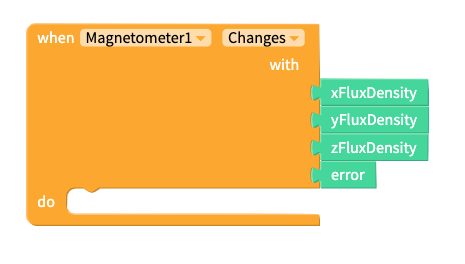
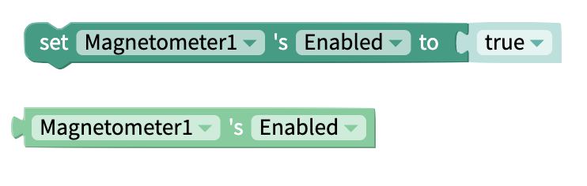

# Magnetometer

## Description

The magnetometer is used to measure magnetic flux density. This is the total magnetic field passing through a given area, per metre squared, $$\frac{T \cdot m^2}{m^2}$$ . The sensor will returns values with units of microtesla $$\mu T$$ for each of the three coordinate axes; x, y and, z. The magnetic flux density is quite similar to magnetic field strength.

## 

## Adding a Magnetometer to your app

To add a Magnetometer to your app:

1. Go to the Blocks tab of your project
2. Find the Sensors drawer of blocks and click on the ⊕ symbol to add a Sensor to your app
3. Select Magnetometer from the menu that pops up

You will see a settings panel where you can set:

* The **Name** of the Magnetometer
* Whether the Magnetometer is **Enabled**

You can either confirm your choices and create the Magnetometer, or delete the Magnetometer.

##  Change Settings of Magnetometer 

‌You will see the sensors you have added to your app underneath the Sensors section of your blocks.

  
If you click on the ⚙ icon next to your Magnetometer, you will be able to edit its settings as seen in the panels above. You can click on your Magnetometer's name to access its drawer of blocks.‌

## Events

#### When Magnetometer Changes

When the magnetometer detects a change in the ambient magnetic field the `Changes` event will fire. The event returns 4 parameters that we can work with. 

| Parameter | Type | Returns |
| :--- | :--- | :--- |
| `xFluxDensity` | Number | Flux density, in the x direction, expressed in $$\mu T$$  |
| `yFluxDensity` | Number | Flux density, in the y direction, expressed in $$\mu T$$  |
| `zFluxDensity` | Number | Flux density, in the z direction, expressed in $$\mu T$$  |
| `error` | String | Error message from the Sensor |

## Functions

### Call X

Returns flux density, in the x direction, expressed in $$\mu T$$

### Call Y

Returns flux density, in the y  direction, expressed in $$\mu T$$

### Call Z

Returns flux density, in the x direction, expressed in $$\mu T$$

### Call Heading

Returns a value between 0 and 360 which denotes the user's direction relative to the Earth's geographic North Pole

## Properties

### Enabled

The magnetometer is, by default, turned on, but the `enabled` property can be used to turn in on and off by setting it to `true` or `false` respectively.

| Property | Type | Default |
| :--- | :--- | :--- |
| `set Enabled` | Bool | true |
| `get Enabled` | Bool | true |

