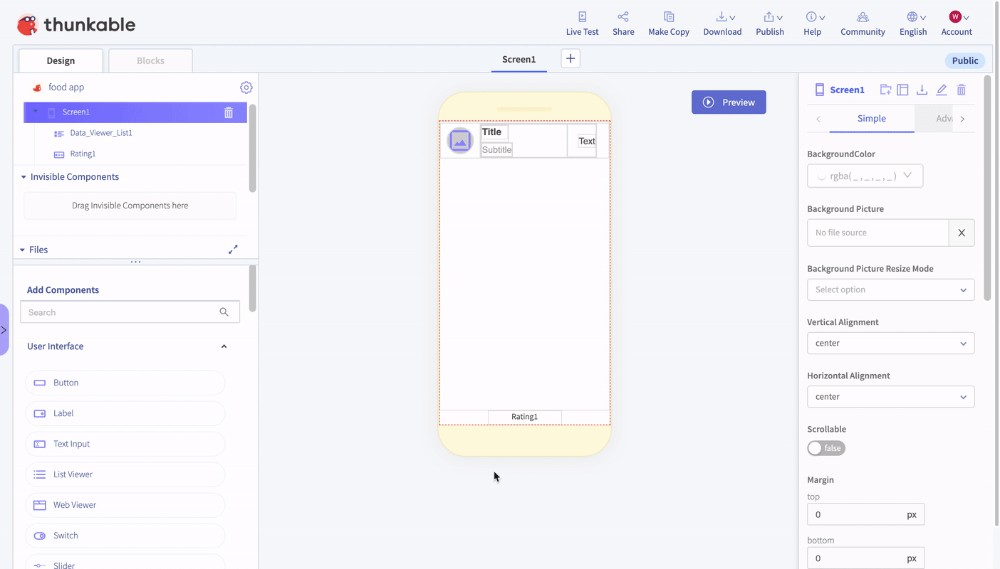

# ➕ Make Copy

## 

When you have invested time building your app, you may want to make a copy of your app project. To do so, just select 'Make Copy.' A copy will automatically be generated and appear in your project page.

## In App Copy

You can make a copy of your project while your working on it by clicking on the "Copy" button in the top menu.

## Duplicating Your Project

You can also make a copy of your project from your projects page. Click on the menu and choose "Duplicate" to create a copy.

