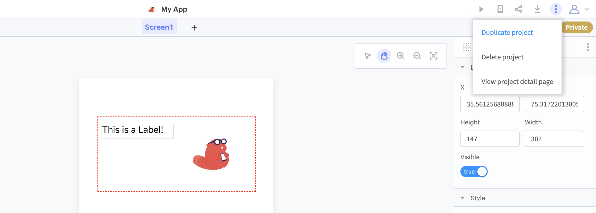
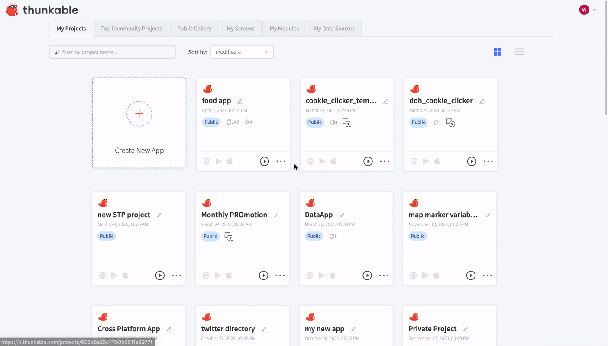

# ➕ Duplicate your Project

## 

When you have invested time building your app, you may want to make a copy of your app project. To do so, just select 'Make Copy.' A copy will automatically be generated and appear in your project page.

## In-App Copy

You can make a copy of your project while you're working on it by clicking the project actions menu in the top right hand corner and selecting `Duplicate Project`.

## Copy from your Projects Page

You can also make a copy of your project from your projects page. Click on the menu and choose "Duplicate" to create a copy.

