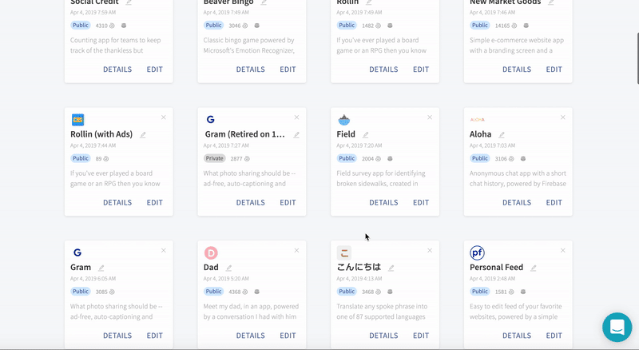

# Managing Storage

To make it easier on your app users, it's always good to keep your app sizes as small as possible. As a result, we have limited all app projects to a max of 50MB per app and a total of 200MB per account \(See [App Limits](app-limits.md)\).

To help you manage within these limits, we have some recommendations 

## App size limits \(50MB per app\)

You can view a project's app size on the project's details page. 

The main contributor to an app's size are files \(also known as assets\). It's possible that simply removing unneeded files will get you under the limit or in some cases, optimizing large asset files like videos either by shrinking the file sizes or storing them in the cloud and not locally in the app.

## Account storage limits \(200MB per account\)

You can view your total account storage size in your account settings.

If you are near the limit, you may be able to create additional storage by removing projects that you no longer need like an old version or copy of a project. For our power Thunkers, we may add the option for you to purchase additional storage in the future.

 

