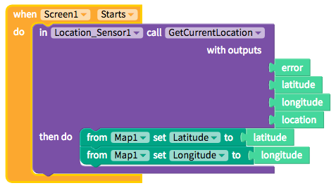
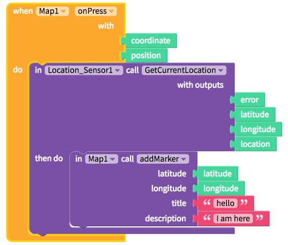
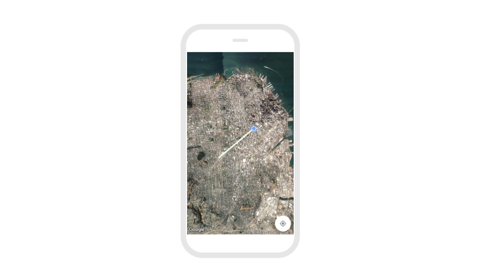
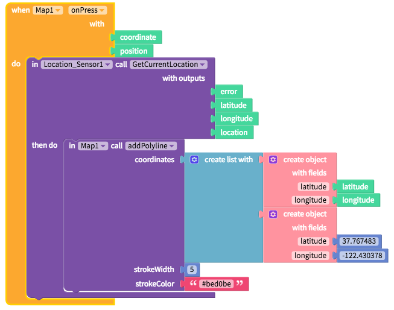
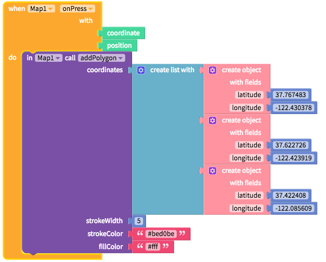

# Map by Google and Apple

* [Choose your provider](map.md#choose-your-provider)
* [Zoom and center the Map](map.md#zoom-and-center-the-map)
* [Style the Map](map.md#style-the-map) 
* [Edit Map size](map.md#edit-map-size)
* [Add spacing](map.md#add-spacing)
* [Add marker](map.md#add-marker)
* [Add polyline](map.md#add-polyline)
* [Add polygon](map.md#add-polygon)


## Choose your provider

For iOS, you have the option to choose between Apple Maps or Google Maps. On Android, only Google Maps is available. Google Maps provides more custom style options from different map types to coloring and exposing or hiding map features.

| Property | Description |
| :--- | :--- |
| Provider `Advanced` | Default \(`google`\); To select Apple Maps for iOS, leave the property `blank` |

## Zoom and center the Map

To auto-center your map, you can pair the Map component with a Location Sensor



| Property | Description |
| :--- | :--- |
| Latitude | Default \(`37.78`\); In degrees above the equator from `-90` to `90` where locations north of the equator are positive and those south are negative |
| Longitude | Default \(`-122.4`\); In degrees east or west from the equator from `-90` to `90` where locations west of the equator are negative and those east are positive |
| Zoom | Default \(`0`\); Range is -15 to 10 where -15 is most zoomed out |
| Shows User Location | Default \(`true`\); If `true`, shows user location as a blinking blue dot |
| Shows My Location Button \(Google Maps only\) | Default \(`true`\); In `true`, shows my location button that auto-centers map on user's location |

## Style the Map


To style the Map like the picture above, set Prover to `google`, Shows Traffic to `true`, Map Type to `standard` and Custom Map Style String to:

```javascript
[ { "elementType": "geometry", "stylers": [ { "color": "#f5f5f5" } ] }, { "elementType": "geometry.fill", "stylers": [ { "color": "#ffffff" } ] }, { "elementType": "labels.icon", "stylers": [ { "visibility": "off" } ] }, { "elementType": "labels.text.fill", "stylers": [ { "color": "#000000" } ] }, { "featureType": "administrative.land_parcel", "elementType": "labels.text.fill", "stylers": [ { "color": "#bdbdbd" } ] }, { "featureType": "poi", "elementType": "geometry", "stylers": [ { "color": "#eeeeee" } ] }, { "featureType": "poi", "elementType": "labels.text.fill", "stylers": [ { "color": "#757575" } ] }, { "featureType": "poi.park", "elementType": "geometry", "stylers": [ { "color": "#e5e5e5" } ] }, { "featureType": "poi.park", "elementType": "labels.text.fill", "stylers": [ { "color": "#9e9e9e" } ] }, { "featureType": "road", "elementType": "geometry", "stylers": [ { "color": "#ffffff" } ] }, { "featureType": "road", "elementType": "geometry.fill", "stylers": [ { "color": "#d8d8d8" } ] }, { "featureType": "road.arterial", "elementType": "labels.text.fill", "stylers": [ { "color": "#757575" } ] }, { "featureType": "road.highway", "elementType": "geometry", "stylers": [ { "color": "#dadada" } ] }, { "featureType": "road.highway", "elementType": "labels.text.fill", "stylers": [ { "color": "#616161" } ] }, { "featureType": "road.local", "elementType": "labels.text.fill", "stylers": [ { "color": "#9e9e9e" } ] }, { "featureType": "transit.line", "elementType": "geometry", "stylers": [ { "color": "#e5e5e5" } ] }, { "featureType": "transit.station", "elementType": "geometry", "stylers": [ { "color": "#eeeeee" } ] }, { "featureType": "water", "elementType": "geometry", "stylers": [ { "color": "#e4e4e4" } ] }, { "featureType": "water", "elementType": "geometry.fill", "stylers": [ { "color": "#f3f3f3" } ] }, { "featureType": "water", "elementType": "labels.text.fill", "stylers": [ { "color": "#9e9e9e" } ] } ]
```

There are a number of `Advanced` properties available to help you add custom styling to your map. Below are the most popular.

| Property | Description |
| :--- | :--- |
| Map Type `Advanced` | Default \(`standard`\); `standard` is the classic map style; `satellite` displays only satellite imagery; `hybrid` shows roads and features layered over satellite imagery; `terrain` shows physical terrain overlay on top of a classic map \(Google Maps only\) |
| Custom Map Style String \(Google Maps Only\) `Advanced` | Accepts a JSON string imported from the [Google Maps API styling wizard](https://mapstyle.withgoogle.com/). Map Type must be set to `standard` and provider must be set to `google`. |
| Shows Traffic `Advanced` | Default \(`false`\); if `true`, shows real-time traffic overlay on the map |

## Edit Map size

For more information on sizing in your app, please see our [introduction here​](https://docs.thunkable.com/~/edit/primary/thunkable-cross-platform/2-create/intro-to-sizing)

| Property | Description |
| :--- | :--- |
| Height | Default \(`Fill container`\); Four options: 1\) `Fit contents` which auto-sizes to the content size or 2\) `Fill container` which auto-sizes to the container 3\) `Relative size` in percent of Screen, 4\) `Absolute size` in pixels |
| Width | Default \(`Fit container`\); Four options: 1\) `Fit contents` which auto-sizes to the content size or 2\) `Fill container` which auto-sizes to the container 3\) `Relative size` in percent of Screen, 4\) `Absolute size` in pixels |

## Add spacing

For more information on adding spacing in your app, please see our [introduction here](intro-to-spacing.md)

To find the spacing properties, you'll have to select the `Advanced` tab

| Property | Description |
| :--- | :--- |
| Margin `Advanced` | Default \(`none`\); Margin is the space outside of the border of a component; You can set space on the `top`, `bottom`, `right` or `left` of the component in both pixels or percent of Screen |
| Padding `Advanced` | Default \(`none`\); Padding is the space between the contents and the border of a component; You can set space on the `top`, `bottom`, `right` or `left` of the component in both pixels or percent of Screen |

## Add marker


There are limited styling options for markers at the moment. We are working to add the ability to change colors as well as add custom icons



You can add a standard default marker to your map with the blocks below. The Map component does not yet supply its own latitude and longitude so we currently recommend using the Location Sensor component



## Add polyline



To add a polyline, you can use the blocks below where `coordinates` need to be in a list of latitude and longitude objects, `stroke Width` is an integer and `stroke Color` is in hex format



## Add polygon


To add a polygon, you can use the blocks below where `coordinates` need to be in a list of latitude and longitude objects, `stroke Width` is an integer, `stroke Color` is in hex format, and `fill Color` is in hex format



