# Map

## Overview

The Map component lets you show an area of a Google map to the user. You can add [markers](map.md#add-marker), [polylines](map.md#add-polyline), and [polygons](map.md#add-polygon) to this map.

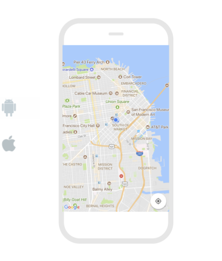

## Properties

### Add Google Maps API Key

You can add your own Google Maps API Key to your Thunkable project. This is not necessary to show a map in your app.

Simply click on your project name to open the [Project Settings](project-settings.md) menu, and scroll down to the **Google Map Settings **section. You will see the option to enter a Google Maps API Key for Android and iOS.

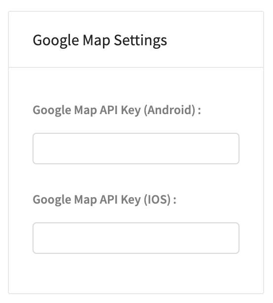

You can get your own Google Maps API Key [here](https://developers.google.com/maps/documentation/javascript/get-api-key).

### Map

| Property  | Description                                                      | Data Type |
| --------- | ---------------------------------------------------------------- | --------- |
| Latitude  | Co-ordinate of the map's center on the north-south axis          | Number    |
| Longitude | Co-ordinate of the map's center on the east-west axis            | Number    |
| Zoom      | Zoom level between -15 (most zoomed out) and 15 (most zoomed in) | Number    |

### Layout

| Property | Description                                                                   | Data Type  |
| -------- | ----------------------------------------------------------------------------- | ---------- |
| X        | Location of top left corner of Map on X-axis, where the left hand side is X=0 | Number     |
| Y        | Location of top left corner of Map on Y-axis, where the top side is Y=0       | Number     |
| Height   | Height of Map in pixels                                                       | Number     |
| Width    | Width of Map in pixels                                                        | Number     |
| Visible  | Set whether the Map is visible                                                | True/False |

### **Style**

| **Property**  | Description                                                                             | Data Type        |
| ------------- | --------------------------------------------------------------------------------------- | ---------------- |
| Border Width  | Width of border around Map in pixels                                                    | Number           |
| Border Radius | Radius of corners of border on Mapr in degrees                                          | Number           |
| Border Color  | Color of border (only visible if border width > 0)                                      | Color            |
| Border Style  | Set whether border style is solid, dotted or dashed  (only visible if border width > 0) | Select from menu |

## Blocks

### Events

The map has several events. You can trigger actions to happen when these events occur.

#### On Map Ready

This event happens when the Map has loaded in your app.&#x20;

This is a good time to add any markers, polylines or polygons to your app that you want the user to see as soon as your app opens.

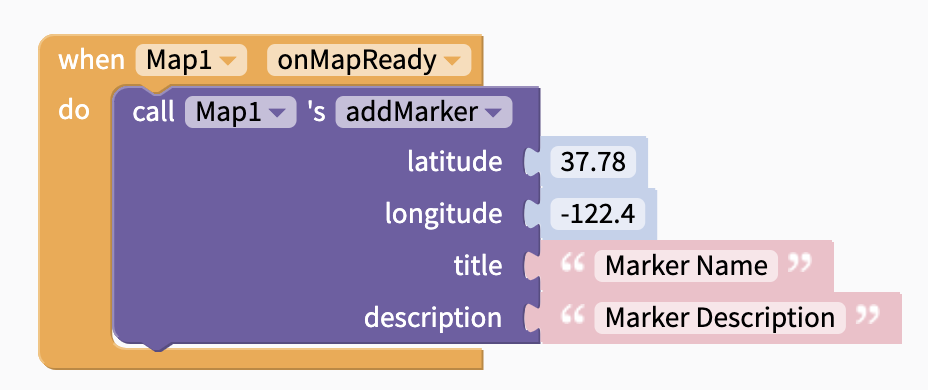

#### On User Location Change

This event happens when the location of the user changes. It returns the **coordinate **object.\
You can use [object blocks](objects.md) to get the properties of the coordinate object.

The **coordinate** object has the following properties:

**{**\
**    target: **Numeric ID for your app\
&#x20;   **coordinate:{**\
**          latitude: **latitude of point selected\
&#x20;         **longitude: **longitude of point selected \
**    }**\
**    position:{**\
**          x: **x-position of selected point on the Map component\
**          y: **x-position of selected point on the Map component\
**    }**\
**}**

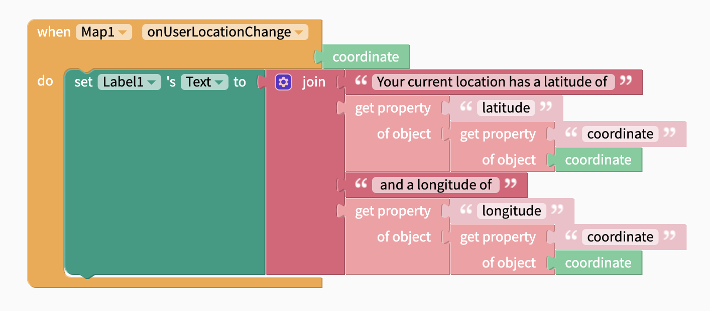

#### On Press

This event happens when the user taps on the Map.

.png>)

| Output name | Output value                                        | Data Type |
| ----------- | --------------------------------------------------- | --------- |
| Latitude    | Latitude of selected position                       | Number    |
| Longitude   | Longitude of selected position                      | Number    |
| position X  | X Co-ordinate of selected position on map component | Number    |
| position Y  | Y Co-ordinate of selected position on map component | Number    |

#### On Long Press

This event happens when the user presses on the map for a longer period of time.

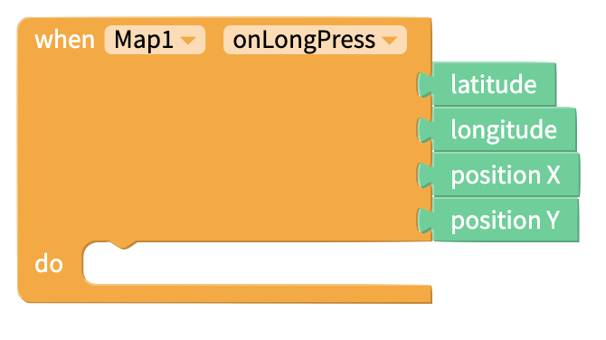

| Output name | Output value                                        | Data Type |
| ----------- | --------------------------------------------------- | --------- |
| Latitude    | Latitude of selected position                       | Number    |
| Longitude   | Longitude of selected position                      | Number    |
| position X  | X Co-ordinate of selected position on map component | Number    |
| position Y  | Y Co-ordinate of selected position on map component | Number    |

#### On Marker Press

This event happens when the user clicks on a Marker that is on the Map.

The **On Marker Press **block returns an **event **object. This is an object which can be used with [object blocks.](objects.md)&#x20;

The **event **object has the following properties:

{\
**    latitude: **latitude of the selected Marker\
&#x20;   **longitude**: longitude of the selected Marker\
}

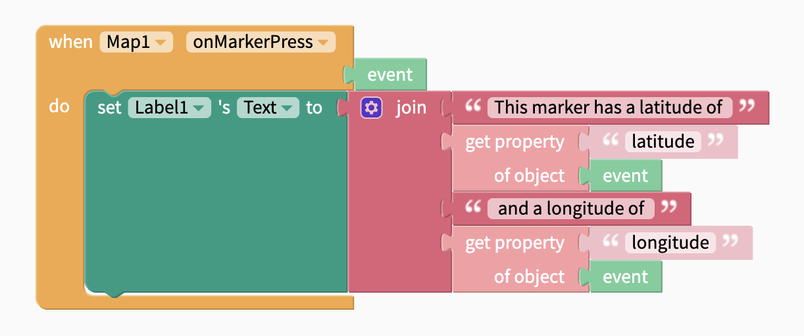

### Functions

#### Add Marker

Add a marker to your map at the specified latitude/longitude.

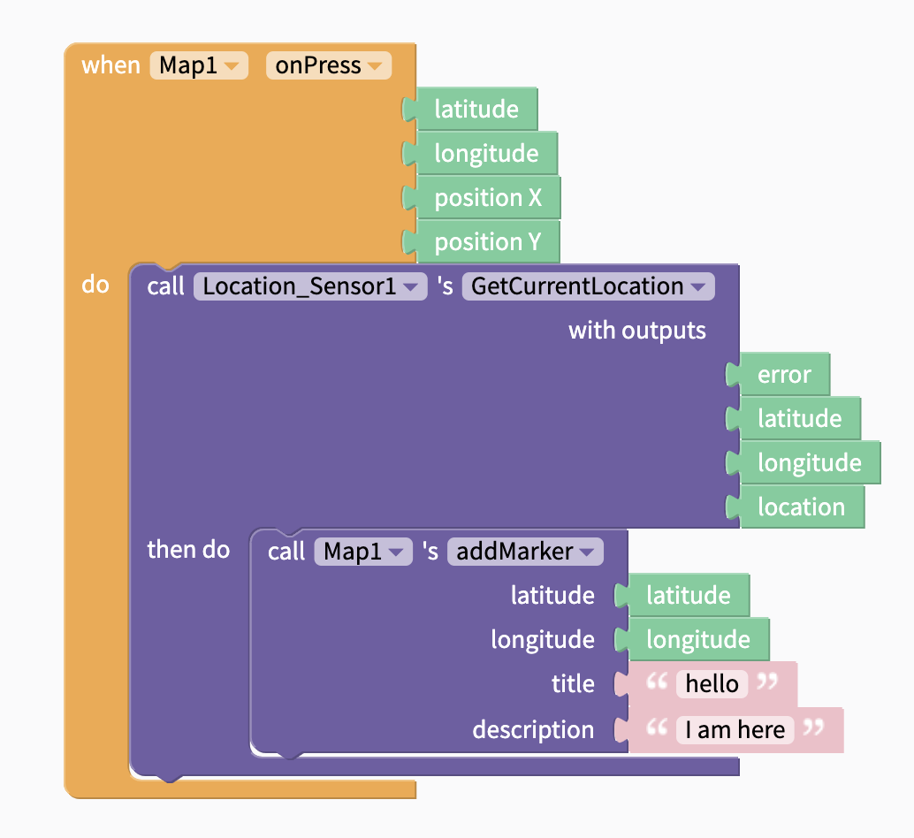

#### Add Polyline

Add a polyline to your map. This is an outline that connects several points on your map.

This block takes the following inputs:

| Input        | Description                                                    | Data Type                                                                                                                                          |
| ------------ | -------------------------------------------------------------- | -------------------------------------------------------------------------------------------------------------------------------------------------- |
| Coordinate   | List of points to draw a line between. List can be any length. | List of [objects](objects.md). Each object must have the properties `latitude` and `longitude.` Latitude and Longitude must be [numbers](math.md). |
| Stroke Width | Width of polyline                                              | Number                                                                                                                                             |
| Stroke Color | Color of polyline                                              | Color                                                                                                                                              |

&#x20;These blocks:

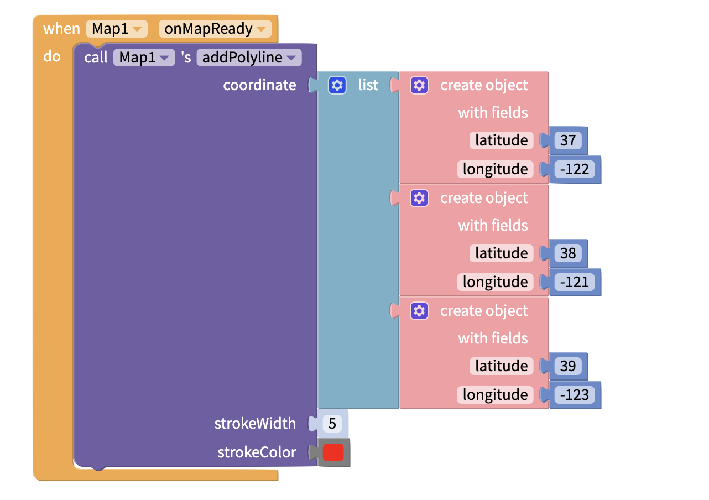

Will produce this polyline:

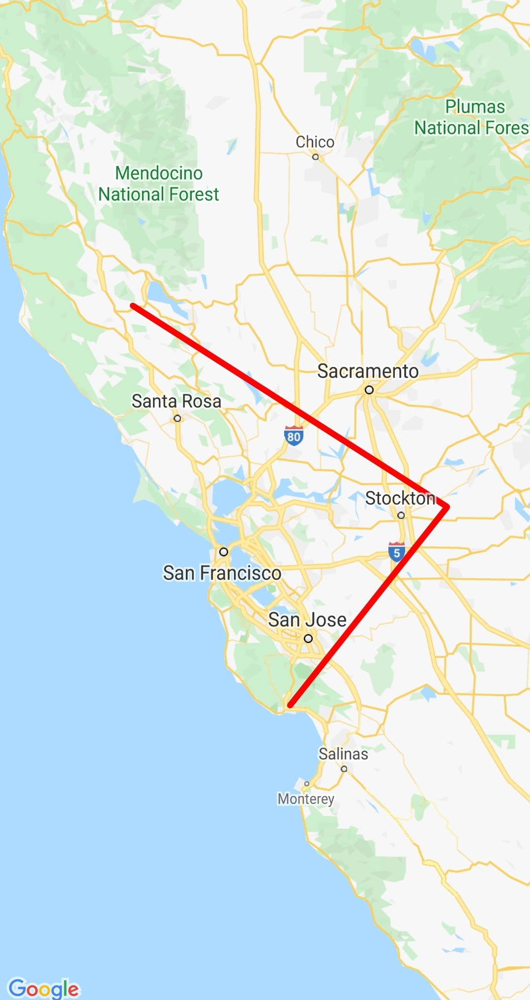

Note that polylines won't automatically create a closed shape. You would need to add a forth object with the properties `latitude: 37` and `longitude: -122` to the `coordinate` input of the `addPolyline` block above to close this triangular polyline.

#### Add Polygon

Add a polygon to your map. This is a solid shape that connects several points on your map.

This block takes the following inputs:

| Input        | Description                                                    | Data Type                                                                                                                                          |
| ------------ | -------------------------------------------------------------- | -------------------------------------------------------------------------------------------------------------------------------------------------- |
| Coordinate   | List of points to draw a line between. List can be any length. | List of [objects](objects.md). Each object must have the properties `latitude` and `longitude.` Latitude and Longitude must be [numbers](math.md). |
| Stroke Width | Width of outline                                               | Number                                                                                                                                             |
| Stroke Color | Color of outline (Only visible if Stroke Width > 0)            | Color                                                                                                                                              |
| Fill Color   | Color of polygon shape                                         | Color                                                                                                                                              |

These blocks:

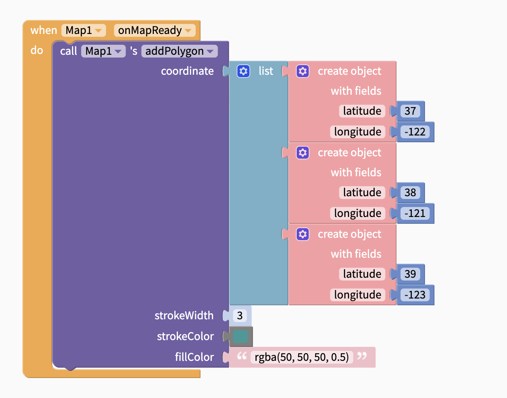

Will produce this polygon:

.jpeg>)

Note that the polygon outline will automatically connect the first and last points in the list of coordinates.

#### Delete Markers, Polylines and Polygons

You can use the **deleteAllMarkers** block to delete all [markers](map.md#add-marker) from your app.

You can use the **deleteAllPolylines** block to delete all [polylines](map.md#add-polyline) from your app.

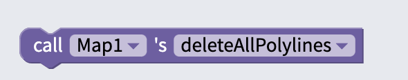

You can use the **deleteAllPolygons** block to delete all [polygons](map.md#add-polygon) from your app.

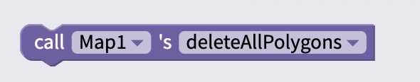

### Properties

Set and get [properties](map.md#properties) of the Map component.

#### Latitude

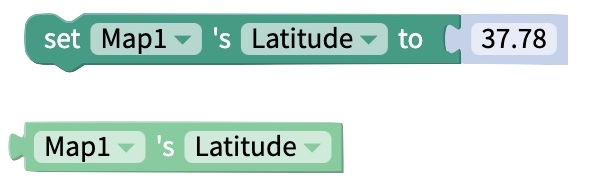

#### Longitude

#### Zoom

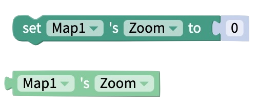

#### Computed Height

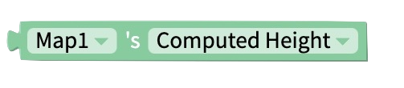

Returns the height of the Map on the device screen in pixels.

#### Computed Width

Returns the width of the Map on the device screen in pixels.

#### Visible

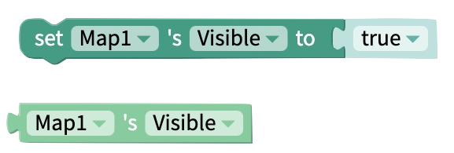

## See Also

You can pair the Map component with a [Location Sensor](location-sensor.md). This helps you show content relevant to the user's location.

These blocks will set the map's latitude and longitude to show the user's location once the map is ready:

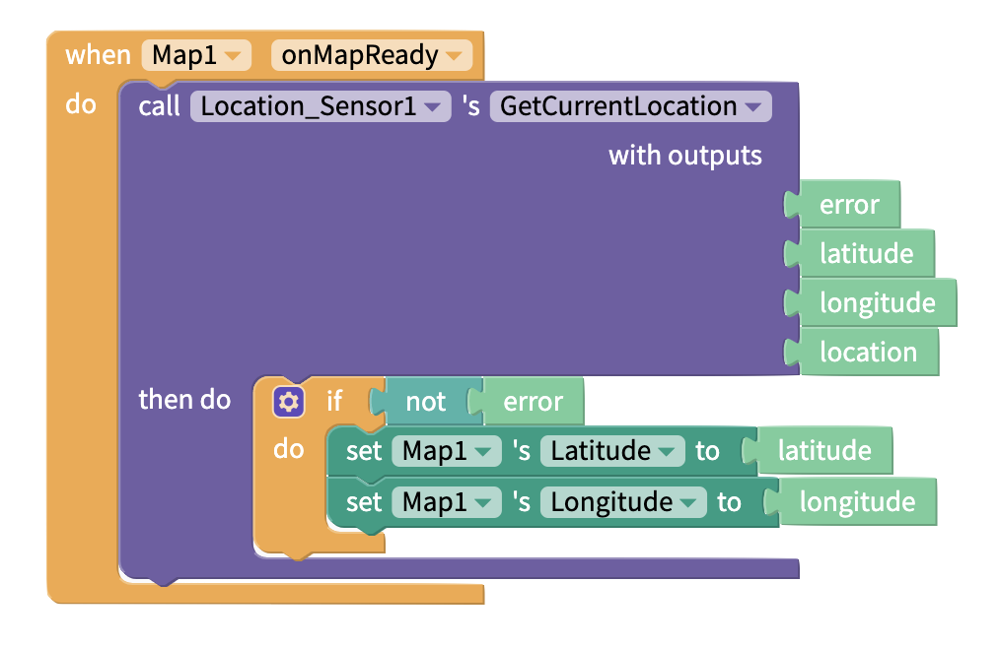
