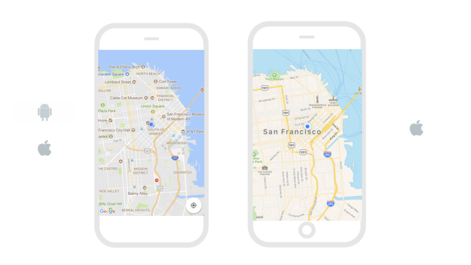
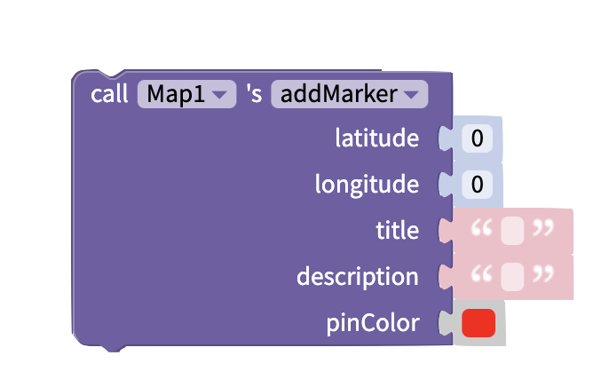

# Maps by Google and Apple

## Choose Your Provider

For iOS, you have the option to choose between Apple Maps or Google Maps. On Android, only Google Maps is available. Google Maps provides more custom style options from different map types to coloring and exposing or hiding map features.

## Properties

### Add Google Maps API Key

You can add your own Google Maps API Key to your Thunkable project. This is not necessary to show a map in your app.

Simply click on your project name to open the [Project Settings](projects/settings.md) menu, and scroll down to the **Google Map Settings** section. You will see the option to enter a Google Maps API Key for Android and iOS.

You can get your own Google Maps API Key [here](https://developers.google.com/maps/documentation/javascript/get-api-key).

### Map

| Property  | Description                                                      | Data Type |
| --------- | ---------------------------------------------------------------- | --------- |
| Latitude  | Co-ordinate of the map's center on the north-south axis          | Number    |
| Longitude | Co-ordinate of the map's center on the east-west axis            | Number    |
| Zoom      | Zoom level between -15 (most zoomed out) and 15 (most zoomed in) | Number    |

### Layout

| Property | Description                    | Data Type  |
| -------- | ------------------------------ | ---------- |
| Height   | Height of Map in pixels        | Number     |
| Width    | Width of Map in pixels         | Number     |
| Visible  | Set whether the Map is visible | True/False |

### **Style**

| **Property**  | Description                                                                             | Data Type        |
| ------------- | --------------------------------------------------------------------------------------- | ---------------- |
| Border Width  | Width of border around Map in pixels                                                    | Number           |
| Border Radius | Radius of corners of border on Mapr in degrees                                          | Number           |
| Border Color  | Color of border (only visible if border width > 0)                                      | Color            |
| Border Style  | Set whether border style is solid, dotted or dashed  (only visible if border width > 0) | Select from menu |

There are a number of `Advanced` properties available to help you add custom styling to your map. Below are the most popular.

| Property                                              | Description                                                                                                                                                                                                                                                   |
| ----------------------------------------------------- | ------------------------------------------------------------------------------------------------------------------------------------------------------------------------------------------------------------------------------------------------------------- |
| Map Type `Advanced`                                   | Default (`standard`); `standard` is the classic map style; `satellite` displays only satellite imagery; `hybrid` shows roads and features layered over satellite imagery; `terrain` shows physical terrain overlay on top of a classic map (Google Maps only) |
| Custom Map Style String (Google Maps Only) `Advanced` | Accepts a JSON string imported from the [Google Maps API styling wizard](https://mapstyle.withgoogle.com/). Map Type must be set to `standard` and provider must be set to `google`.                                                                          |
| Shows Traffic `Advanced`                              | Default (`false`); if `true`, shows real-time traffic overlay on the map                                                                                                                                                                                      |

### Edit Map size

For more information on sizing in your app, please see our [introduction here​](https://docs.thunkable.com/\~/edit/primary/thunkable-cross-platform/2-create/intro-to-sizing)

| Property | Description                                                                                                                                                                                                                     |
| -------- | ------------------------------------------------------------------------------------------------------------------------------------------------------------------------------------------------------------------------------- |
| Height   | Default (`Fill container`); Four options: 1) `Fit contents` which auto-sizes to the content size or 2) `Fill container` which auto-sizes to the container 3) `Relative size` in percent of Screen, 4) `Absolute size` in pixels |
| Width    | Default (`Fit container`); Four options: 1) `Fit contents` which auto-sizes to the content size or 2) `Fill container` which auto-sizes to the container 3) `Relative size` in percent of Screen, 4) `Absolute size` in pixels  |

### Add Spacing

For more information on adding spacing in your app, please see our [introduction here](intro-to-spacing.md)

To find the spacing properties, you'll have to select the `Advanced` tab

| Property           | Description                                                                                                                                                                                                 |
| ------------------ | ----------------------------------------------------------------------------------------------------------------------------------------------------------------------------------------------------------- |
| Margin `Advanced`  | Default (`none`); Margin is the space outside of the border of a component; You can set space on the `top`, `bottom`, `right` or `left` of the component in both pixels or percent of Screen                |
| Padding `Advanced` | Default (`none`); Padding is the space between the contents and the border of a component; You can set space on the `top`, `bottom`, `right` or `left` of the component in both pixels or percent of Screen |

## Blocks

### Events

The map has several events. You can trigger actions to happen when these events occur.

#### On Map Ready

This event happens when the Map has loaded in your app.&#x20;

This is a good time to add any markers, polylines or polygons to your app that you want the user to see as soon as your app opens.

#### On User Location Change

This event happens when the location of the user changes. It returns the **coordinate** object.\
You can use [object blocks](objects.md) to get the properties of the coordinate object.

The **coordinate** object has the following properties:

**{**\
&#x20;   **target:** Numeric ID for your app\
&#x20;   **coordinate:{**\
&#x20;         **latitude:** latitude of point selected\
&#x20;         **longitude:** longitude of point selected \
&#x20;   **}**\
&#x20;   **position:{**\
&#x20;         **x:** x-position of selected point on the Map component\
&#x20;         **y:** x-position of selected point on the Map component\
&#x20;   **}**\
**}**

#### On Press

This event happens when the user taps on the Map.

.png>)

| Output name | Output value                                        | Data Type |
| ----------- | --------------------------------------------------- | --------- |
| Latitude    | Latitude of selected position                       | Number    |
| Longitude   | Longitude of selected position                      | Number    |
| position X  | X Co-ordinate of selected position on map component | Number    |
| position Y  | Y Co-ordinate of selected position on map component | Number    |

#### On Long Press

This event happens when the user presses on the map for a longer period of time.

| Output name | Output value                                        | Data Type |
| ----------- | --------------------------------------------------- | --------- |
| Latitude    | Latitude of selected position                       | Number    |
| Longitude   | Longitude of selected position                      | Number    |
| position X  | X Co-ordinate of selected position on map component | Number    |
| position Y  | Y Co-ordinate of selected position on map component | Number    |

#### On Marker Press

This event happens when the user clicks on a Marker that is on the Map.

The **On Marker Press** block returns an **event** object. This is an object which can be used with [object blocks.](objects.md)&#x20;

The **event** object has the following properties:

{\
&#x20;   **latitude:** latitude of the selected Marker\
&#x20;   **longitude**: longitude of the selected Marker\
}

### Functions

#### Add Marker

Adds a generic map marker to your map at the specified latitude/longitude.

This block takes the following inputs:

| Input       | Description                                              | Data Type                 |
| ----------- | -------------------------------------------------------- | ------------------------- |
| Latitude    | Latitude of marker's position                            | Number between -90 and 90 |
| Longitude   | Longitude of marker's position                           | Number between -90 and 90 |
| Title       | Title of marker (displayed when marker is clicked)       | Text                      |
| Description | Description of marker (displayed when marker is clicked) | Text                      |
| Pin Color   | Color of marker                                          | Color                     |

#### Add Icon Marker

Adds a marker of a selected image to your map at the specified latitude/longitude

.png>)

This block takes the following inputs:

| Input       | Description                                              | Data Type                                                                        |
| ----------- | -------------------------------------------------------- | -------------------------------------------------------------------------------- |
| Latitude    | Latitude of marker's position                            | Number between -90 and 90                                                        |
| Longitude   | Longitude of marker's position                           | Number between -90 and 90                                                        |
| Title       | Title of marker (displayed when marker is clicked)       | Text                                                                             |
| Description | Description of marker (displayed when marker is clicked) | Text                                                                             |
| Icon        | Image to use as marker                                   | Dropdown menu (select [asset](projects/assets.md#uploading-and-managing-assets)) |

#### Add Polyline

Add a polyline to your map. This is an outline that connects several points on your map.

This block takes the following inputs:

| Input        | Description                                                    | Data Type                                                                                                                                          |
| ------------ | -------------------------------------------------------------- | -------------------------------------------------------------------------------------------------------------------------------------------------- |
| Coordinate   | List of points to draw a line between. List can be any length. | List of [objects](objects.md). Each object must have the properties `latitude` and `longitude.` Latitude and Longitude must be [numbers](math.md). |
| Stroke Width | Width of polyline                                              | Number                                                                                                                                             |
| Stroke Color | Color of polyline                                              | Color                                                                                                                                              |

&#x20;These blocks:

Will produce this polyline:

Note that polylines won't automatically create a closed shape. You would need to add a forth object with the properties `latitude: 37` and `longitude: -122` to the `coordinate` input of the `addPolyline` block above to close this triangular polyline.

#### Add Polygon

Add a polygon to your map. This is a solid shape that connects several points on your map.

This block takes the following inputs:

| Input        | Description                                                    | Data Type                                                                                                                                          |
| ------------ | -------------------------------------------------------------- | -------------------------------------------------------------------------------------------------------------------------------------------------- |
| Coordinate   | List of points to draw a line between. List can be any length. | List of [objects](objects.md). Each object must have the properties `latitude` and `longitude.` Latitude and Longitude must be [numbers](math.md). |
| Stroke Width | Width of outline                                               | Number                                                                                                                                             |
| Stroke Color | Color of outline (Only visible if Stroke Width > 0)            | Color                                                                                                                                              |
| Fill Color   | Color of polygon shape                                         | Color                                                                                                                                              |

These blocks:

Will produce this polygon:

.jpeg>)

Note that the polygon outline will automatically connect the first and last points in the list of coordinates.

#### Delete Markers, Polylines and Polygons

You can use the **deleteAllMarkers** block to delete all [markers](map.md#add-marker) from your app.

You can use the **deleteAllPolylines** block to delete all [polylines](map.md#add-polyline) from your app.

You can use the **deleteAllPolygons** block to delete all [polygons](map.md#add-polygon) from your app.

### Properties

Set and get [properties](map.md#properties) of the Map component.

#### Latitude

#### Longitude

#### Zoom

#### Computed Height

Returns the height of the Map on the device screen in pixels.

#### Computed Width

Returns the width of the Map on the device screen in pixels.

#### Visible

## See Also

You can pair the Map component with a [Location Sensor](location-sensor.md). This helps you show content relevant to the user's location.

These blocks will set the map's latitude and longitude to show the user's location once the map is ready:

.png>)
