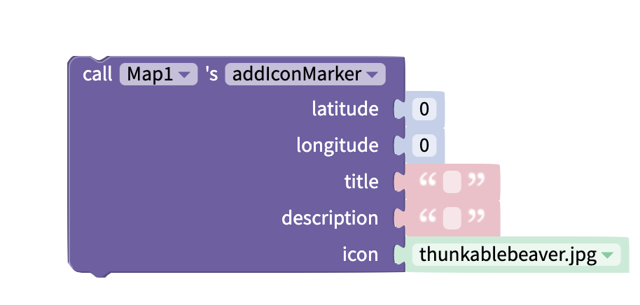
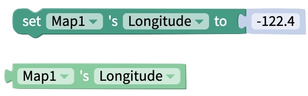

# Map

## Overview

The Map component lets you show an area of a Google map to the user. You can add [markers](map.md#add-marker), [polylines](map.md#add-polyline), and [polygons](map.md#add-polygon) to this map.

## Properties

### Add Google Maps API Key

You can live-test your app without adding your unique Google Maps API keys, but you need to add them if you want to download or publish your app.&#x20;

#### Generate a Google Maps API Key

To generate your personal Google Maps API key, you need to:

1. Create a Google Cloud project for your app.
2. Create a billing account or enable billing for the project.
3. Click **Enable** to enable the Maps SDK for Android or Maps SDK for iOS. &#x20;
4. Select **Enable all Google Maps APIs for this project**.\
   
5. Copy the provided API key.&#x20;


**Note:** If you close this pop pup message without copying your API key

1. Navigate to **APIs & Services**.
2. Select **Credentials** from the left side menu.
3.  Click **SHOW KEY**.\

    <figure><figcaption></figcaption></figure>


For more detailed instructions, please see here: [Google Maps Platform: Set up your Google Cloud project](https://developers.google.com/maps/documentation/android-sdk/cloud-setup).

#### Add Google Maps API Key to Thunkable&#x20;

Once you've generated your Google Maps API keys, you can add them to your Thunkable project. Click the gear icon on the left of your project's designer tab to access your [Project Settings](project-settings.md). Scroll to the **Google Map Settings** section and paste your Android and iOS API keys into the corresponding fields.&#x20;

### Map

| Property  | Description                                                      | Data Type |
| --------- | ---------------------------------------------------------------- | --------- |
| Latitude  | Co-ordinate of the map's center on the north-south axis          | Number    |
| Longitude | Co-ordinate of the map's center on the east-west axis            | Number    |
| Zoom      | Zoom level between -15 (most zoomed out) and 15 (most zoomed in) | Number    |

### Advanced Properties

| Property           | Description                                                              | Data Type                                                     |
| ------------------ | ------------------------------------------------------------------------ | ------------------------------------------------------------- |
| Provider           | Map provider (ex. Google).                                               | Text                                                          |
| Map Type           | Style of map.                                                            | Select from list (standard, satellite, hybrid, terrain, none) |
| User location      | Show the user where they are on the map.                                 | True/False                                                    |
| My location button | Show button that allows the user to re-center the map on their location. | True/False                                                    |
| Compass            | Show compass.                                                            | True/False                                                    |
| Scroll             | Allow user to scroll on the map.                                         | True/False                                                    |
| Zoom               | Allow user to zoom in and out on the map.                                | True/False                                                    |
| Traffic            | Show traffic data.                                                       | True/False                                                    |

### Layout

| Property    | Description                                                                   | Data Type                                    |
| ----------- | ----------------------------------------------------------------------------- | -------------------------------------------- |
| X           | Location of top left corner of Map on X-axis, where the left hand side is X=0 | Number                                       |
| Y           | Location of top left corner of Map on Y-axis, where the top side is Y=0       | Number                                       |
| Height      | Height of Map in pixels                                                       | Number                                       |
| Width       | Width of Map in pixels                                                        | Number                                       |
| Resize Mode | Define dimensions of the map component/container                              | Select from list `[Stretch, Float in Place]` |

### **Style**

| Property       | Description                                                                             | Data Type                                  |
| -------------- | --------------------------------------------------------------------------------------- | ------------------------------------------ |
| Visible        | Toggle whether your end users can see the Map                                           | True/False                                 |
| Border Style   | Set whether border style is solid, dotted or dashed  (only visible if border width > 0) | Select from list `[solid, dotted, dashed]` |
| Border Color   | Color of border (only visible if border width > 0)                                      | Color                                      |
| Border Width   | Width of border around Map in pixels                                                    | Number                                     |
| Border Radius  | Radius of corners of border on Map in degrees                                           | Number                                     |
| Shadow Color   | Color of map's shadow                                                                   | Color                                      |
| Shadow Opacity | Opacity of map's shadow                                                                 | Number between 0 and 100                   |
| Shadow Radius  | Radius of corners of map's shadow in pixels                                             | Number                                     |
| Shadow Offset  | How far map's shadow should be offset, in Height and Width, in pixels                   | Number                                     |

## Blocks

### Events

The map has several events. You can trigger actions to happen when these events occur.

#### On Map Ready

This event happens when the Map has loaded in your app.&#x20;

This is a good time to add any markers, polylines or polygons to your app that you want the user to see as soon as your app opens.

#### On User Location Change

This event happens when the location of the user changes. It returns the **coordinate** object.\
You can use [object blocks](objects.md) to get the properties of the coordinate object.

The **coordinate** object has the following properties:

**{**\
&#x20;   **target:** Numeric ID for your app\
&#x20;   **coordinate:{**\
&#x20;         **latitude:** latitude of point selected\
&#x20;         **longitude:** longitude of point selected \
&#x20;   **}**\
&#x20;   **position:{**\
&#x20;         **x:** x-position of selected point on the Map component\
&#x20;         **y:** x-position of selected point on the Map component\
&#x20;   **}**\
**}**

#### On Press

This event happens when the user taps on the Map.

.png>)

| Output name | Output value                                        | Data Type |
| ----------- | --------------------------------------------------- | --------- |
| Latitude    | Latitude of selected position                       | Number    |
| Longitude   | Longitude of selected position                      | Number    |
| position X  | X Co-ordinate of selected position on map component | Number    |
| position Y  | Y Co-ordinate of selected position on map component | Number    |

#### On Long Press

This event happens when the user presses on the map for a longer period of time.

| Output name | Output value                                        | Data Type |
| ----------- | --------------------------------------------------- | --------- |
| Latitude    | Latitude of selected position                       | Number    |
| Longitude   | Longitude of selected position                      | Number    |
| position X  | X Co-ordinate of selected position on map component | Number    |
| position Y  | Y Co-ordinate of selected position on map component | Number    |

#### On Marker Press

This event happens when the user clicks on a Marker that is on the Map.

The **On Marker Press** block returns an **event** object. This is an object which can be used with [object blocks.](objects.md)&#x20;

The **event** object has the following properties:

{\
&#x20;   **latitude:** latitude of the selected Marker\
&#x20;   **longitude**: longitude of the selected Marker\
}

### Functions

#### Add Marker

Adds a generic map marker to your map at the specified latitude/longitude.

This block takes the following inputs:

| Input       | Description                                              | Data Type                 |
| ----------- | -------------------------------------------------------- | ------------------------- |
| Latitude    | Latitude of marker's position                            | Number between -90 and 90 |
| Longitude   | Longitude of marker's position                           | Number between -90 and 90 |
| Title       | Title of marker (displayed when marker is clicked)       | Text                      |
| Description | Description of marker (displayed when marker is clicked) | Text                      |
| Pin Color   | Color of marker                                          | Color                     |

#### Add Icon Marker

Adds a marker of a selected image to your map at the specified latitude/longitude

This block takes the following inputs:

| Input       | Description                                              | Data Type                                                               |
| ----------- | -------------------------------------------------------- | ----------------------------------------------------------------------- |
| Latitude    | Latitude of marker's position                            | Number between -90 and 90                                               |
| Longitude   | Longitude of marker's position                           | Number between -90 and 90                                               |
| Title       | Title of marker (displayed when marker is clicked)       | Text                                                                    |
| Description | Description of marker (displayed when marker is clicked) | Text                                                                    |
| Icon        | Image to use as marker                                   | Dropdown menu (select [asset](assets.md#uploading-and-managing-assets)) |

#### Add Polyline

Add a polyline to your map. This is an outline that connects several points on your map.

This block takes the following inputs:

| Input        | Description                                                    | Data Type                                                                                                                                          |
| ------------ | -------------------------------------------------------------- | -------------------------------------------------------------------------------------------------------------------------------------------------- |
| Coordinate   | List of points to draw a line between. List can be any length. | List of [objects](objects.md). Each object must have the properties `latitude` and `longitude.` Latitude and Longitude must be [numbers](math.md). |
| Stroke Width | Width of polyline                                              | Number                                                                                                                                             |
| Stroke Color | Color of polyline                                              | Color                                                                                                                                              |

&#x20;These blocks:

Will produce this polyline:

Note that polylines won't automatically create a closed shape. You would need to add a forth object with the properties `latitude: 37` and `longitude: -122` to the `coordinate` input of the `addPolyline` block above to close this triangular polyline.

#### Add Polygon

Add a polygon to your map. This is a solid shape that connects several points on your map.

This block takes the following inputs:

| Input        | Description                                                    | Data Type                                                                                                                                          |
| ------------ | -------------------------------------------------------------- | -------------------------------------------------------------------------------------------------------------------------------------------------- |
| Coordinate   | List of points to draw a line between. List can be any length. | List of [objects](objects.md). Each object must have the properties `latitude` and `longitude.` Latitude and Longitude must be [numbers](math.md). |
| Stroke Width | Width of outline                                               | Number                                                                                                                                             |
| Stroke Color | Color of outline (Only visible if Stroke Width > 0)            | Color                                                                                                                                              |
| Fill Color   | Color of polygon shape                                         | Color                                                                                                                                              |

These blocks:

Will produce this polygon:

.jpeg>)

Note that the polygon outline will automatically connect the first and last points in the list of coordinates.

#### Delete Markers, Polylines and Polygons

You can use the **deleteAllMarkers** block to delete all [markers](map.md#add-marker) from your app.

You can use the **deleteAllPolylines** block to delete all [polylines](map.md#add-polyline) from your app.

You can use the **deleteAllPolygons** block to delete all [polygons](map.md#add-polygon) from your app.

### Properties

Set and get [properties](map.md#properties) of the Map component.

#### Latitude

#### Longitude

#### Zoom

#### Computed Height

Returns the height of the Map on the device screen in pixels.

#### Computed Width

Returns the width of the Map on the device screen in pixels.

#### Visible

## See Also

You can pair the Map component with a [Location Sensor](location-sensor.md). This helps you show content relevant to the user's location.

These blocks will set the map's latitude and longitude to show the user's location once the map is ready:

