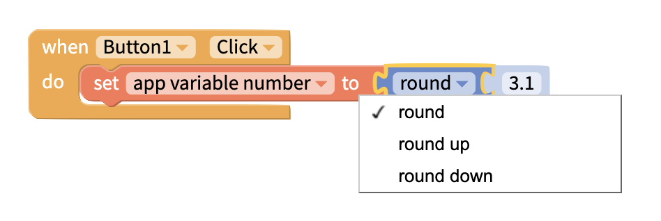
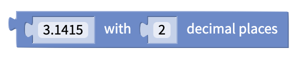
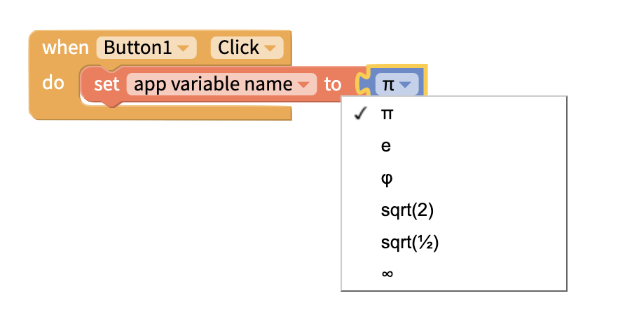
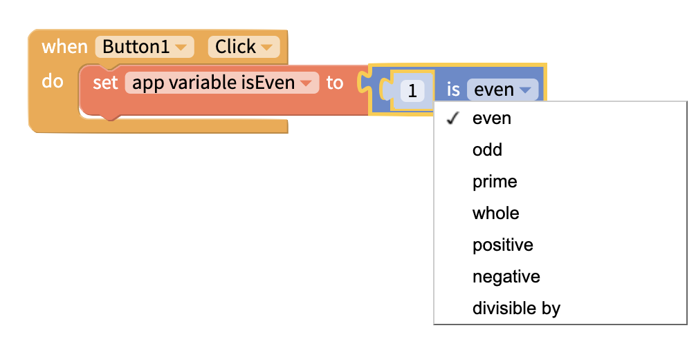
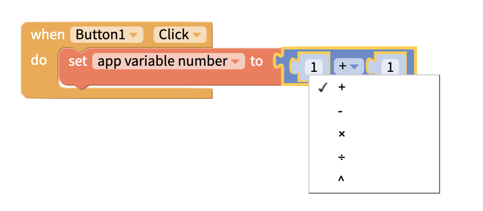
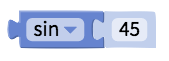
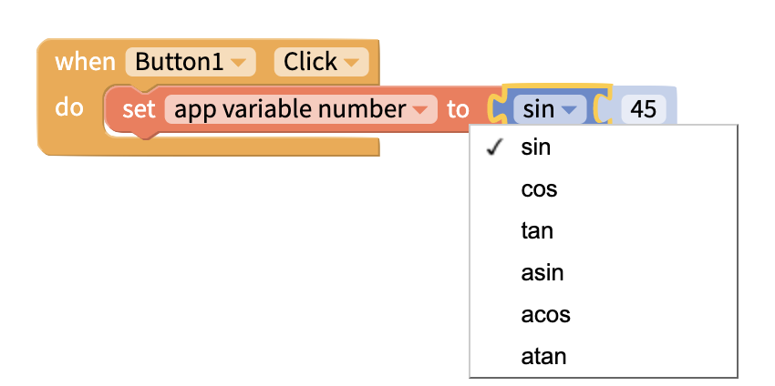
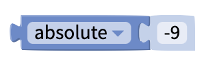
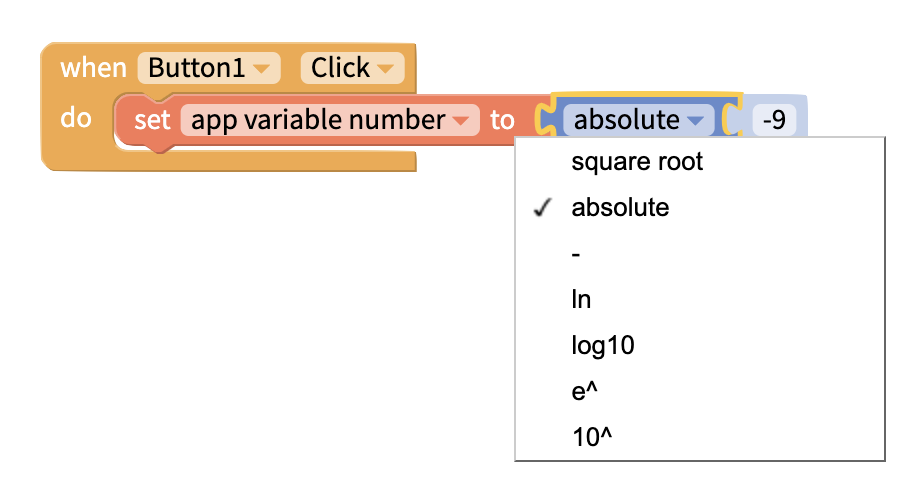

# Math

## Numeric Value

### Specify Number

Use this block to specify a number you want to use in your app.

### Round

You can also round up or down a decimal figure into an integer using the **round** block

### Round to X Decimal Places

You can also round a number to a selected amount of decimal places

### Irrational Numbers

There is also a block for irrational numbers like `π`

## Analyze Numbers

Returns **true** or **false** based on whether the chosen condition applies to the number

## Perform Operations

### Constrain Number

If the given number is of a lower value than the lower bound, this block will set the given number to have the value of the lower bound.

If the given number is of a higher value than the upper bound, this block will set the given number to have the value of the upper bound.

### Arithmetic

Perhaps the most often used calculation in an app is `addition` but this block also supports `subtraction`, `multiplication`, `division` and `exponential` figures

### Get remainder

Returns the remainder when a number is divided by another number.

### Trigonometry

There are also a few more advanced calculation blocks that may be helpful including `trigonometric.`

These blocks will return a value assuming the input is given in **degrees**.

### Logarithmic values

###

## Introduce Randomness

For games and other apps, it may be important to introduce randomness into your app.

### Random Integer from X to Y

Returns integer between two given integers. Is inclusive of the given integers.

Returns a random integer between two given integers. Is inclusive of the given integers.

### Random Fraction

Returns a random fraction $$x$$ where $$0 ≤ x < 1$$

#### Other Ways to add randomness to your app

The [Lists](lists.md) blocks also have blocks for selecting [random items from a list of values](lists.md#sum-min-max-averages-standard-deviation-random-item).

## See Also

The [Lists](lists.md) blocks have a block for getting certain mathematical values from a List, including [sum min, max, averages, and standard deviation.](lists.md#sum-min-max-averages-standard-deviation-random-item)
