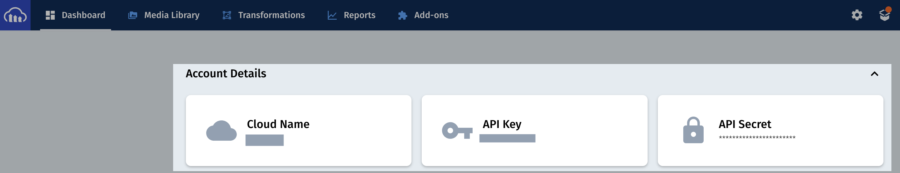

# Media DB by Cloudinary

## Media DB Overview


No set up is required but creating your free Cloudinary account is highly recommended


## Getting Started

No set up is required but creating your free Cloudinary account is highly recommended. Thunkable provides its own subscription key for your convenience but we strongly recommend creating your own account to ensure privacy for your uploaded media. We also have a current media size limit of 10MB per app and we may periodically clean out our default Cloudinary account

### Create a [free Cloudinary](https://cloudinary.com) account

### Connect your Cloudinary cloud to Thunkable

To connect your Cloudinary cloud to Thunkable, simply retrieve the following fields from the Cloudinary dashboard: `Cloud name`, `API key`, and `API secret.`&#x20;

You can add these details to your app in the properties panel of the Media DB component.&#x20;

## Upload Media

You can upload any media file from your phone to your Cloudinary account with the mediaDB component. In this case we do some additional checking with the [if do else](control.md#if-this-do-that) block to make sure that the user has attached an image and that neither the photo library nor the mediaDB components encounter an error.&#x20;

| Event            | Description                                                                                                                             |
| ---------------- | --------------------------------------------------------------------------------------------------------------------------------------- |
| Upload (`media`) | 
Uploads the image to the Cloudinary cloud. Returns a <code>mediaURL</code> if successful.

Else returns <code>error</code>.
 |
