# Motion

## Speed 

### Set Speed To 

Set the X or Y value for the sprite's speed to a particular value.

### Change Speed By 

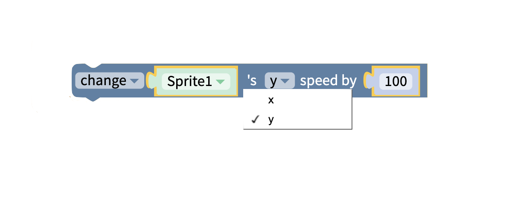

Change the X or Y value for the sprite's speed by a specific amount.

### Get Speed 

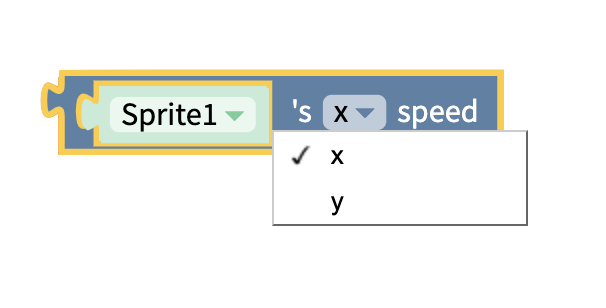

Get the X or Y value for the sprite's speed.

### 

### Set Velocity

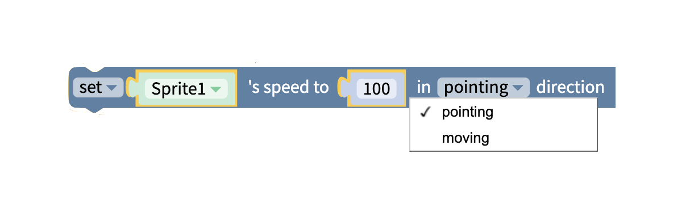

Set or change the sprite's velocity, by a given amount, in the pointing or moving direction.

## Position 

### Move Sprite To

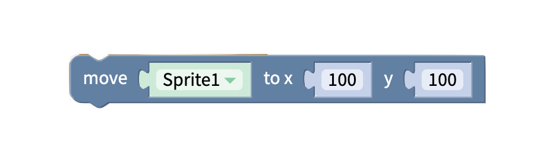

Move the sprite to the x and y location specified in the block

### Set Sprite Position

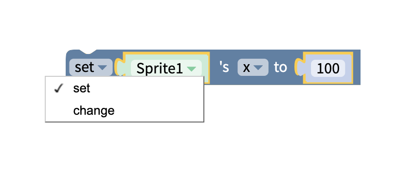

Set the sprite's X, Y, Z or Angle value to a specific position.

Change the sprites X, Y, Z or Angle value by a given amount.

**Note**: Sprite angle is measured in degrees, so should be a value between 0 and 360. 

### Get Sprite Position

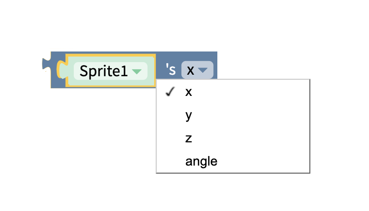

Get the sprite's current X, Y, Z or Angle value.

**Note**: Sprite angle is measured in degrees, so should be a value between 0 and 360

## Pointer

### Get Pointer Value

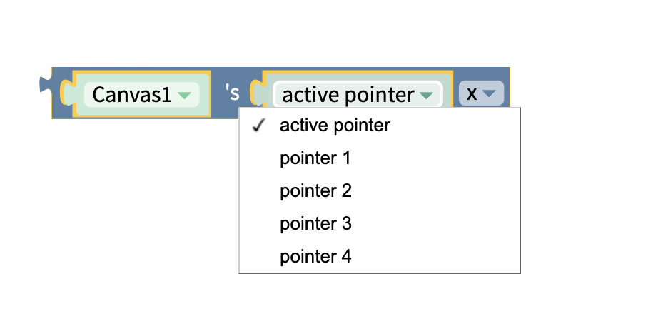

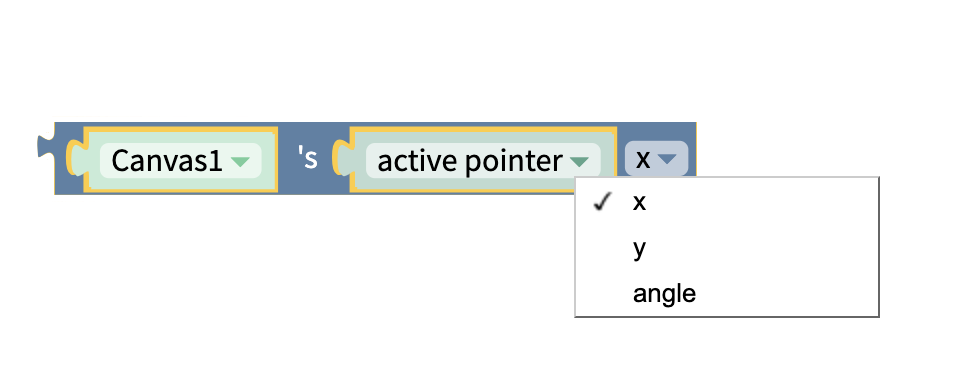

Get the X, Y, or Angle of the where the user tapped on the canvas

## Behavior

On the canvas, it's possible to make a sprite either draggable or to have it fixed in position.

Similarly, it's possible for other sprites to pass through a sprite, or it can be made impassable. 

Finally, if a sprite is moving, it's possible to programatically cause it to stop moving. 

### Set Draggable or Passable 

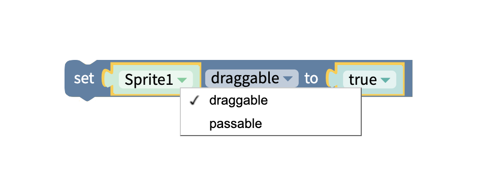

Set the draggability or passability of the sprit

### Get Draggable or Passable

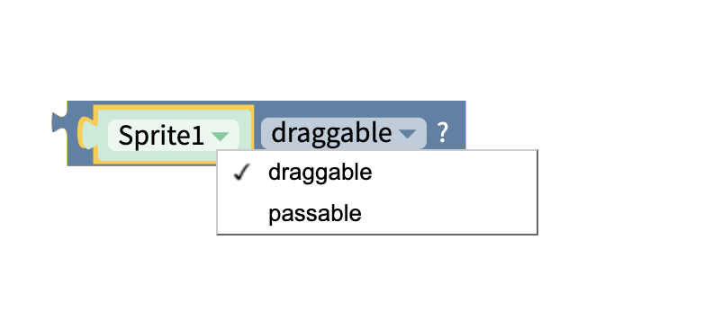

Get draggability of the sprite

### Stop All Sprites

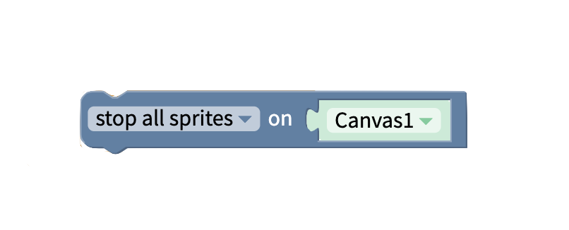

Stop all sprites that are moving.

## 

