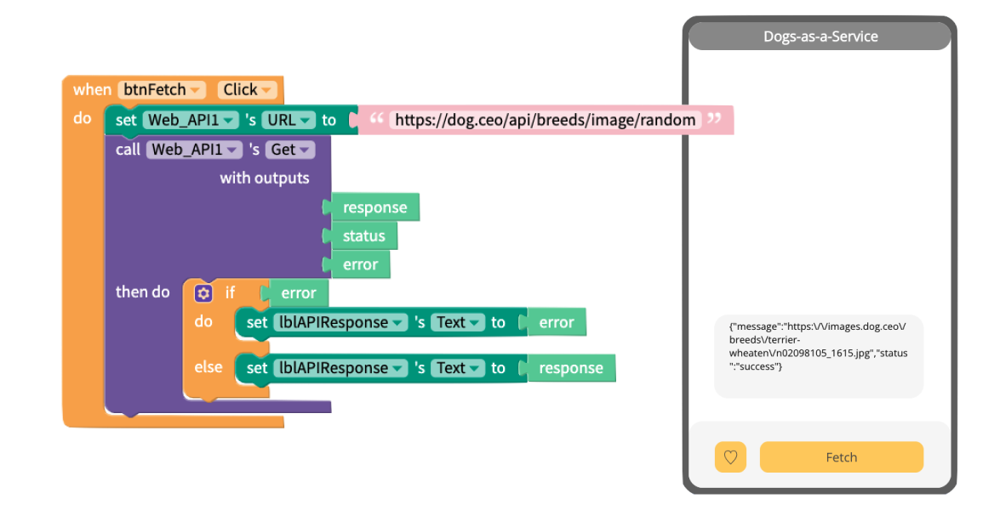
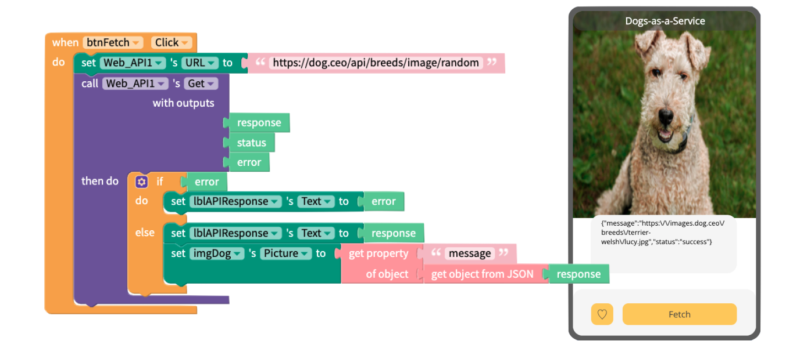
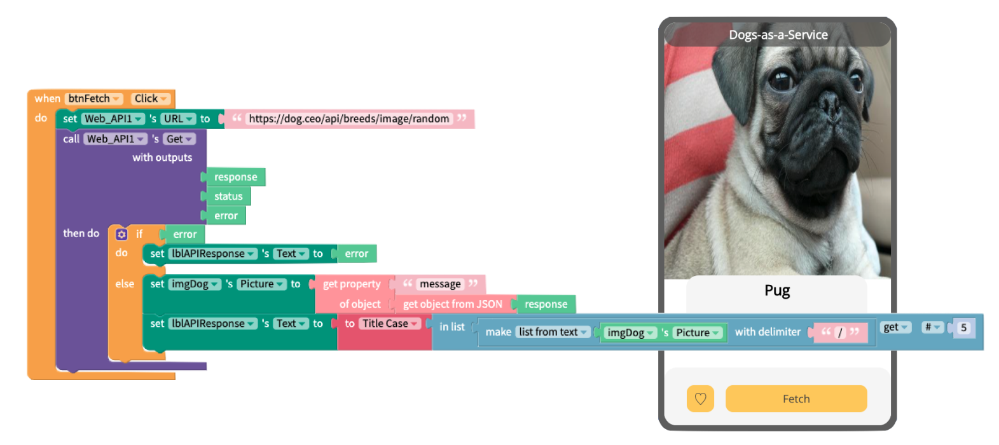
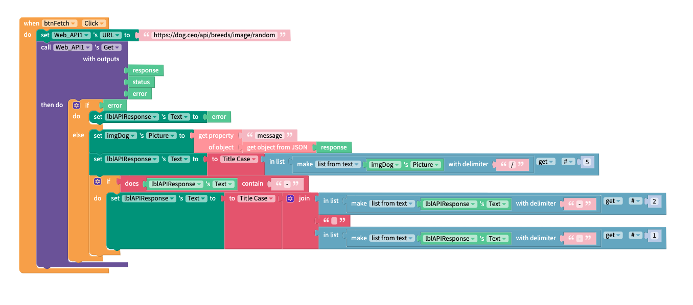

# CRUD Operations

## How do I use an API?&#x20;

Most modern APIs will have support for a variety of CRUD operations. In this context, the acronym CRUD stands for **C**reate, **R**ead, **U**pdate, **D**elete. While most API developers probably won't want to give just anyone free rein to change or remove data on their system there are plenty out there who provide public, read-only access to their end points. This is also convenient for us, since reading data from an API and displaying it in a Thunkable app is probably the easiest way to familiarise ourselves with APIs.&#x20;

At the end of this tutorial, you should be able to&#x20;

1. Send a GET request to an API&#x20;
2. Parse (interpret) a response from that API.

### Overview


**Remix Link:** [<mark style="color:blue;">**https://x.thunkable.com/projectPage/620e62ccc6b7590159627317**</mark>](https://x.thunkable.com/projectPage/620e62ccc6b7590159627317)<mark style="color:blue;">****</mark>


The app we're going to build in this example is called "Dogs-as-a-Service". It connects to the [dog.ceo API](https://dog.ceo/dog-api/) and can "fetch" an image and breed name for a random dog.&#x20;

<figure><figcaption></figcaption></figure>

### Design Your User Interface

At its core we need at least three components to get this app working correctly; a Button to send the API request, an Image to show the picture in the response and a Label to display the name of the dog breed. If you want your project to look the same as the sample project then you can go ahead and make a copy of it for yourself.&#x20;

### Show the Picture&#x20;

Let's begin by sending a GET request the to API. Notice here that the purple `Get` block returns three parameters; <mark style="background-color:green;">response</mark>, <mark style="background-color:green;">status</mark> and <mark style="background-color:green;">error</mark>. If anything goes wrong with the request then an error will be returned so it's always a good idea to do some error handling in your app. The status block returns the HTTP status. According to [this list](https://developer.mozilla.org/en-US/docs/Web/HTTP/Status) there are about 30 different response codes. You don't need to remember what they all mean but it is good to know that a response code in the 200s is successful, codes in the 300s are for redirects and status codes in the 400s correspond to errors. Indeed you may already be familiar with the 404 error code for "Page Not Found". The example below has some basic error handling and, if successful, displays the entire JSON response in a label.&#x20;

<figure><figcaption></figcaption></figure>

Our response contains just two properties, `message` and `status` which really makes this API as easy as possible for us to work with.&#x20;







```javascript
{
    "message": "https://images.dog.ceo/breeds/cotondetulear/IMAG1063.jpg",
    "status": "success"
}
```



All we need to do here is get the value from the `message` property and pass that to our image component. The <mark style="color:blue;"></mark> [<mark style="color:blue;">object blocks</mark>](https://docs.thunkable.com/v/drag-and-drop/objects) <mark style="color:blue;"></mark> in Thunkable make this incredibly easy to do and we can set our picture by using just two of them. First we have to convert the raw JSON response into an object using the <mark style="background-color:red;">get object from JSON</mark> block, then we can go ahead and get the message value and pass it to the image component using the <mark style="background-color:red;">get property of object</mark> block like this:

<figure><figcaption></figcaption></figure>

### Display the Name

The URLs for every image also contain the breed names for each dog. If you look closely you'll notice they all follow the same pattern:

> https://API-HOST/DOG-BREED/DOG-IMAGE.jpg

What we want to do is grab the name of the dog breed, remove any stray backslashes and convert it to Title Case. In practice, this involves using the <mark style="background-color:blue;">make list from text</mark> blocks and then the <mark style="background-color:blue;">in list get #</mark> block to get the name of the breed and then pass that through the <mark style="background-color:red;">Title Case</mark> text block to output the nicely formatted dog breed in our label.

<figure><figcaption></figcaption></figure>

#### Sub Breeds

While the above approach works perfectly well for pugs and collies, our API is set up in such a way that you might also see responses like "terrier-welsh" or "terrier-westhighland". The second <mark style="background-color:yellow;">if then do</mark> block below shows one way that you can split the text at the hyphen and display the words in reverse order.&#x20;

<figure><figcaption></figcaption></figure>


### Conclusion

In this first example we've learned how make a `Get` request in Thunkable and use the object blocks to retrieve information from the API response. We've also seen firsthand how just a handful of list and text blocks can be combined to extract additional information and present it to the end user in an easy-to-read format.&#x20;

### Questions?

If you have any questions about this tutorial, please post them over in the Thunkable Community


**Community Link:** [<mark style="color:blue;">**https://community.thunkable.com/t/dog-breeds-api-tutorial/**</mark>](https://bit.ly/3iJvOYS)<mark style="color:blue;">****</mark>

