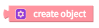
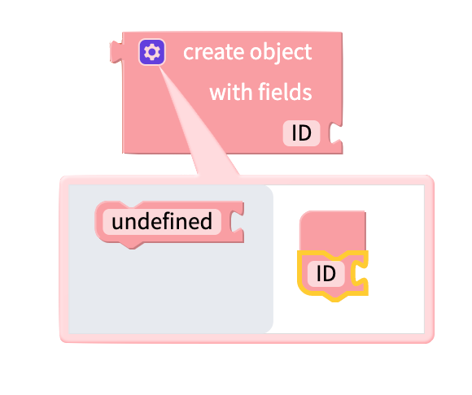
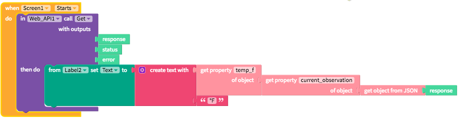
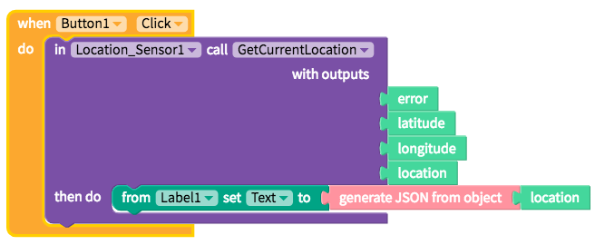
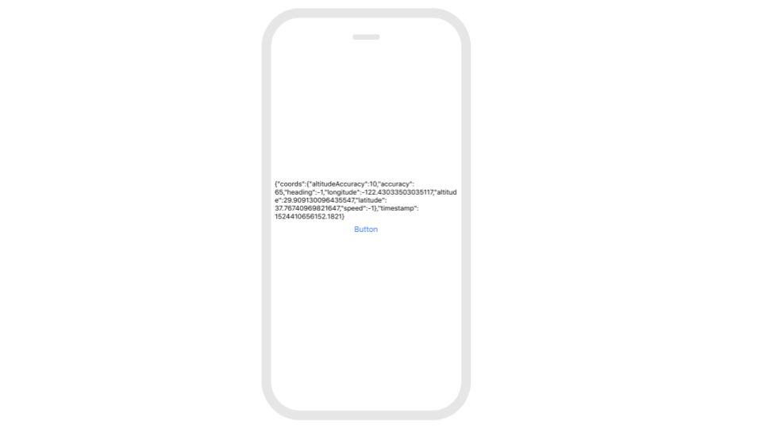

# Objects

The Object blocks pair well with the [Web API](web-api.md), [Map](map.md) and [Location Sensor](location-sensor.md) components which often send data in object format. The [Spreadsheet](spreadsheet.md) component also requires data to be in object format for it to upload successfully

## Creating an Object

### Create a New Object

You can use the following block to create a new object. Objects can be uploaded to your [Firebase DB](realtime-db.md) as the value of a [cloud variable](variables.md#cloud-variables), or they can be uploaded to an [Airtable DB](spreadsheet.md) as a row object.

You can click on the gear icon to add properties to your object:

### Convert between Object and JSON

Sometimes, you want to convert between JSON \(JavaScript Object Notation\) and Objects. If an [API](web-api.md) returns a JSON value, you can convert it to an Object to use with Object blocks. Use the `get object from JSON` block:

Similarly, you may want to convert an Object to JSON to make an API POST, or set headers or query parameters for your API call. You can do this with the `generate JSON from Object` block: 

## Reading Values of an Object

### Retrieving Properties of an Object

You can use the `get property` block to read the value of an object's property.  
If the object does not have a property with this name, it will return `undefined`.

### Get properties of an Object

You can use the `get Object properties of` block to return the names of the properties of an object.

This block returns a list of property names. This list can be used with [list](lists.md) blocks.

## Set Properties of an Object

With the `set property` block, you can change the value of a single property of an object.

## Examples of using Object blocks in your app

### Getting values from an API

You can use Object blocks when making calls to an[ API.](web-api.md)

Often, when retrieving data from an API like [Weather Underground](https://www.wunderground.com/weather/api/d/docs?MR=1), you will get a large data dump in JSON format like shown below.

`{ "response": { "version": "0.1", "termsofService": "http://www.wunderground.com/weather/api/d/terms.html", "features": { "conditions": 1 } }, "current_observation": { "image": { "url": "http://icons-ak.wxug.com/graphics/wu2/logo_130x80.png", "title": "Weather Underground", "link": "http://www.wunderground.com" }, "display_location": { "full": "San Francisco, CA", "city": "San Francisco", "state": "CA", "state_name": "California", "country": "US", "country_iso3166": "US", "zip": "94101", "latitude": "37.77500916", "longitude": "-122.41825867", "elevation": "47.00000000" }, "observation_location": { "full": "SOMA - Near Van Ness, San Francisco, California", "city": "SOMA - Near Van Ness, San Francisco", "state": "California", "country": "US", "country_iso3166": "US", "latitude": "37.773285", "longitude": "-122.417725", "elevation": "49 ft" }, "estimated": {}, "station_id": "KCASANFR58", "observation_time": "Last Updated on June 27, 5:27 PM PDT", "observation_time_rfc822": "Wed, 27 Jun 2012 17:27:13 -0700", "observation_epoch": "1340843233", "local_time_rfc822": "Wed, 27 Jun 2012 17:27:14 -0700", "local_epoch": "1340843234", "local_tz_short": "PDT", "local_tz_long": "America/Los_Angeles", "local_tz_offset": "-0700", "weather": "Partly Cloudy", "temperature_string": "66.3 F (19.1 C)", "temp_f": 66.3, "temp_c": 19.1, "relative_humidity": "65%", "wind_string": "From the NNW at 22.0 MPH Gusting to 28.0 MPH", "wind_dir": "NNW", "wind_degrees": 346, "wind_mph": 22.0, "wind_gust_mph": "28.0", "wind_kph": 35.4, "wind_gust_kph": "45.1", "pressure_mb": "1013", "pressure_in": "29.93", "pressure_trend": "+", "dewpoint_string": "54 F (12 C)", "dewpoint_f": 54, "dewpoint_c": 12, "heat_index_string": "NA", "heat_index_f": "NA", "heat_index_c": "NA", "windchill_string": "NA", "windchill_f": "NA", "windchill_c": "NA", "feelslike_string": "66.3 F (19.1 C)", "feelslike_f": "66.3", "feelslike_c": "19.1", "visibility_mi": "10.0", "visibility_km": "16.1", "solarradiation": "", "UV": "5", "precip_1hr_string": "0.00 in ( 0 mm)", "precip_1hr_in": "0.00", "precip_1hr_metric": " 0", "precip_today_string": "0.00 in (0 mm)", "precip_today_in": "0.00", "precip_today_metric": "0", "icon": "partlycloudy", "icon_url": "http://icons-ak.wxug.com/i/c/k/partlycloudy.gif", "forecast_url": "http://www.wunderground.com/US/CA/San_Francisco.html", "history_url": "http://www.wunderground.com/history/airport/KCASANFR58/2012/6/27/DailyHistory.html", "ob_url": "http://www.wunderground.com/cgi-bin/findweather/getForecast?query=37.773285,-122.417725" } }`

You may just want to pull out one attribute \(like temp\_f or the temperature in Farenheit\). To do so, you'll need to use the object blocks below:

### Getting values from the Location Sensor

The [Location Sensor ](location-sensor.md)components returns a latitude, longitude and location object and it's not always clear which attributes are available. One way to troubleshoot is to print out the JSON from the object like below

This will output the following on your app

