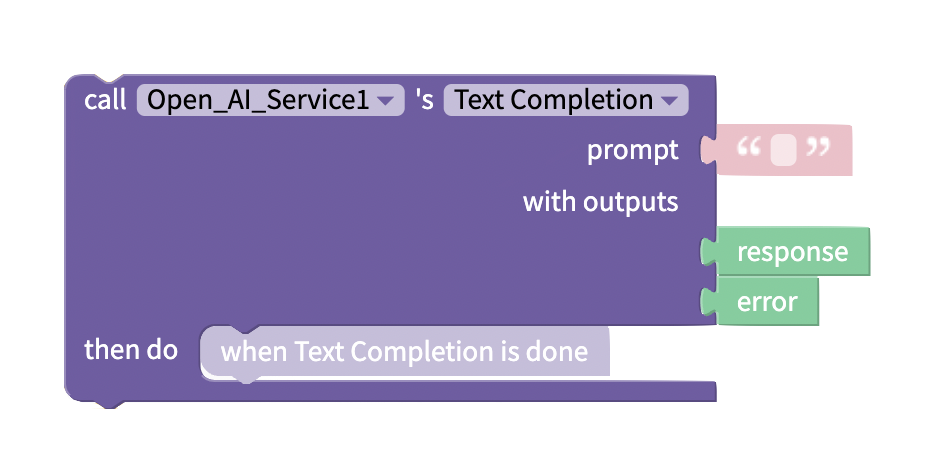
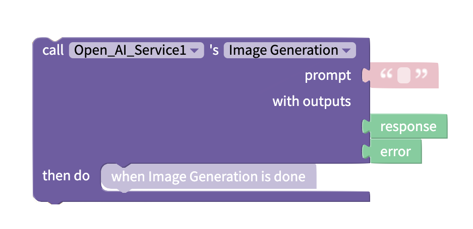
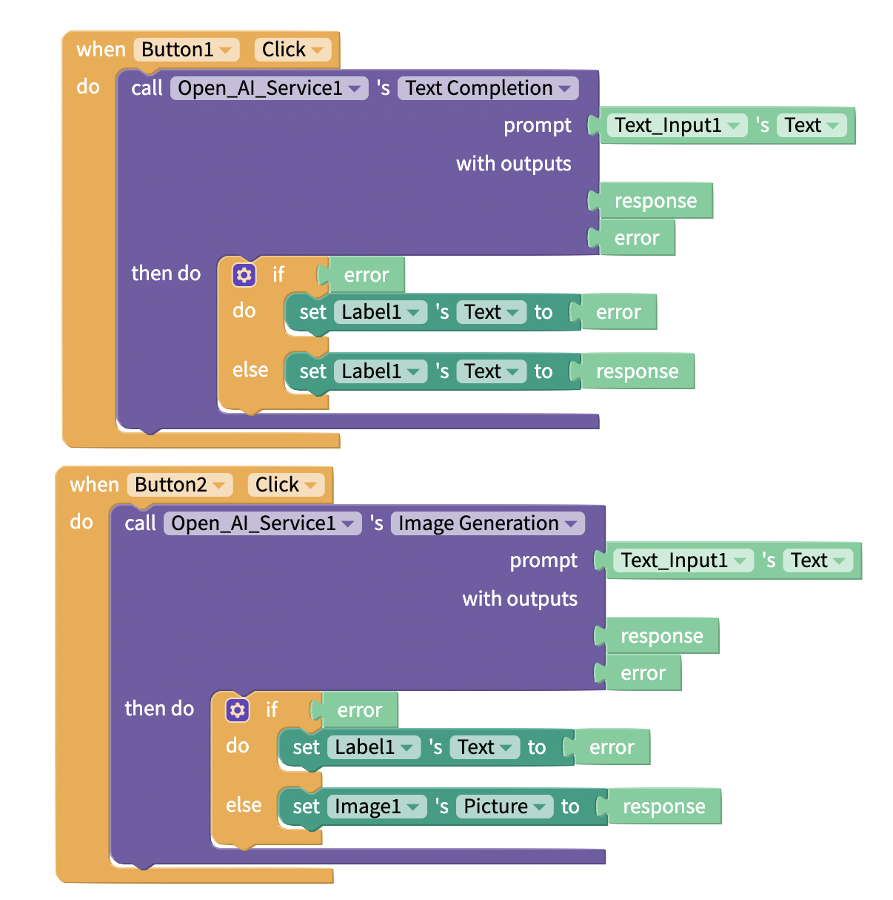
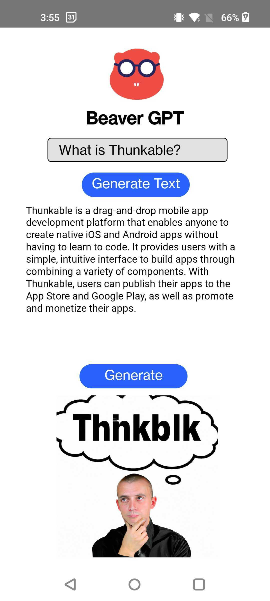

# OpenAI ChatGPT Integration

## Overview

An artificial intelligence research and deployment company,[ OpenAI](https://openai.com/) focuses on the creation of safe, artificial, general intelligence. Their latest AI model, called ChatGPT, has the ability to interact with a user in a conversational tone.&#x20;

When prompted, it composes responses relevant to the topic requested. Thunkable creators can utilize this model in their own apps and tap into the power of AI and natural language generation.&#x20;

### Create an OpenAI account and generate a secret API key

To use the OpenAI ChatGPT model in your Thunkable app, you need to generate a personal Open AI API key. To do this:

1. Navigate to [https://openai.com/api/](https://openai.com/api/)&#x20;
2. Click **Sign Up**.
3. On the Overview page, click your avatar to show the menu and select **View API Keys**.
4. Select **Create new secret key**.
5. Copy the secret key that is provided in the popup window. You will need to paste this into your Thunkable project.&#x20;


You will only be able to see your OpenAI API key once. You will not be able to copy it after the initial modal closes.


### OpenAI Integration Setup in Thunkable

To setup the OpenAI integration in Thunkable:&#x20;

1. Navigate to your project’s Blocks tab.
2. Scroll to the bottom of the blocks panel on the left side to access the Advanced section.
3. Click the expand chevron to show the Advanced components.
4. Click the plus icon next to `Open AI Services`.
5. Your “Open AI Services” component will appear under the Open AI Services (Beta) drawer. Click the gear icon next to the component's name to access its properties dialog.
6. Paste your Open Secret API Key in the text box under APIKey (currently set to ‘default’).
7. Click Submit.

<figure><figcaption></figcaption></figure>

## Properties

### API Key

| Property | Description                                                                                          | Data Type |
| -------- | ---------------------------------------------------------------------------------------------------- | --------- |
| API Key  | Your person API for making requests to the OpenAI API (default key used if this field is left blank) | Text      |

### Request Settings

Request Settings are passed as a [list](lists.md) of [Objects](objects.md), or key-value pairs. In this modal, you can pass the property name and property value in their own fields.

See what kind of settings you can pass in OpenAI's [Making Requests](https://beta.openai.com/docs/api-reference/making-requests) documentation.

| Property | Description                                                           | Data Type |
| -------- | --------------------------------------------------------------------- | --------- |
| Property | Name of the property you are assigning a value to in your API request | Text      |
| Value    | Value of the property you are specifying in your API request          | Text      |

## Blocks

### Functions

#### Call Text Completion

<figure><figcaption></figcaption></figure>

Make a call to [OpenAI's Completion model](https://beta.openai.com/docs/api-reference/completions)

| Input Name | Description                                    | Data Type | Required? |
| ---------- | ---------------------------------------------- | --------- | --------- |
| Prompt     | Text prompt for OpenAI to generate text around | Text      | Yes       |

| Output Name | Description                                                             | Data Type                                 |
| ----------- | ----------------------------------------------------------------------- | ----------------------------------------- |
| response    | Generated Text from OpenAI API                                          | Text                                      |
| error       | If an error is encountered while making the API call, returns the error | Text if an error is returned; else `null` |

#### Call Image Generation

<figure><figcaption></figcaption></figure>

Make a call to [OpenAI's Create Image model](https://beta.openai.com/docs/api-reference/images/create)

| Input Name | Description                               | Data Type | Required? |
| ---------- | ----------------------------------------- | --------- | --------- |
| Prompt     | Text prompt for OpenAI to generate image  | Text      | Yes       |

| Output Name | Description                                                             | Data Type                                 |
| ----------- | ----------------------------------------------------------------------- | ----------------------------------------- |
| response    | Generated Image from OpenAI API                                         | Image                                     |
| error       | If an error is encountered while making the API call, returns the error | Text if an error is returned; else `null` |

### Properties

#### Set API Key

Set the API Key being used to make calls to the OpenAI API in your app

#### Get API Key

Get the API Key being used to make calls to the OpenAI API in your app

#### Set API Request Settings

Use [lists](lists.md) and [Objects](objects.md) blocks to set the [Request Settings](openai-chatgpt-integration.md#request-settings) of your call to the OpenAI API

#### Get API Request Settings

Get the [Request Settings](openai-chatgpt-integration.md#request-settings) of your call to the OpenAI API

Your Request Settings will be returned as a [list](lists.md) of [Objects](objects.md)

## Create a Thunkable Project Using the OpenAI Integration

### Design Tab: Design the App’s User Interface

To utilize the OpenAI ChatGPT integration, your Thunkable project will need a minimum of:

* One text input
* One label
* Two buttons
* One image component

Below is a sample minimum viable product design:

<figure><figcaption></figcaption></figure>

\
To use the OpenAI integration to display text and an image from a query, recreate the following block combination.

<figure><figcaption></figcaption></figure>

Users of this app enter a prompt into the text input.&#x20;

The app calls the OpenAI API and populates the label and image components when the 'Text' or 'Image' button is clicked.&#x20;

The label component shows the text output from the OpenAI model. The image component shows the image output from the OpenAI model.&#x20;

<figure><figcaption></figcaption></figure>
