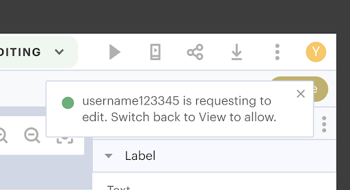

# Organizations

**Note:** Organizations is currently being beta-tested.

## Overview

Thunkable Organizations is a set of administration and collaboration capabilities that allow multiple team members to work on a single project. Creators can jointly design and develop a single, shared project asynchronously.&#x20;

A single Creator can edit the project at a time, and their changes are available for other members to view when they refresh their page.&#x20;

## Organization Management


To get started with Thunkable Organizations, please contact the Thunkable team here: [book a meeting](https://meetings.hubspot.com/bryan-luckyheard/team-pricing-request). The Thunkable team will take care of setting up and managing your organization.&#x20;


Thunkable Creators have:&#x20;

* roles with the organization (admin or member)
* permissions within a project (project owner, editor, or viewer)
* modes when actively within a project (editing or viewing)

### Roles and Permissions Summary

<table><thead><tr><th width="237">Action</th><th width="119">Org. Admin</th><th width="149">Project Owner</th><th>Editor</th><th>Viewer</th></tr></thead><tbody><tr><td>Add/Remove members</td><td><mark style="color:green;">Yes</mark></td><td>No</td><td>No</td><td>No</td></tr><tr><td>Publish</td><td>-</td><td><mark style="color:green;">Yes</mark></td><td><mark style="color:green;">Yes</mark></td><td>No</td></tr><tr><td>Share</td><td>-</td><td><mark style="color:green;">Yes</mark></td><td>No</td><td>No</td></tr><tr><td>Download</td><td>-</td><td><mark style="color:green;">Yes</mark></td><td><mark style="color:green;">Yes</mark></td><td>No</td></tr><tr><td>Access project settings</td><td>-</td><td><mark style="color:green;">Yes</mark></td><td><mark style="color:green;">Yes</mark></td><td>No</td></tr><tr><td>Grant Edit Access</td><td>-</td><td><mark style="color:green;">Yes</mark></td><td>No</td><td>No</td></tr><tr><td>Remix project</td><td>-</td><td><mark style="color:green;">Yes</mark></td><td><mark style="color:green;">Yes</mark></td><td>No</td></tr><tr><td>Duplicate project</td><td>-</td><td><mark style="color:green;">Yes</mark></td><td>No</td><td>No</td></tr><tr><td>Delete project</td><td>-</td><td><mark style="color:green;">Yes</mark></td><td>No</td><td>No</td></tr><tr><td>Figma import</td><td>-</td><td><mark style="color:green;">Yes</mark></td><td>No</td><td>No</td></tr><tr><td>Versioning</td><td>-</td><td><mark style="color:green;">Yes</mark></td><td>No</td><td>No</td></tr></tbody></table>

### Admin Dashboard

The Organizations Admin Dashboard is available for an Organization’s admins. This is where they can add, remove, and modify members' roles.

#### Access Admin Dashboard

1. Click your **profile image** in the upper right.
2.  Select **Organizations**. \

    

    <figure><figcaption></figcaption></figure>

    

3. The Organizations page lists the Organizations for which you hold admin status.

#### View Organization

1. Click an Organization name.
2. The Members tab lists the Organization’s members.&#x20;
3. The Projects tab lists the Organization’s projects.

#### Add Member

1. Click **Add Member**.
2. Input the invitee’s email address.
3. Indicate their role (Admin or Member).&#x20;
4. Click **Add**.

#### Modify a Role

1. Navigate to the **Members tab** of the Organization’s page.&#x20;
2. Click the **role dropdown** associated with the member.
3. Select the appropriate role (Admin or Member).

#### Remove a Member

1. Navigate to the **Members tab** of the Organization’s page.
2. Click the **role dropdown** associated with the member.
3. Select **Remove**.
4. Confirm the removal.

## Assigning a Project to an Organization

### Creating a New Project in an Organization

When creating a new project, Organization members can assign it to their own personal projects or the Organization.&#x20;

Projects assigned to the Organization can be collaborated on by members of the Organization.&#x20;

Once a project is assigned to an Organization, it cannot be converted to a personal project. It remains part of the Organization and cannot be moved to any one Creator’s personal projects, including the Admin of the Organization.

Projects created within an organization cannot be shared with users outside of the Organization.

<figure><figcaption></figcaption></figure>

### Duplicate into an Organization

The owner of a personal project can make a copy of the project in an organization in which they are a member. To do this, as the project's owner:

1. On the project's Design tab, click the **Project Actions** icon.
2.  Select **Duplicate into...**\

    

    <figure><figcaption></figcaption></figure>

    

3. In the modal provided, give the project a name.
4. Use the dropdown menu to indicate which Organization you want to copy the project into.
5.  Click **Duplicate into Organization**.\

    

    <figure><figcaption></figcaption></figure>

    

6. You are the owner of the newly created project in the selected Organization. There are no other members with permissions on this project yet.

## Viewing and Editing Modes

When accessing Organization projects, members are in one of two modes: Editing or Viewing. There can only be one project member in Editing mode at any given time – all other members of the Organization remain in Viewing mode.&#x20;

Members accessing the project in Viewing mode cannot make active changes to the shared project.

<figure><figcaption></figcaption></figure>


### Transferring Editing Access

Only one project member can be in Editing mode at a time.&#x20;

* To request editing access, a member in Viewing mode must click the chevron next to **VIEWING**.
* Click **Request Edit**.
* The member currently in Editing mode is notified that another member has requested editing access.
* When the member currently in Editing mode switches to View mode, the member requesting Editing access is switched to Editing mode and can make changes to the project.


<figure><figcaption></figcaption></figure>


If the member currently in Editing mode is offline, no other member can edit the project. The member currently in Editing mode must return online and grant access to a different member.


## Sharing and Updating Permissions

To share a project with a user in your Organization:

1. Click the **Share** icon.\
   
2. Select **Project Sharing**.&#x20;
3. Enter the **email address** of the user you want to add to the project
4. Assign the user a **permission level**: Editor or Viewer.&#x20;
5. Click **Add**.

To update the permissions of a user in your Organization:

1. Click the **Share** icon.\
   
2. Click the user's existing permission level (EDITOR or VIEWER) and select Editor, Viewer, or Remove.&#x20;

## Collaborating with Comments

Organization members can collaborate on projects by adding comments to UI components.

### Add Comments

To add a comment to a UI component:

1. Access the project’s Design tab.
2. Ensure you’re in **Editing** mode.&#x20;
3. Click the **Comment** icon to open the comment panel on the right.
4. Click to select a UI component on a screen or in the component tree.&#x20;
5. Type your comment in the provided text input field in the comment panel.
6. Click the **send** button.
7. To add comments to other UI components, repeat steps 4-6.&#x20;
8. Click the **Comment** icon to close the comment panel.

<figure><figcaption></figcaption></figure>


Each UI component is limited to 25 comments, and each comment has a maximum character count of 2000.


### View Comments

To view comments on a UI component:

1. Access the project’s Design tab.
2. Click the **Comment** icon to open the comment panel on the right.
3. Comments are grouped with the UI component they were added to.
   1. Comments are displayed in the order they were added, with the most recent comment appearing at the bottom of the UI component's comments.
   2. UI components with the most recent comments appear at the top of the comment panel, making it easier to find the most recent discussions.
4. Click the Comment icon to close the comment panel.

### Delete Comments

You can delete your own comments. To delete a comment:

1. Access the project’s Design tab.
2. Ensure you’re in **Editing** mode.&#x20;
3. Click the **Comment** icon to open the comment panel on the right.
4. Locate the comment you want to delete.
5. Click the vertical ellipsis icon within the comment’s box.
6. Click **Delete**.
7. This cannot be undone. Click **Delete** to confirm the deletion of the comment.
8. Click the **Comment** icon to close the comment panel.


**Have feedback on this doc?** Please take a moment to share your feedback here: [Thunkable Docs Feedback](https://docs.google.com/forms/d/e/1FAIpQLSfCwn5L2xyla-LSLZX0DSWFcFeJ43qp-r1tELCacuVS2zduLA/viewform?usp=sf\_link). Your valuable insights will help us improve and better serve you in the future.

