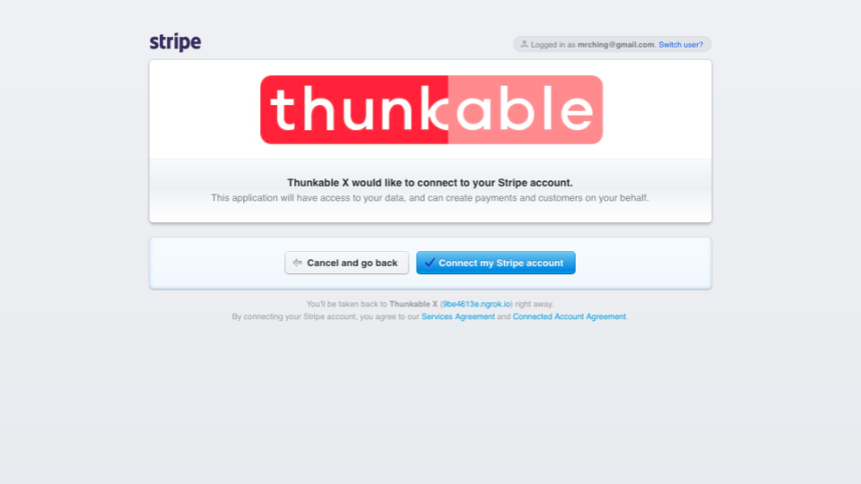
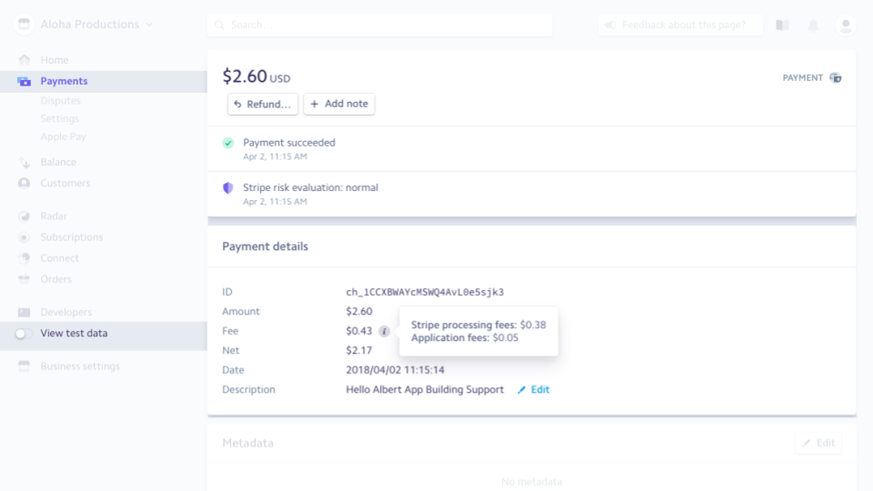
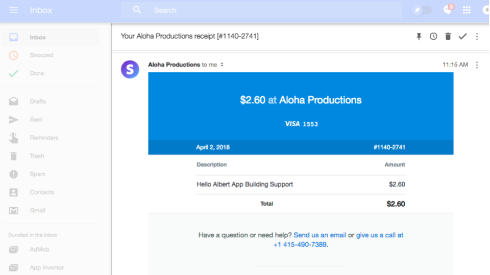

# Payment by Stripe

Some of the leading apps in the world from Lyft to Instacart process their credit card payments via Stripe. Thanks to the Payment component powered by Stripe, you have access to the same developer friendly service that professional developers around the world use to build businesses in their apps.


### New lower fees for  members! 

### 

The Payment component by Stripe will no longer charge a Thunkable fee for  members. 

members now enjoy the same payment processing fee that Stripe charges its partners.

<table>
  <thead>
    <tr>
      <th style="text-align:left"></th>
      <th style="text-align:left">
        

        

          
        

      </th>
      <th style="text-align:left">Everyone else</th>
    </tr>
  </thead>
  <tbody>
    <tr>
      <td style="text-align:left">Payment processing fee</td>
      <td style="text-align:left">2.9% fee +$0.30 per transaction</td>
      <td style="text-align:left">4.9% fee +$0.30 per transaction (2% Thunkable fee)</td>
    </tr>
  </tbody>
</table>


* [Set up](payment.md#set-up)
* [Send a test transaction](payment.md#send-a-test-transaction)
* [Accept payments](payment.md#accept-payments)

On Android, the user does not have to submit any address information. On iOS, the developer can specify whether or not to require a full address or just a zipcode to submit a transaction. Requiring a full address may lower the risk of fraudulent activity.

## Set up

### Create your [Stripe](https://stripe.com/) account

### Apply to accept payments by credit or debit card

You'll have to apply to Stripe for your business to accept payment by credit or debit card

### Connect your Stripe account with Thunkable

There are three properties that you need to retrieve from Stripe to connect it with Thunkable: `Test Publishable Key` , `Live Publishable Key` and `Stripe Account ID`. The first two are retrievable from the Stripe dashboard while the third requires visiting a special link. In the interest of security, you'll have to navigate to the App Settings on Thunkable to enter the properties for Stripe

`Test Publishable Key`

On the Stripe dashboard, set your Developer toggle to "Viewing test data" and copy the Publishable key from the interface

`Live Publishable Key`

On the Stripe dashboard, set your Developer toggle to live and copy the Publishable key from the interface

`Stripe Account ID`

The Stripe Account ID is a unique account level ID that you retrieve by connecting your Stripe account to Thunkable. Make sure you are logged into your Stripe account and then visit **BOTH** [**x.thunkable.com/stripe/connect/test**](https://x.thunkable.com/stripe/connect/test) **and** [**x.thunkable.com/stripe/connect/live**](https://x.thunkable.com/stripe/connect/live) and click the buttons below

You should see the following on your Stripe dashboard if your connections were successful

## Send a test transaction

To send a test transaction, make sure your Stripe property setting is set to `Test Mode`

To submit a test transaction, we recommend using a test card with the number `4242 4242 4242 4242`. You can specify any expiration date, security code and billing address / zipcode \(if necessary\).

Apps that accept payments should have a simple form for collecting user information both for sending a receipt and collecting transaction information and a confirmation page for letting the user know if the transaction went through successfully

The Payment block itself returns a `chargeId` if the payment went through successfully or an `error` if it did not. The blocks below also include uploading data to a Spreadsheet if successful or an error message if the transaction did not go through.

| Event | Description |
| :--- | :--- |
| One Time Charge \(`amount`, `currency` in three letter abbreviation e.g. USD, `receiptEmail`, `receiptDescription`\) | Stripe accepts [135 different currencies](https://stripe.com/docs/currencies#charge-currencies) but `amount` is denoted in the currencies' smallest unit i.e. USD is measured in cents. If successful, returns a `chargeId` and `chargeInfo` . During live mode, a successful charge will send a receipt to the `receiptEmail` with the `receiptDescription` as the title. \(No email will be send during testing mode\). There are [minimum charge amounts](https://stripe.com/docs/currencies#charge-currencies) for certain currencies as per Stripe's rules |

If you toggle on "Viewing test data" and "Payments" on the Stripe Dashboard, you will be able to view your test transactions

## Accept payments

To accept payments, simply toggle the "Test Mode" to false in the Thunkable Stripe app settings

After you sent a successful transaction, you'll see both the user payment amount\(s\) on your Stripe dashboard as well as the Net amount \(the amount you receive = the user payment amount less $0.30 + 4.9% of the total amount, which includes both Stripe and Thunkable's fees\).

Users will also receive an email receipt if the email address is provided

