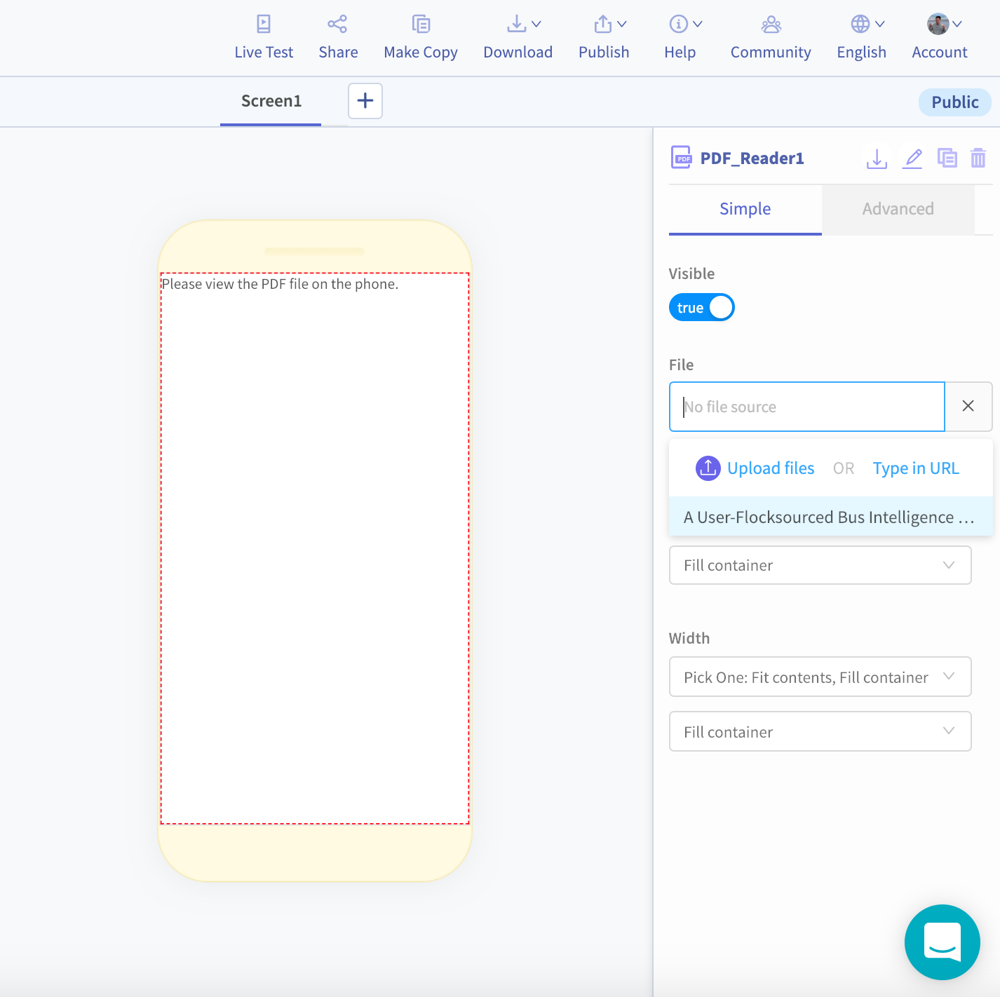

# PDF Reader

## PDF Reader Overview

Allow your users to view your favorite PDFs -- legal contracts, art posters or maybe even a PhD dissertation -- all from the convenience of your app

## Upload PDF

Simply upload your PDFs into the File property and voila!  


There is a limit of 50 MB per app so be careful or size down your larger PDFs if it may exceed this limit


Once you upload the PDF, you will be able to view it in your app and pinch to zoom in. 

## Properties

### Computed Height and Width 

### File 

### Visible

