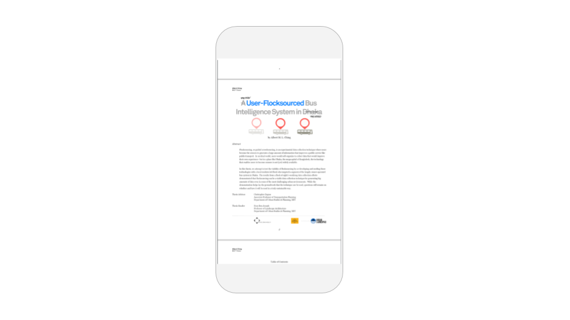

# PDF Reader

## PDF Reader Overview

* [Upload PDF](pdf-reader.md#upload-pdf)
* [Properties](pdf-reader.md#properties)

Allow your users to view your favorite PDFs -- legal contracts, art posters or maybe even a PhD dissertation -- all from the convenience of your app

## Display PDF

### Upload PDF

You can upload a PDF as an [Asset](assets.md) to your app and display it in the PDF Viewer.

### Use URL

You can enter a URL that points to a PDF on the web to display in your PDF. Make sure this URL ends in `.pdf`


There is a size limit of 50MB per app. For larger PDFs, either reduce the size of the file before uploading to your Thunkable project, or host your PDF online and use a URL that points to it in your app


Once you upload the PDF, you will be able to view it in your app and pinch to zoom in. 

## Edit size and position

You can drag and drop your component into position, and set its size.   
You can set exact values for the component's Height and Width, and X and Y coordinates, in its properties.

**Height:** Height of Button in pixels  
**Width:** Width of Button in pixels

**X:** position of top left corner of Button on X-axis  
**Y:** position of top right corner of component on Y-axis

## Properties

### Computed Height and Width 

### File 

### Visible

