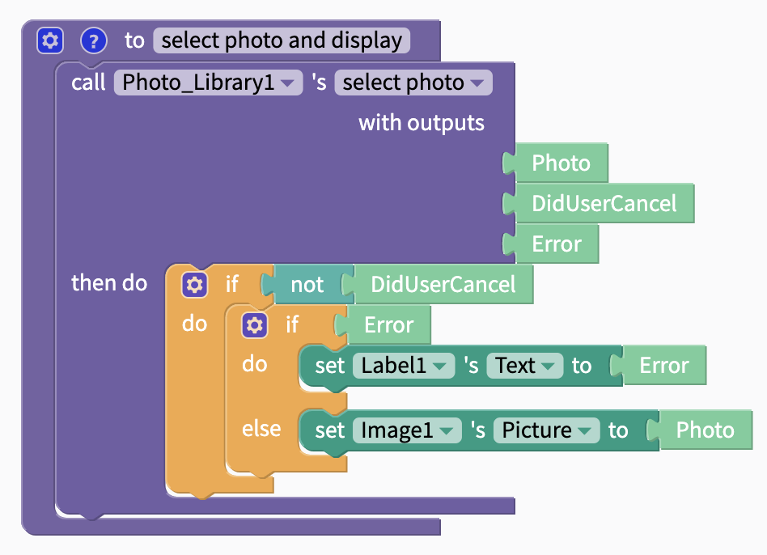

# Photo Library

## Blocks

### Select Photo

Opens the photo library and allows the user to select and upload a photo.

#### Outputs

| Name | Data Type | Data |
| :--- | :--- | :--- |
| Photo | Image | Image the user selected |
| DidUserCancel | True/False | If user cancelled action, returns `true`; else returns `false` |
| Error | Text | If error, returns error; else returns `null` |

