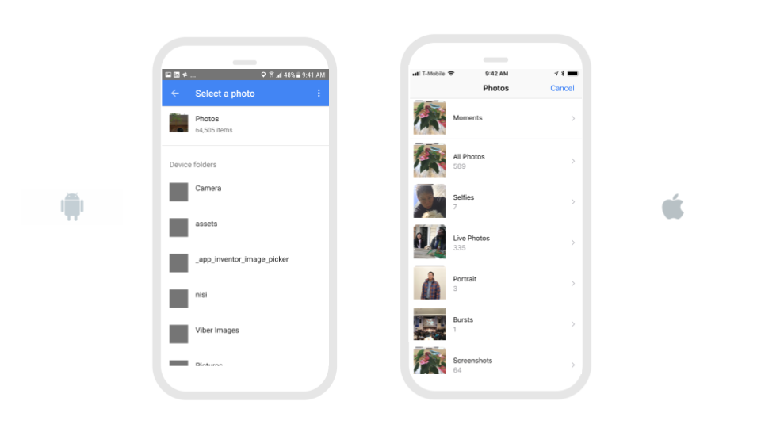

# Photo Library

* [Select Photo](photo-library.md#select-photo)

## Select Photo

* **Select Photo:** Opens the camera and saves the `Photo` after the user takes a picture.
  *  `DidUserCancel` is either 'true' or 'false' depending on whether or not the user cancelled selecting a photo.
  *  `Error` is the error message if there was an error in selecting the photo

