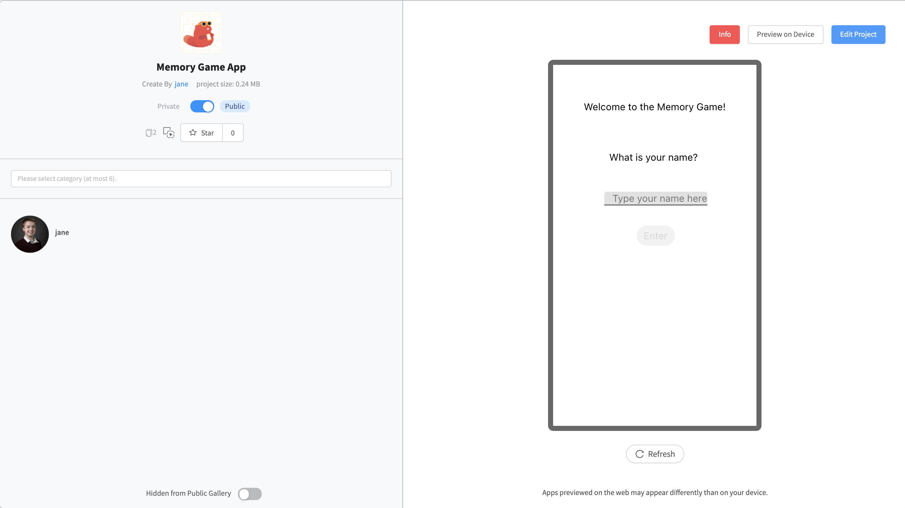

# 🆕 Create New Project

A project is a place where your designs, files and blocks come together to create Android and iOS apps. There are four different types of project in Thunkable.

1. [Public Projects](projects.md#public-projects)
2. [Private Projects](projects.md#private-projects)
3. [Read-Only Projects](projects.md#read-only-projects)
4. [Legacy Projects](projects.md#legacy-projects)

When you first sign in to Thunkable you will be prompted to create a project. To learn more about the maximum size your projects can be, please see our article about the [minimum requirements](assets.md#app-size-limits-50-mb-per-app) for apps.

### Other articles in this section







## Public Projects

Public projects are included in the [Thunkable Public Gallery](public-gallery.md) for anyone to preview, download or remix. If you create a public project, please know that it can be viewed by anyone in the Thunkable community. 

## Private Projects

Private projects are just that, private. They can only be seen by their app creator and do not get included in the [Thunkable Public Gallery.](public-gallery.md) Only Thunkable PRO users can create and share private projects. 

[Learn more about PRO.](https://thunkable.com/#/pricing)

## Making Projects Public or Private

To make your projects public or private, click the "details" button on a project. You can then click the Public/Private switch to change who can view your project.

You can also click on the gear icon on the upper left of the screen to access your [Project Settings](project-settings.md), and set your project to private from there.

## Read-Only projects

Private projects become Read-Only projects when a Thunker's [PRO membership](https://thunkable.com/#/pricing) expires. Read-Only projects remain private and are not included in the Thunkable Gallery.

You can only preview Read-Only. Once a project has been switched to Public, you cannot switch it back to Read-Only.

