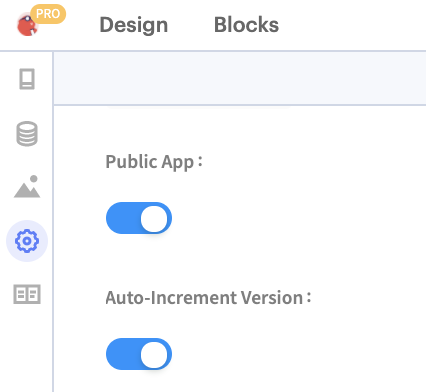
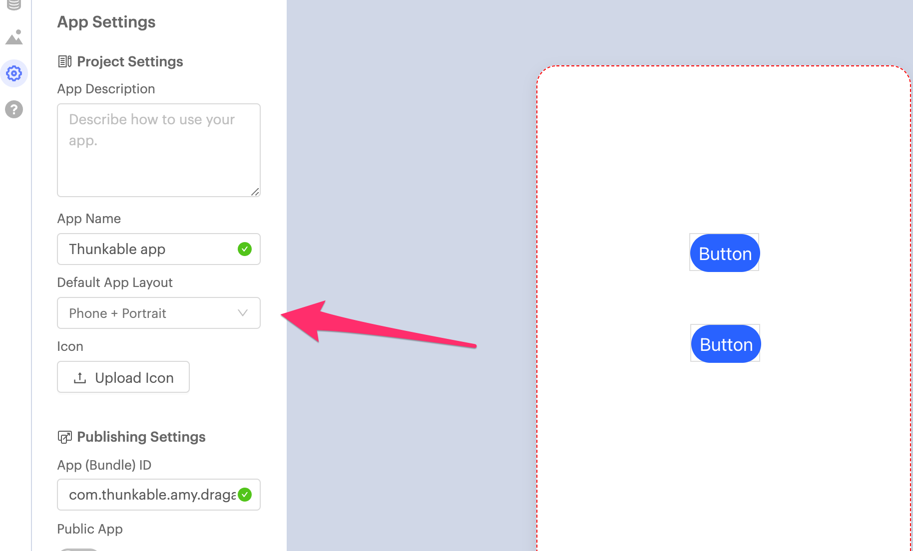

# 🆕 Create New Project

A project is a place where your designs, files and blocks come together to create Android and iOS apps. There are four different types of projects in Thunkable.

1. [Public Projects](projects.md#public-projects)
2. [Private Projects](projects.md#private-projects)
3. [Read-Only Projects](projects.md#read-only-projects)
4. [App layout and size](projects.md#undefined)

When you first sign in to Thunkable you will be prompted to create a project. To learn more about the maximum size your projects can be, please see our article about the [minimum requirements](assets.md#app-size-limits-50-mb-per-app) for apps.

## Public Projects

Public projects are included in the [Thunkable Public Gallery](broken-reference) for anyone to preview, download or remix. If you create a public project, please know that it can be viewed by anyone in the Thunkable community.&#x20;

## Private Projects

Private projects are just that, private. They can only be seen by their app creator and do not get included in the [Thunkable Public Gallery.](broken-reference) Only Thunkable Pro users can create and share private projects.&#x20;

[Learn more about Pro.](https://thunkable.com/#/pricing)

## Making Projects Public or Private

You can decide whether a project is public or private when you create it.&#x20;

<figure><figcaption></figcaption></figure>

You can also change the privacy setting of an existing app. Click the gear icon in the upper left to access your app's  [Project Settings](project-settings.md) and use the switch to change the app's privacy settings.

## Read-Only projects

Private projects become Read-Only projects when a Thunker's [Pro membership](https://thunkable.com/#/pricing) expires. Read-Only projects remain private and are not included in the Thunkable Gallery.

You can only preview Read-Only. Once a project has been switched to public, you cannot switch it back to Read-Only.

## App Layout and Size

By default, a Thunkable project is the size of a mobile phone in portrait mode. If you want to change this, you can do this by adjusting the default app layout in the Settings panel of your project. [Learn more about this here](project-settings.md#default-app-layout).


Please note that your layout will not automatically respond when you change your Default App Layout. Your existing components will not change size, and the distance between components will not change. We recommend setting your Default App Layout before you start adding components to your app.


