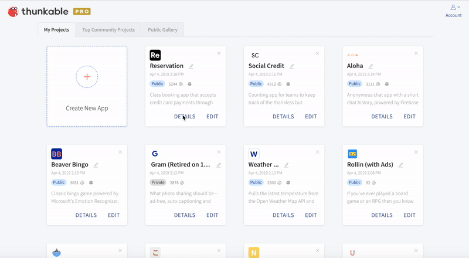
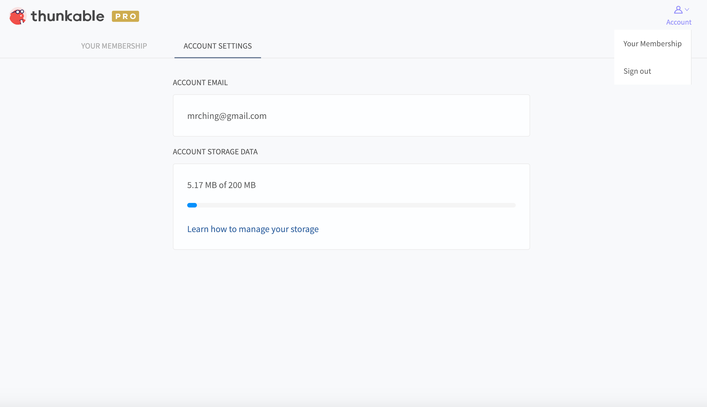

# Project Assets and Sizes

It's best to keep app sizes as small as possible to preserve space on people's devices. All app projects have a 50MB limit, and free Thunkable accounts have a 200 MB total storage limit. If you need more storage fo your account then you can [upgrade to PRO](https://x.thunkable.com/account/membership) to get 1 GB of space for your projects. 


Thunkable PRO subscribers get 1GB of storage and can create unlimited public and [private](./#private-projects) projects.

[Learn more about PRO.](https://thunkable.com/#/pricing)


## Minimum Requirements

| Element | Limit |
| :--- | :--- |
| App size | 50 MB for Free and [PRO](https://thunkable.com/#/pricing) accounts. |
| Account size limit | 200 MB for Free, 1 GB for [PRO](https://thunkable.com/#/pricing). |
| Screens | No fixed limit |
| Download | One app per phone for iOS; no limit for Android |
| Minimum Android version | 5.0 \(21\) Lollipop |
| Minimum iOS version | 10.0 |

You can view a project's app size on the project's details page:

The main contributor to an app's size are files \(also known as assets\). To add or delete files, click on the Assets button in the side bar. Then click the "+" icon to manage all the files in your project. 

## Account storage limits \(200MB per account\)

You can view your total account storage size in your account settings.

If you are near the limit, you may be able to create additional storage by removing projects that you no longer need like an old version or copy of a project. We may add the option for you to purchase additional storage in the future.

 

