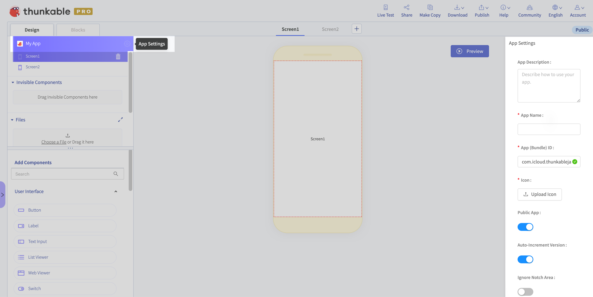

# Project Settings

To view or change your project settings, click on the ⚙ icon next to your Project name in the left-hand side bar. Your App Settings will appear on the right-hand side of the screen.

## App Description 

This is a description of your app and how you intend it to be used. It is not necessary to fill this out in Thunkable. If you [publish](https://docs.thunkable.com/v/drag-and-drop/publish) your app you will need to enter this information, whether on Thunkable or the App Store or Play Store.

## App Name 

To put it simply, your "app name" is the name of your app. This is the name that will be displayed on the Google Play Store or App Store, and that users see when they install your app on their device. This name is also used to set the page title when you publish as a [web app](https://docs.thunkable.com/v/drag-and-drop/publish-as-a-web-app-pro).

### Best Practises 

Since space is limited, we recommend a **short one or two word** app name

Avoid using the character "&" in your app name: at the moment, it prevents your app from being installed on your device

### **Project Name**  

This is not your app name! This is just the name of your project on Thunkable. When you create a new project, you will be prompted to write in a project name. You can change this name at anytime from your [Projects Page](settings.md#app-name).

## App \(Bundle\) ID 

A unique identifier for your app on the [App Store](https://docs.thunkable.com/v/drag-and-drop/publish-to-app-store-ios#register-an-app-id-on-app-store-connect) or [Play Store](https://docs.thunkable.com/v/drag-and-drop/publish-to-play-store-android#the-package-name).

This should follow a pattern like `com.domain.creatorname.appname`

Make sure none of the segments of this package name begins with a number. Make sure none of the letters in this package name has an accent \(e vs ë\).

## Icon 

Your app icon is the picture that represents your app on your mobile device. This icon will also appear on your listing in the Google Play Store or App Store, and as your project icon on Thunkable.

Thunkable PRO users can remove the Thunkable branding from their app splash screen by changing the app icon.

​[Learn more about PRO.](https://thunkable.com/#/pricing)​

Please make sure that the file you upload does not have the same name as another asset that you are using for your app. This will cause an error.

### Best Practises  

| **Property** | Setting |
| :--- | :--- |
| Size | 192 x 192 px \(minimum\) |
| Shape | Square \(equal height and width\) |
| File Type | Preferably .png \(vs. jpg or other file types\) |

For publishing to the iOS [App Store](https://docs.thunkable.com/v/drag-and-drop/publish-to-app-store-ios#upload-an-icon-and-enter-your-build-number-and-version-number), you will also need an app icon that does not have any transparency or it may cause an error.

For publishing your app to the Play and App stores, you will need to create a separate icon with a higher resolution. For [Google Play](https://developer.android.com/google-play/resources/icon-design-specifications#creating_assets), the current requirement is 500 x 500 px. For the [App Store](https://developer.apple.com/design/human-interface-guidelines/ios/icons-and-images/app-icon#app-icon-sizes), it's 1024 x 1024 px.

## Public/Private App 

PRO Thunkable users have the option to set their app to Private. A private app will not be displayed in the Thunkable Public Gallery. [Learn more about Thunkable PRO here.](https://thunkable.com/#/pricing)​

## Auto-increment Version 

When you publish to the [App Store](https://docs.thunkable.com/v/drag-and-drop/publish-to-app-store-ios) or the [Play Store](https://docs.thunkable.com/v/drag-and-drop/publish-to-play-store-android), you will need to increment \(increase\) your version number each time. If this switch is set to `true,` Thunkable will automatically increment your project's version number each time you publish your app \(iOS\) or download your app \(Android\).

## AdMob Settings

### iOS App ID

Enter the AdMob app ID for your iOS app. [More info from AdMob here.](https://support.google.com/admob/answer/7356431?hl=en)

### Android App ID

Enter the AdMob app ID for your Android app. [More info from AdMob here.](https://support.google.com/admob/answer/7356431?hl=en)

### Tracking Usage Description \(iOS only\)

Enter a string to explain to the user that a personal advertising identifier may be used to show them ads relevant to their online activity. Read more about [tracking permissions for AdMob on iOS](../admob.md#ios-and-admob-permissions).

Default Value: "This identifier will be used to deliver personalized ads to you."

## Android 

### Version Name 

Set a [version name](https://docs.thunkable.com/v/drag-and-drop/publish-to-play-store-android#build-and-version-number) for this version of your Android app.

### Version Code 

Set a [version code](https://docs.thunkable.com/v/drag-and-drop/publish-to-play-store-android#build-and-version-number) for this version of your Android app.

### Keystore 

Import and export an Android Keystore to/from your app. Learn more about the Android Keystore [here](https://docs.thunkable.com/v/drag-and-drop/publish-to-play-store-android#the-keystore-private-key).

## iOS 

### Ignore Notch Area 

This property enables you to remove the Safe Area View which Thunkable adds to the app automatically. If you set this property to be `true`, the screen background color will extend to full screen and there won’t be any white area. However, you need to manually take care of the notch in your app design, like adding extra space, in order to avoid the app element being blocked by the notch.

### Notch Area Background Color 

This property enables you to set the safe area view color. With this, you can customize the background color of the _white area_. Please note, this is an app level setting and you won’t be able to customize the color at the screen level.

### Version Number 

Set a [version number](https://docs.thunkable.com/v/drag-and-drop/publish-to-app-store-ios#set-a-version-number) for this version of your iOS app.

### iOS Permissions 

When you add components that require permissions to your app, like the camera, you will need to add **purpose** **strings** to your app if you want to publish it to the App Store.

You will be able to add purpose strings for any component you have added which explicitly requires a purpose string.

## API Keys 

If you use blocks for [Translating](https://docs.thunkable.com/v/drag-and-drop/speech#translation), [Image Recognition](https://docs.thunkable.com/v/drag-and-drop/camera#image-recognition) or [Uploading media to the cloud](https://docs.thunkable.com/v/drag-and-drop/camera#upload-image-to-the-cloud), or use a Firebase database to support your [cloud variables](https://docs.thunkable.com/v/drag-and-drop/variables#cloud-variables) or [Signing In](https://docs.thunkable.com/v/drag-and-drop/sign-in-1), you can enter personal API keys for these components in the project settings.

