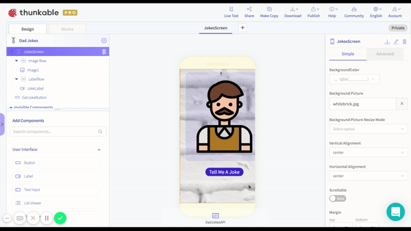
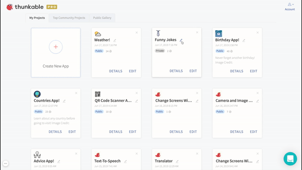
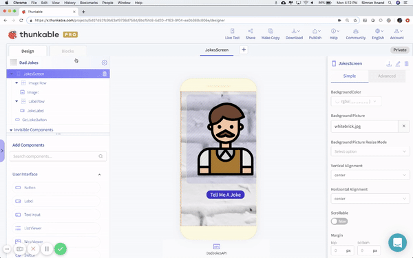

# Change Project Settings

## Here are three important settings you need to know:

### App Name

To put it simply, your "app name" is the name of your app. This is the name that will be displayed on the Google Play Store or App Store. To create an app name, click on the name of your project on the upper left hand side. Next, write in your app name where it says "App Name". 

### **Project Name** 

This is not your app name! This is just the name of your project on Thunkable. When you create a new project, you will be prompted to write in a project name. You can change this name at anytime by clicking on the edit icon next to your project name.

### **Changing the App Icon and Removing the Thunkable Branding Screen**

Your app icon is the picture that represents your app on your mobile device. This icon will also appear on your listing in the Google Play Store or App Store, and as your project icon on Thunkable.


Thunkable PRO users can remove the Thunkable branding from their app splash screen by changing the app icon.

[Learn more about PRO.](https://thunkable.com/#/pricing)


To upload an app icon, click on your app's project name on the upper left hand side, and then click the upload button in the icon section. Please make sure that the file you upload does not have the same name as another asset that you are using for your app. This will cause an error.


Avoid using the character "&" in your app name; at the moment, it prevents your app from being installed on your device


## Best Practices

| App Icon | App Name |
| :--- | :--- |
| **192 x 192 px \(minimum\)**; square \(equal height and width\) and preferably .png \(vs. jpg\). For publishing to the iOS App Store, you will also need an app icon that does not have any transparency or it may cause an error. | Since space is limited, we recommend a **short one or two word** app name |

## Publishing Your App -- High Resolution Images


For publishing your app to the Play and App stores, you will need to create a separate icon with a higher resolution. For [Google Play](https://developer.android.com/google-play/resources/icon-design-specifications#creating_assets), the current requirement is 500 x 500 px. For the [App Store](https://developer.apple.com/design/human-interface-guidelines/ios/icons-and-images/app-icon#app-icon-sizes), it's 1024 x 1024 px.


