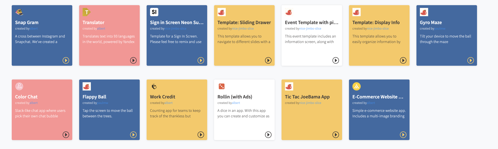

# Public Gallery of Projects

## Thunkable Public Gallery

The Thunkable Gallery is an app building marketplace where users can find, share and remix existing projects. By default, all public projects built on Thunkable are sent to the Public Gallery.

## How to use the Thunkable Gallery

When browsing the Gallery, here are three things that you can do with public projects:

1. **View a Project** Click to open any project on the Public Gallery to view an app's design or programming blocks.

**2. Preview a Project**  
After downloading the [Thunkable Live mobile app](live-test.md), you can use the app to preview any public project directly on your mobile device. 

**3. Remix a Project**  
All projects on the Public Gallery can be remixed. This means that you can customize any app project that you see. 

