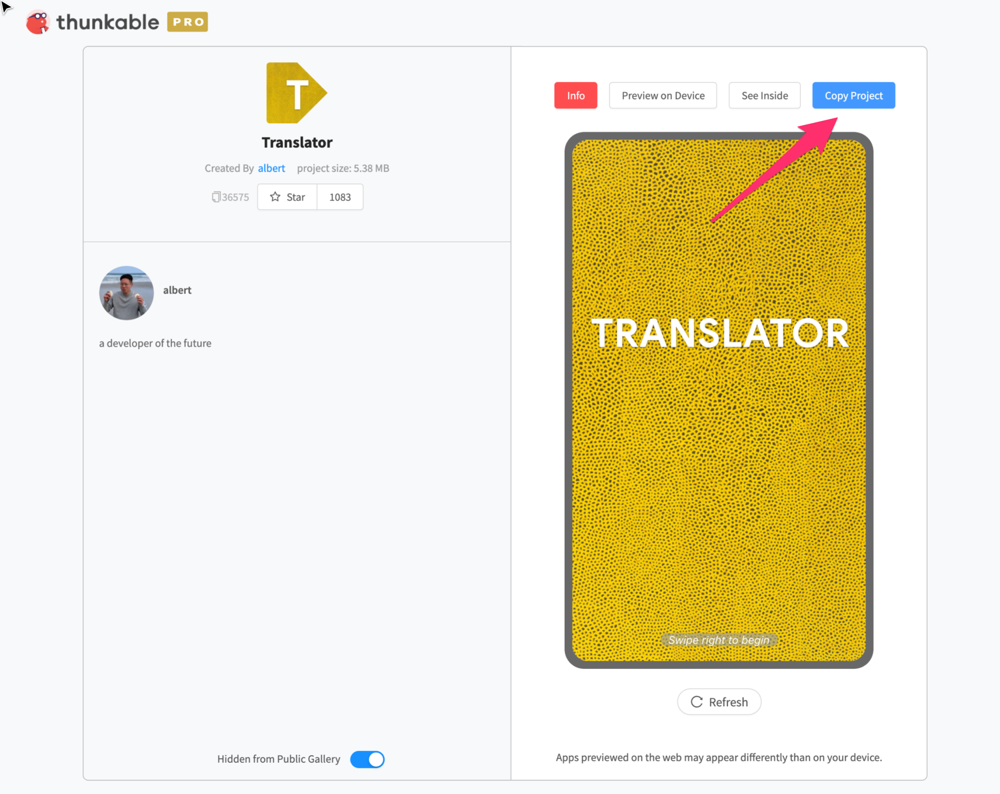

# Template Gallery

The Thunkable Template Gallery is your best way to get started. Find an app that you similar to one you want to build and remix it to start building.


Note that all **Template Gallery** only contains projects using the older _Snap to Place_ interface. We are actively working on updating the templates with Drag and Drop projects.


## How to use the Template Gallery

When browsing the Gallery, here are three things that you can do with a template:

1. **View a Project** Click to open any project on the Public Gallery to view an app's design or programming blocks.

**2. Preview a Project**  
After downloading the [Thunkable Live mobile app](live-test.md), you can use the app to preview any public project directly on your mobile device. 

**3. Remix a Project**  
All projects on the Public Gallery can be copied and remixed. This means that you can customize any app project that you see. 

