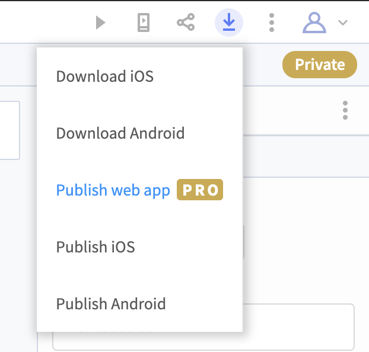
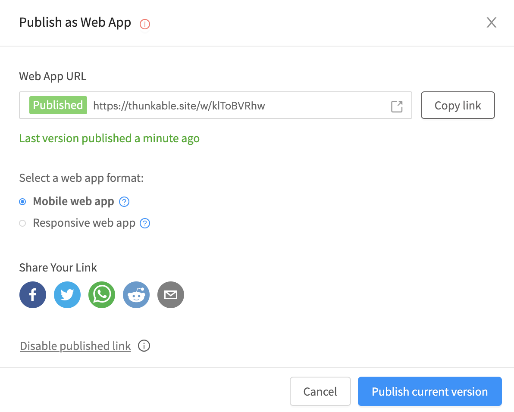

# Publish as a Web App (PRO)

Publishing as a Web App is currently the fastest way to publish your Thunkable app. This means that you can get user feedback in minutes instead of hours or days. One major advantage to publishing on the internet is that you don't need to pay additional fees to an app market place.&#x20;


The "Publish as a Web App" component is a feature just for Thunkable creators with active PRO subscriptions. To upgrade your subscription please visit your [membership page](https://x.thunkable.com/account/membership). If you cancel your PRO membership, your app will be unpublished once your PRO membership expires.


## Mobile Web App

Mobile web apps are best experienced by opening the link directly on your phone. To make your mobile app feel more like a native app you can add it to the [home screen](https://intercom.help/thunkable/en/articles/3828958-add-to-home-screen) directly from your mobile web browser.

If you preview a mobile web app on a desktop or laptop computer you will see a phone frame around the app. This is to give you a rough idea of its final proportions, but ultimately this will vary from device to device depending on factors such as screen size, aspect ratio, and pixel density.

To get an app that can respond to devices of any size, consider publishing as a [Responsive Web App](publish-as-a-web-app-pro.md#responsive-web-app).

## Responsive Web App

Publishing your app as a responsive web app means that it will scale according to the size of the device that it is being opened on.&#x20;

If your app in designed only to be run on phones, consider publishing as a [Mobile Web App](publish-as-a-web-app-pro.md#mobile-web-app).

## Demo

Here's a 3 minute overview of how "Publish as a Web App" works.



## How to Publish

Start by clicking on the Publish menu and choose the "Publish as Web App (PRO)" option at the bottom of the drop down menu

The first time you publish a new project you will have to click on the blue `Get link and publish` button.

In the next modal you can:

* open the app in a new tab
* copy the app link
* select whether to publish as a [**Mobile web app**](publish-as-a-web-app-pro.md#mobile-web-app) or a [**Responsive web app**](publish-as-a-web-app-pro.md#responsive-web-app)****
* share your app through popular channels like Facebook, Twitter and Reddit&#x20;
* **unpublish** your app by clicking on `Disable published link` text

.png>)

🎉 Congratulations - your Thunkable project is now live on the internet a published web app.

## Updating your App

Each time you press publish it’s similar to creating a new release of your app in one of stores. This means you can make changes and updates to your  without worrying about users seeing a half-finished new feature that you’re still working on.

When you’re ready to release a new version, choose “Publish as a Web App” then click the blue “Publish current version” to update your app. The URL will remain the same, but the project that it links to will be updated.

## Embed your app in a webpage

If you host a webpage, you can embed your Thunkable web app in an iframe using the syntax

`<iframe src="https://thunkable.site/w/K0XDxMqwl" title="Chop Down the Tree Thunkable App" height = 1000 width = 500></iframe>`

You can read more about iframes [here](https://www.w3schools.com/tags/tag\_iframe.ASP).

## Unsupported Components&#x20;

Not all components are supported on the web at this time so please see the list below of components that are not supported. Please note that some are **`Supported but may not work as expected`**so may not work consistently on every device. Others, such as AdMob **`Can not be supported`**but may be replaced by an alternative in the future. While other are  **`Not supported yet`** but may be made available in future updates.

| Component                | Category       | Status                                                                                               |
| ------------------------ | -------------- | ---------------------------------------------------------------------------------------------------- |
| **Accelerometer**        | Sensors        | **`Supported but may not work as expected`**                                                         |
| **AdMob**                | Monetization   | **`Can not be supported`**                                                                           |
| **Assistant**            | Voice          | **`Not supported yet`**                                                                              |
| **Barcode Scanner**      | Image          | **`Not supported yet`**                                                                              |
| **Bluetooth Low Energy** | Sensors        | **`Not supported yet`**                                                                              |
| **Gyroscope**            | Sensors        | **`Supported but may not work as expected`**                                                         |
| **Local Storage**        | Data           | **`Not supported yet -`**[**`stored variables`**](variables.md#stored-variables)**` are supported`** |
| **Magnetometer**         | Sensors        | **`Supported but may not work as expected`**                                                         |
| **Map**                  | Location       | **`Not supported yet`**                                                                              |
| **Photo Library**        | Image          | **`Not supported yet`**                                                                              |
| **Push Notification**    | Social         | **`Not supported yet`**                                                                              |
| **Share**                | Social         | **`Email and Phone work, other blocks not supported yet`**                                           |
| **Speech Recognizer**    | Voice          | **`Not supported yet`**                                                                              |
| **Web Viewer**           | User Interface | **`BACK block not supported yet, some Google sites not supported`**                                  |
