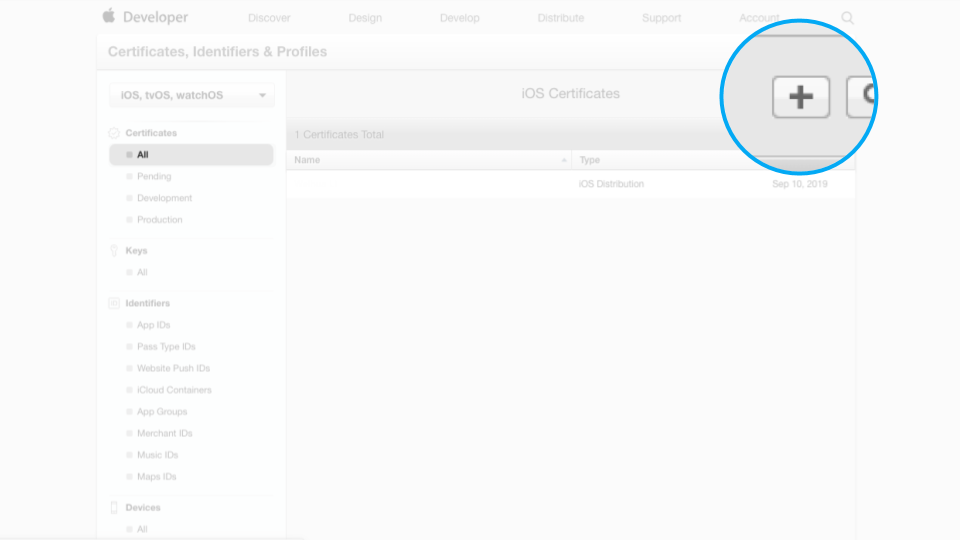
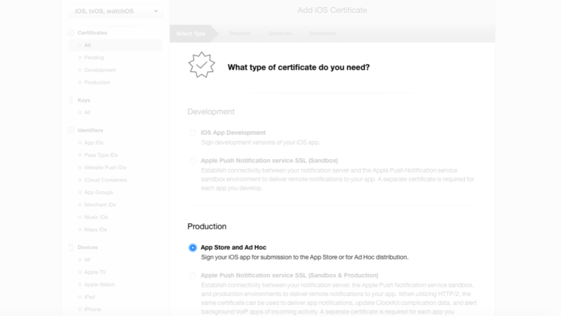
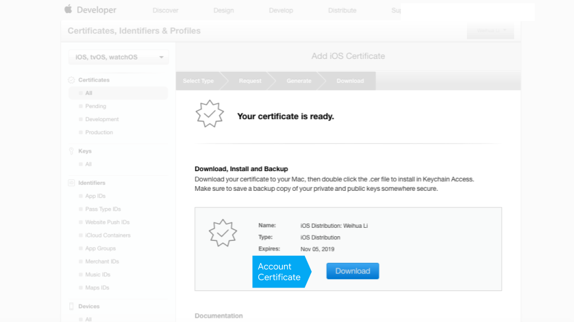
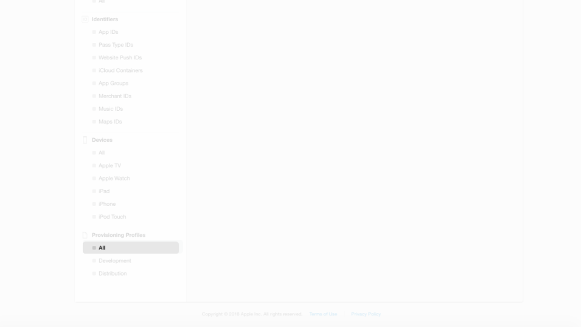
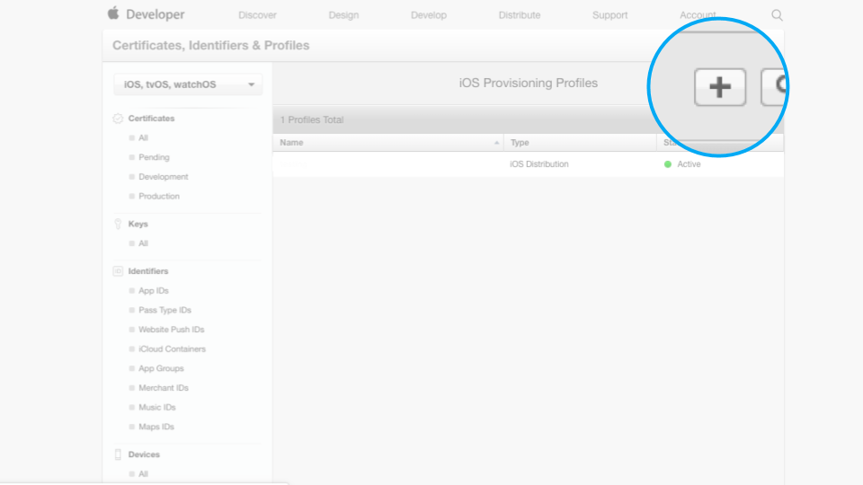
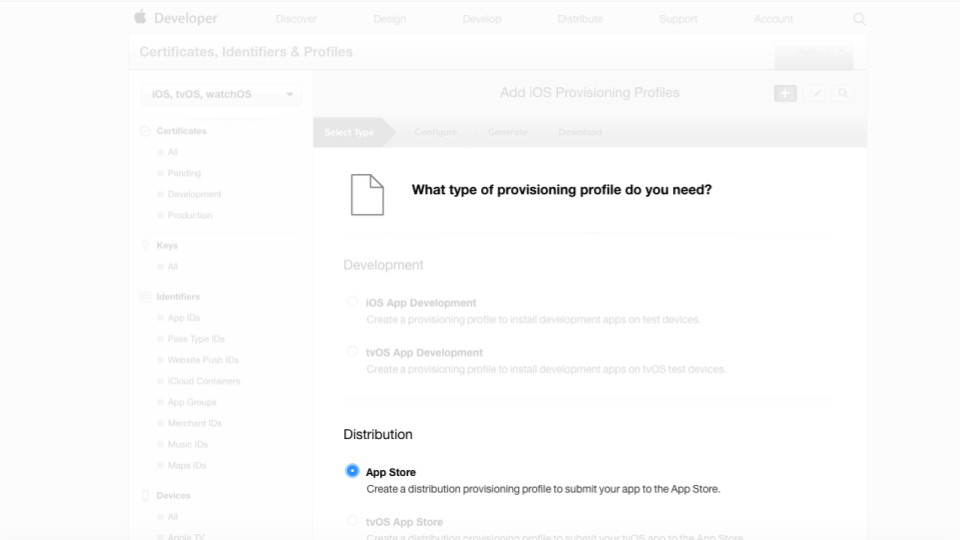
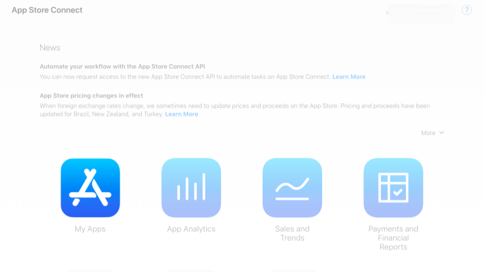
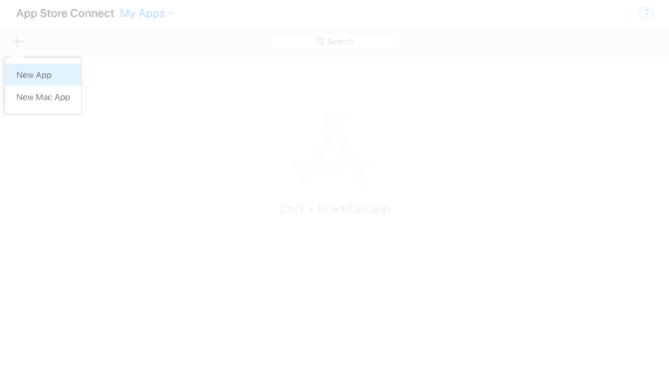
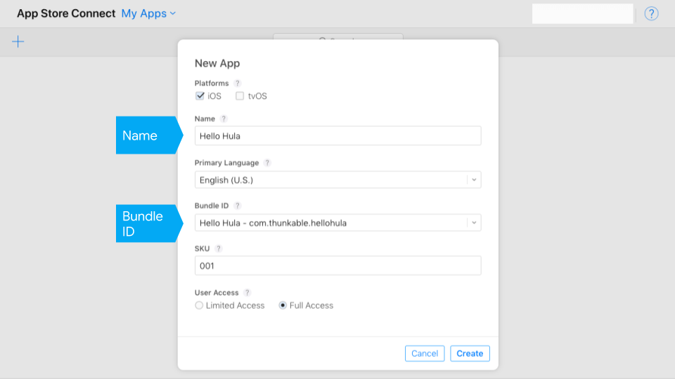
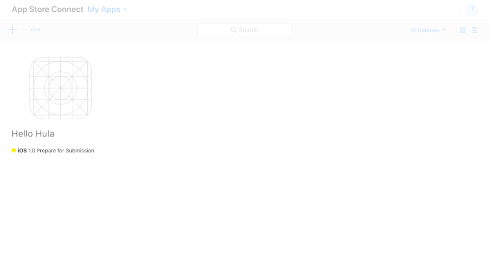

# Publish to App Store \(iOS\)

Publishing your app to the App Store can be a rewarding process.

Apple requires a lot information for apps that are available in their App Store. As a result, the publishing process can feel long and will require at least 20 minutes to complete the necessary steps, which currently requires information from 4 different Apple websites.

Thunkable is continually looking for ways to streamline the publishing process and has made it possible for creators to publish from a non-Mac computer, which is normally required from the standard publishing process.

* [Minimum requirements](publish-to-app-store-ios.md#minimum-requirements)
* [Register your app](publish-to-app-store-ios.md#register-your-app)
* [Two-factor authentication](publish-to-app-store-ios.md#two-factor-authentication)
* [App Store Connect](publish-to-app-store-ios.md#app-store-connect)
* [App info](publish-to-app-store-ios.md#app-info)
* [Troubleshooting](publish-to-app-store-ios.md#troubleshooting)
* [Submit your app for review](publish-to-app-store-ios.md#submit-your-app-for-review)
* [Adding Push Notifications](publish-to-app-store-ios.md#adding-push-notifications)

## Minimum requirements


Apple holds a high standard for apps that are approved for distribution in the App Store so please [review Apple's policies and guidelines](https://developer.apple.com/app-store/review/guidelines/) to make sure your app is in compliance before you sign up for the Apple Developer Program


* Apple Developer Program membership \($100/year\). Don't have one? [**Sign up here**](https://developer.apple.com/programs/).

## Register your app

**Go to the** [**Apple Developer website**](https://developer.apple.com/account/ios/identifier/bundle/create) _\*\*_\(Certificates, Identifiers and Profiles\)

After login, the first thing you want to do is navigate to the App IDs section and register a new App ID.

When you register an App ID, you'll have to pick an app `Name`. The app Name must be unique to the App Store and is what appears next to the app icon when it is downloaded on a user's phone.

Apple will automatically create a `Team ID`. The `Team ID` is your unique account identifier that is linked to your Apple Developer Program membership.

You will then create a `Bundle ID` which is unique to your app but not visible to your app users. If you plan on publishing multiple apps, we suggest you create a Wildcard App ID. Otherwise, a single Explicit App ID should work.

Apple recommends reversing your domain name to create your bundle ID i.e. com.{yourdomain}.{appname} to avoid conflicts with other apps.

## Two-factor authentication

Two-factor authentication helps to keep your account secure and Apple is making it mandatory for new developers to turn two-factor authentication on.

If you do have it turned on, you'll need to complete a few more steps to confirm your identity with Apple.

### Generate and upload an account certificate

First download the Certificate Signing Request \(CSR\) file. You'l need this file to generate an account certificate.

**Go to the** [**Apple Developer website**](https://developer.apple.com/account/ios/identifier/bundle/create) _\*\*_\(Certificates, Identifiers and Profiles\)


You may already have an account certificate in your account. You can only have two certificates per account so you may need to revoke a certificate before you can create a new one.


### Generate and upload an app provisioning profile

**Go to the** [**Apple Developer website**](https://developer.apple.com/account/ios/identifier/bundle/create) _\*\*_\(Certificates, Identifiers and Profiles\)

Provisioning profiles are required by Apple to install an app on a device.

### Generate an app-specific password

#### Go to the [Apple ID account website](https://appleid.apple.com/#!&page=signin)

Apple requires app-specific passwords to sign-in securely from Thunkable.

## App Store Connect  

### Create a new app

#### Go to the [App Store Connect website](https://appstoreconnect.apple.com/login)

App Store Connect is your portal for managing your submission to the App Store.

## App info

#### You're almost there.

### Upload an app icon

This app icon appears when a user downloads your app from the App Store. Our recommended size is 192 x 192 px.

### Set a build and version number

The version number is visible to your users when they download a new version of your app. The build number needs to increase with each version and is only visible to you. You can opt to let Thunkable automatically increment your build and version numbers.

### Permissions

Apple requires that you explain to users why you may need access to a sensitive services like a camera, photo library and microphone. You can add these explanations in the App Settings panel.

## **Send to App Store Connect**

You should receive an email from Apple that says your app is ready in the App Store Connect website. **This may take up to an hour.**

If your app is submitted successfully, it should appear under the Testflight tab in your App Store Connect dashboard. Testflight is a tool from Apple that allows you to test your app before it is submitted for release in the App Store.

\(If there are any issues, you’ll get an email from us telling you what you’ll need to fix.\)

## Troubleshooting

**You do not see your app uploaded to App Store Connect**

* Download. One way to check if your app is build-able is to download it to your phone first. Two common download errors are:
  * You uploaded an icon that has the same name as an existing asset that you have uploaded
  * Your app icon is not an image file
* Icons. Apple additionally does not allow you to have any icons with any transparent colors. We recommend app icons to be 192 x 192 px
* Membership. To publish to the App Store, you'll need to sign up for [Apple Developer Program Membership](https://developer.apple.com/programs/). This currently costs $99 / year.
* App Store Connect. Make sure to [follow this step](publish.md#step-③--create-a-new-app-in-itunes-connect) on creating a new app on iTunes Connect
* Certificates. If you have an existing Apple Developer Program account with 2 iOS certificates, you'll have to revoke one. Apple only allows developers to have 2 iOS certificates at a time and Thunkable creates one when it publishes to your account
* Provisioning profile. After you revoke your certificate, it is possible that one or more of your provisioning profiles will become inactive.  To publish successfully, you'll also need to delete any inactive provisioning profiles
* Two-factor authentication. You must turn off two-factor authentication for your Apple Developer ID to publish with Thunkable. Please [click here](https://community.thunkable.com/t/important-two-factor-authentication-publishing-to-ios-app-store-on-thunkable-cross-platform/42504) to see our recommendations for turning off two-factor authentication 
* Login. Apple ID or password were entered incorrectly.  Since we don't store either one, there's no easy way for us to check so enter it slowly
* Apple ID and privacy terms. You must accept Apple's new Apple ID and privacy terms.

## Submit your app for review

Congrats. You're so close.

There are three main steps that are required before you can submit your app for review. To complete the steps, you will need:

* Design assets
  * Icon \(1024 x 1024 px\)
  * iPhone and iPad screenshots
* Privacy policy url for all apps

### App information

The App Information section is straightforward but does include a privacy policy url, which is required for all apps

### Pricing and availability

### Design assets

The final section requires screenshots for both iPhone and iPad and a high resolution icon \(1024 x 1024 px\)


Thunkable automatically submits your app for both iPhone and iPad so you'll have to submit screenshots for both iPhone and iPad. _\*\*_ There is currently no way to specify the device type. For generating screenshots, we recommend a tool [like this](https://shotbot.io/?utm_source=makeappicon&utm_medium=web&utm_campaign=makeappicon)

The high resolution icon will be featured in the App Store listing and must be 1024 x 1024 px with no transparency. To generate this icon, we recommend a tool [like this](https://makeappicon.com/)


You'll also need to select the build version that you want to submit.

### Export compliance


You may need to answer a question about **export compliance**. You can select 'no' when asked if you app uses encryption since apps made on Thunkable for iOS do not at the moment.


### Advertising identifier


After submitting your app for review, you may asked, "Does this app use the Advertising Identifier \(IDFA\)?"

The app will still be able to be published but you will want to **check** **the following three boxes**:

* Attribute this app installation to a previously served advertisement”
* “Attribute an action taken within this app to a previously served advertisement”
* “I, YOUR\_NAME, confirm that this app, and any third party…”

Note, you should _not_ check the box labeled “Serve advertisements within the app”.


## Adding Push Notifications

If you are adding Push Notifications to an app that is already published, you will need to create a new **.mobileprovision** file. Here's a quick overview of what that process looks like.

Click on _Provisioning Profiles &gt; All_ to see your current iOS provisioning profiles. Notice that the app you just created is now **invalid** so we need to generate a new one.

Open the inactive profile and click on **Edit** to generate a new one.

Scroll to the bottom of the page and click **Generate.**

On the next screen, click the **Download** button and the .mobileprovision file will be saved to your downloads folder.

 

