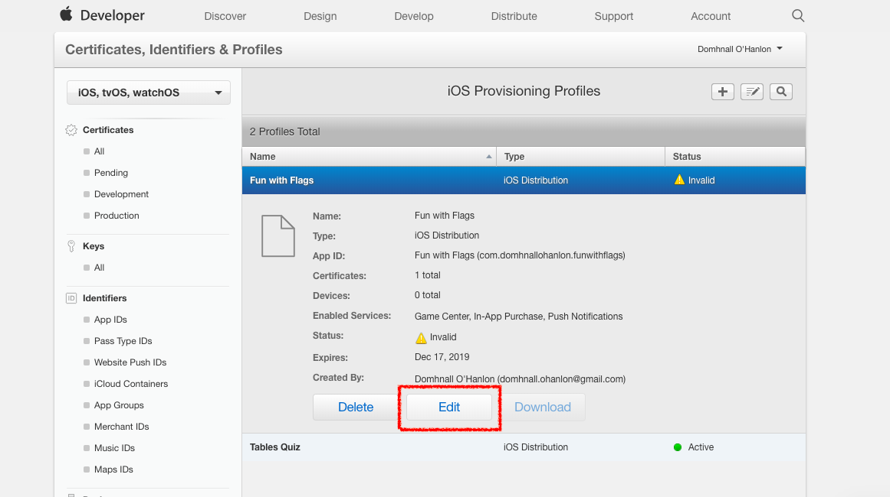

# Publish to the App Store (iOS)

Publishing your app to the App Store can be a rewarding process.

Apple requires a lot information for apps that are available in their App Store. As a result, the publishing process can feel long and will require at least 20 minutes to complete the necessary steps on the Thunkable website, which currently requires information from 4 different Apple websites. We recommend completing the [Prepare for Submission](./#prepare-for-submission) steps before starting the publishing process in Thunkable.

Thunkable is continually looking for ways to streamline the publishing process and has made it possible for creators to publish from a non-Mac computer, which is normally required by the standard publishing process.

In this document, the version of your app that you submit to the App Store is referred to as a **build**.


Apple holds a high standard for apps that are approved for distribution in the App Store so please [review Apple's policies and guidelines](https://developer.apple.com/app-store/review/guidelines/) to make sure your app is in compliance before you sign up for the Apple Developer Program


Steps to publishing to the Apple App Store:

1. [Prepare for Submission](./#prepare-for-submission)
2. [Send a build to App Store Connect](./#send-a-build-to-app-store-connect)
3. [Next Steps - App Store Connect](./#next-steps-app-store-connect)

## Prepare for Submission

1. [Create an Apple Developer Account](./#create-an-apple-developer-account)
2. [Set a Version Number](./#set-a-version-number)
3. [Review Your App Permissions](./#review-your-app-permissions)
4. [Create an App-Specific Password](./#create-an-app-specific-password)
5. [Register an App ID on App Store Connect](./#register-an-app-id-on-app-store-connect)
6. [Create an App Listing on App Store Connect](./#create-an-app-listing-on-app-store-connect)

### Create an Apple Developer Account

You need an Apple Developer Account to publish an app to the App Store. To get a Developer Account you must enroll in the [Apple Developer Program](https://developer.apple.com/programs/). Enrollment is approximately $99 USD (or in local currency where available) per membership year.


Certain educational institutions qualify for free Apple developer accounts. To check if your school or university if eligible, please see here: [iOS Developer University Program](https://developer.apple.com/programs/ios/university/).


### Set a Version Number

1. Open your Thunkable project.
2. Navigate to the **Design tab**.
3. Click the **Settings** gear icon in the sidebar.
4. Under the iOS header, set your app's **Version Number**.&#x20;
   * If this is your first time sending this app to App Store Connect, set the version number to 1.&#x20;
   * You need to increment your version number, or increase it by 1, every time you submit a build to App Store Connect.

### Review your App Permissions

#### iOS Permissions

Apple requires that you explain to users why you need access to sensitive services like the device's camera, photo library, and microphone.&#x20;

To add these explanations:

1. Open your Thunkable project.
2. Navigate to the **Design tab**.
3. Click the **Settings** gear icon in the sidebar.
4. Under the **iOS Permissions** heading, add your explanations. (Note: This section is only visible if your project utilizes these features.)

#### **Tracking Usage Description**

If your app utilizes one of the following features, you must provide user tracking usage details (UTUD):

* AdMob
* Location Sensor
* Push Notifications
* Web Viewer&#x20;

These features share trackable data with third parties, and you must tell your users what data is being shared and why. If you don't provide this and your app engages in tracking, Apple will reject your submission and ask you to resubmit with an appropriate tracking string.&#x20;

The field should be left blank if:

* You do not use one of the features listed above (i.e. no trackable data is shared with third parties).
* Your app contains a Web Viewer component that only accesses a local HTML file.

To learn more about what to say in your Tracking Usage Description, see here: [What should I say in my Tracking Usage Description?](https://intercom.help/thunkable/en/articles/5945318-nsusertrackingusagedescription-messages#h\_6f57296c21)

There are two locations where you can set your Tracking Usage Description:

1. **Project Settings**\
   
2.  **Publishing Wizard**\
    We'll explore the iOS publishing wizard in more detail in future steps. \

    

    <figure><figcaption></figcaption></figure>

    

### Create an app-specific password

If a developer uses a third-party platform like Thunkable to send an app build to App Store Connect, the developer must create an app-specific password.&#x20;

You only need one app-specific password for Thunkable to send any build to App Store Connect on your behalf.

You do not need separate app-specific passwords for separate Thunkable projects.&#x20;


You will need your app-specific password to send each new build to your App Store listing in the future, so make sure to record it securely.


#### Generate an app-specific password

1. Navigate to the [Apple ID account website](https://appleid.apple.com/#!\&page=signin).
2. Enter the **email address** and **password** associated with your Apple ID.
3. If prompted, enter your **two-factor** **authentication code**.
4.  On the **Sign-In and Security** page, select **App-specific passwords**.\

    

    

    

5. Click **Generate an app-specific password** if this is your first time creating an app-specific password or the **plus icon** if you've created an app-specific password previously.&#x20;
6.  Give your app-specific password a meaningful name so you can recognize it later. \

    
    Remember:

    * You can use the same app-specific password for all of your Thunkable projects.
    * Creating a new one every time you publish a new project is unnecessary and not recommended. &#x20;
    * Creating a new one when you want to update an existing project is unnecessary and not recommended. &#x20;
    
7.  Your app-specific password is provided. You cannot retrieve this password once you close this modal, so make sure you save it somewhere safe.\

    
    You cannot retrieve this password once you close this modal, so save it somewhere safe.
    
8. Click **Done**.

#### Change an app-specific password

Any time you change or reset your primary Apple ID password, all of your app-specific passwords are revoked automatically to protect the security of your account. You need to generate new app-specific passwords for any apps that you want to continue using.\
\
To manually revoke an app-specific password:

1. Sign in to [appleid.apple.com](https://appleid.apple.com/account/home).
2. In the **Sign-In and Security** section, select **App-Specific Passwords**.
3. Select the **Remove** button next to a password you want to delete, or **Revoke All**.

After you revoke a password, the app using that password will be signed out of your account until you generate a new password and sign in again.

### Register an App ID on App Store Connect

Every app published on the App Store must have a unique name. For example, there can only ever be one app called `Thunkable Sample App`.  You can register your App ID to reserve the name you want.

To register an App ID:

1. Open your [Apple Developer account page](https://developer.apple.com/account).&#x20;
2. Under the **Certificates, IDs & Profiles** heading, select **Identifiers**.
3. Click the blue **+** icon to add a new identifier to your account.
4. Choose **App IDs** from the list of options.
5. Click **Continue**.
6. Select **App**.
7. Click **Continue**.
8. On the **Register an App ID** screen, complete or take note of the following fields:
   1. **Description** - This is the name you want to give your app. It appears next to the app icon when downloaded on a user's device. It must be unique to the App Store and cannot use special characters such as @, &, \*, "
   2.  **Bundle ID** - This is also unique to your app, but not visible to your app users. Apple recommends reversing your domain name to create your bundle ID, i.e. _com.yourDomainName.yourAppName_ to avoid conflicts with other apps. \

       
       Uploading apps to the App Store requires an Explicit Bundle ID. Wildcard bundle IDs are no longer accepted.
       
   3.  **App ID Prefix (Team ID)** - Record your App ID Prefix or Team ID. \
       This automatically created, unique identifier is linked to your Apple Developer Program membership. The same ID can be used for every app you publish. \

       

       <figure><figcaption></figcaption></figure>

       

9. Click **Continue**.
10. Confirm that the details are correct.
11. Click **Register**.
12. The new App ID you created is included in your list of Identifiers. Click the app's name to review its Description, App ID Prefix (Team ID), or Bundle ID. Platforms

## Send a Build to App Store Connect

1. [Start the Publishing Process in Thunkable](./#start-the-publishing-process-in-thunkable)
2. [Enter your Apple Developer Account Details](./#enter-your-apple-developer-account-details)
3. [Register Your App ID](./#register-your-app-id)
4. [Enter your App Name, Team ID and Bundle ID](./#enter-your-app-name-team-id-and-bundle-id)
5. [Create a Distribution Certificate](./#create-a-distribution-certificate)
6. [Provision your App](./#provision-your-app)
7. [Enter your App-Specific Password](./#enter-your-app-specific-password)
8. [Create an App Listing on App Store Connect](./#create-an-app-listing-on-app-store-connect-1)
9. [Upload an Icon and enter your Build Number and Version Number](./#upload-an-icon-and-enter-your-build-number-and-version-number)

### Start the Publishing Process in Thunkable

Thunkable enables you to send your build directly to the App Store without the need for any specialized software or hardware. To begin the process:

1. Within your Thunkable project, click the **Publish and Download** icon.
2. Select **Publish iOS** from the drop-down menu.\
   \
   
3. A publishing modal is provided to guide you through the publication process.&#x20;
4. Click **Get Started**.&#x20;
5.  Enter the Apple ID and password associated with your [Apple Developer account](./#create-an-apple-developer-account). \

    
    Since two-factor authentication is the default for Apple accounts, the instructions provided are for publishing with two-factor authentication enabled. If you need to enable it for your account, please see Apple's instructions here: [Turn on two-factor authentication for your Apple ID](https://support.apple.com/en-us/HT204915).&#x20;
    
6. Click **Next**.

#### Register app

1.  Input your **App Name**, **Team ID**, and **Bundle ID** from when you completed these steps: [Register an App ID on App Store Connect](./#register-an-app-id-on-app-store-connect).\

    

    <figure><figcaption></figcaption></figure>

    

2. Click **Next**.&#x20;


These values will remain the same every time you publish or update this app, so record them somewhere safe.&#x20;


#### Two-factor authentication - Certificate

A CSR is an encoded file containing information about your app, which Apple uses to create a certificate to encrypt traffic to your app. The following instructions walk you through how to:

* Download a certificate signing request (CSR) from Thunkable
* Use the CSR to generate a certificate from Apple
* Download the certificate from Apple
* Upload the certificate in Thunkable

To generate an Apple certificate and upload it to Thunkable:

1. Click **Click to download CSR** to download a certificate signing request (CSR) file.
2. Open your [Apple Developer account page](https://developer.apple.com/account).&#x20;
3. Under the **Certificates, IDs & Profiles** heading, select **Certificates**.
4. Click the blue **+** icon to add a new certificate to your account.
5. Choose **iOS Distribution (App Store and Ad Hoc)** from the list.
6. Click **Continue**.
7. Click **Choose file**.
8. From your computer, select the **Certificate Signing Request (CSR)** you download from Thunkable.
9. Click **Continue**.
10. Click **Download** to save a copy of the certificate to your computer.
11. Return to Thunkable.
12. Click **Upload Certificate**.
13. &#x20;From your computer, select the **`.cer`** file you just downloaded.&#x20;
14. Click **Next**.


One certificate from Apple is all you need for all the apps you publish from your account in a year. However, the certificate must be uploaded every time you update your app, so we recommend you rename it and save it somewhere you'll know to look for it next time.&#x20;



When a certificate expires, it will not affect published apps, but you must create a new one and connect it to a new provisioning profile the next time you update a published app or publish a new app.&#x20;



A certificate is specific to the email account that was used to generate it. Therefore, if you help another Creator publish their app, you must log in and publish from that Creator's account using their certificate.&#x20;



You can only have two certificates per account, so you may need to revoke a certificate before creating a new one.


#### Two-factor authentication - Provisioning Profile&#x20;

Apple requires a provisioning profile to install an app on a device. You need to create a `.mobileprovision` file in your Apple account and then return to Thunkable to upload this file.

1. Open your [Apple Developer account page](https://developer.apple.com/account).&#x20;
2. Under the **Certificates, IDs & Profiles** heading, select **Profiles**.
3. Click the blue **+** icon to add a new certificate to your account.
4. Under the **Distribution** heading, select **App Store**.&#x20;
5. Click **Continue**.
6. Select the **App ID** for the app you want to publish.&#x20;
7. Click **Continue**.
8. Select the certificate you wish to include in this provisioning profile.
9. Click **Continue**.
10. Name your provisioning profile.
11. Click **Generate**.
12. Click **Download** to save the provisioning profile to your computer.&#x20;
13. Return to Thunkable.
14. Click **Upload Profile**.
15. &#x20;From your computer, select the **`.mobileprovision`** file you just downloaded.&#x20;
16. Click **Next**.

#### Two-factor authentication - App-Specific Password

1. Locate and **copy the app-specific password** you generated and saved earlier. Instructions on generating an app-specific password are available here: [Generate an app-specific password](../generate-screenshots.md). Remember, you only need one app-specific password for Thunkable.
2. **Paste your app-specific password** into the provided field in the Thunkable publishing modal.&#x20;
3. Click **Next**.&#x20;

#### Create an App Listing on App Store Connect

Your app listing on App Store Connect is where you will manage your submission to the App Store.&#x20;

1. Go to the [App Store Connect website](https://appstoreconnect.apple.com/login) and log in.
2.  Click **My Apps**.\

    
3. Click the blue **+** button next to the heading **Apps**.&#x20;
4. Select **New App** from the provided menu.
5. Complete the New App modal.
   1. **Platforms** - iOS
   2. **Name** - The name you gave your app when you registered it. This is how it will appear on the App Store. It can't be longer than 30 characters.
   3. **Primary Language** - If localized app information isn’t available in an App Store country or region, the information from your primary language will be used instead. [Learn more](https://developer.apple.com/help/app-store-connect/manage-app-information/localize-app-store-information).
   4. **Bundle ID** - Select the Bundle ID you registered previously.&#x20;
   5. **SKU** - A unique ID for your app that is not visible on the App Store. This is an identifier you create to track your apps on the App Store. You should stick to a pattern with your apps' SKU numbers to better organize them and keep track of app versions. Characters a-z, A-Z, 0-9, underscores, periods and dashes are all allowed.
   6.  **User Access** - You can limit which users see the app in App Store Connect. If you select Full Access, all users will have access to the app. Users with the Admin, Finance, and Reports roles cannot have their app access limited.\

       

       <figure><figcaption></figcaption></figure>

       

6. Click **Create**.
7. Return to Thunkable.&#x20;
8.  Click **Next** to confirm you've created a new app with App Store Connect. \

    

    <figure><figcaption></figcaption></figure>

    

#### App Info

You're nearly done! You just need to ensure these app settings fields are complete if you didn't populate them previously.

* **App icon:** This app icon appears when a user downloads your app from the App Store. Recommended size: 1024x1024 px. This icon must not have any transparent pixels.
* **Version Number:** The version number is visible to your users when they download a new version of your app. See here for additional information: [Set a Version Number](./#set-a-version-number).
* **User Tracking Usage Description** - If your app utilizes one of the following features, you must provide user tracking usage details (UTUD): AdMob, Location Sensor, Push Notifications, or Web Viewer (but not if your Web Viewer component only accesses a local HTML file). See here for additional information: [Tracking Usage Description](./#tracking-usage-description).

<figure><figcaption></figcaption></figure>

When the necessary fields are populated, click **Submit**.&#x20;

### Congratulations

You should shortly receive an email from Thunkable informing you that your build is being sent to the App Store. There are still a number of steps you need to complete on App Store Connect before your app can be published, but that's everything completed from the Thunkable side of things - congratulations!

Because of Apple's thorough review process, app submissions are frequently not approved on the first attempt. See here to assist you in troubleshooting the issues Apple flags with your submission: [Troubleshooting](./#troubleshooting).

## Next Steps - App Store Connect

You will need to provide some information to Apple about your app before it can be reviewed and published.&#x20;

1. [Connect Your Build to your App Listing](./#connect-your-build-to-your-app-listing)
2. [App Information](./#app-information)
3. [Pricing and Availability](./#pricing-and-availability)
4. [Design assets](./#design-assets)
5. [Export Compliance](./#export-compliance)
6. [Advertising Identifier](./#advertising-identifier)
7. [Click Submit!](./#click-submit)

### Connect Your Build to Your App Listing

You should receive an email from Apple that says your app is ready in the App Store Connect website. **This may take up to an hour.**

To view your build:

1. Go to the [App Store Connect website](https://appstoreconnect.apple.com/login) and log in.
2.  Click **My Apps**.\

    
3. Select the app you want to publish to open the app listing homepage.
4. Click the **TestFlight** tab. [TestFlight](https://testflight.apple.com/) is a tool from Apple that allows you to test your app before it is submitted for release in the App Store. If your build was submitted successfully, it will appear here.
5. Click the **App Store** tab.&#x20;
6. Scroll down to the section titled **Build**.
7. Click **Add Build**.&#x20;
8. Select the build you want to attach to the app listing.
9. Click **Done**.
10. Click **Save** in the upper right.

### iOS App - Prepare for Submission

#### iOS Previews and Screenshots

Apple requires accurate screenshots of your app before publishing. By adding app screenshots that showcase your app's features and functionality on its store listing page, you can help your app attract new users on the App Store.

1. Click **\[version] Prepare for Submission** under the **iOS App** heading in the sidebar.&#x20;
2. Under the heading **iOS Previews and Screenshots**, there is a tab for each required screenshot size.
3. Generate the required screenshots. For instructions, see here: [Generate Screenshots](../generate-screenshots.md).
4. Drag your screenshots into the corresponding tabs.

#### Product Page Details

Apple requires a lot of information before submitting your app for review.&#x20;

1. Click **\[version] Prepare for Submission** under the iOS App heading in the sidebar.
2. Complete the following fields:
   1. **Promotional text** - Your app’s promotional text appears at the top of the description and is up to 170 characters long. You can update promotional text at any time without having to submit a new version of your app. Consider using this to share the latest news about your app, such as limited-time sales or upcoming features.
   2. **Description** - Provide an engaging description that highlights the features and functionality of your app.
   3. **Keywords** - Include one or more keywords that describe your app. Keywords make App Store search results more accurate. Separate keywords with a English comma.
   4. **Support URL** - A URL with support information for your app. This URL will be visible on the App Store.
   5. **Version** - The version number of the app you are adding. Numbering should follow software versioning conventions.
   6. **Copyright** - The name of the person or entity that owns the exclusive rights to your app, preceded by the year the rights were obtained (for example, "2008 Acme Inc."). Do not provide a URL.
   7. **Contact Information** - The person in your organization who should be contacted if the App Review team has any questions or needs additional information.
   8. **Sign-In Information** - This is a user name and password we can use to sign in to your app, so we can review all of its features. If users sign in using social media, provide information for an account we can use. Credentials must be valid and active for duration of review.
3. Click **Save** in the upper right.

For additional guidance, see here: [Apple: Creating your product page](https://developer.apple.com/app-store/product-page/).&#x20;

### App Information

1. Click **App Information** under the General heading in the sidebar.
2. Complete the following fields:
   1. **Subtitle** - Subtitle Your app’s subtitle is intended to summarize your app in a concise phrase. (More details available here: [Apple: Creating your product page](https://developer.apple.com/app-store/product-page/).)
   2. **Categories** - Categories on the App Store help users discover new apps to meet their needs.
   3. **Content Rights** - Click **Set Up Content Rights Information** and answer the questions provided.
   4. **Age Rating** - Click **Set Up Age Rating Across All Platforms** and answer the questions provided.
3. Click **Save** in the upper right.

### Pricing and Availability

1. Click **Pricing and Availability** under the General heading in the sidebar.
2. Use this guide from Apple to complete your Pricing and Availability: [Manage app pricing](https://developer.apple.com/help/app-store-connect/manage-app-pricing/set-a-price).&#x20;
3. Click **Save** in the upper right.

### App Privacy

1. Click **App Privacy** under the General heading in the sidebar.
2. Click **Edit** next to Privacy Policy.
3. Input your **Privacy Policy URL**.
4. Click **Save**.
5. Click **Get Started** to provide some information about your app's data collection practices. Depending on your answer to these questions, you may be asked to answer more quations and provide additional details.&#x20;
6. When you've completed the the necessary fields, click **Save** in the upper right.

### Submit for Review

When you have completed all of the sections above:

1. Click **\[version] Prepare for Submission** under the iOS App heading in the sidebar.
2. Click **Add for Review** in the upper right.
3. Apple will let you know if there are any incomplete fields. Address these errors and click Add for Review again.
4. Confirm your submission is accurate and click **Submit to App Review**.
5. You will receive emails updating you on the progress of your submission.&#x20;

### Design assets

The final section requires screenshots for both iPhone and iPad and a high resolution icon.

The high resolution icon will be featured in the App Store listing and must be 1024 x 1024 px with no transparency. To generate this icon, we recommend a tool [like this](https://makeappicon.com/).

You can see the screenshots you need in Apple's [screenshot specifications document](https://help.apple.com/app-store-connect/#/devd274dd925).


&#x20;You can create your own iOS screenshots in your browser. Learn more here: [Generate Screenshots](../generate-screenshots.md)


### Export compliance

You may need to answer a question about export compliance. Select **Yes** when asked if your app uses encryption.

### Advertising identifier

After submitting your app for review, you may be asked, "Does this app use the Advertising Identifier (IDFA)?"&#x20;

The app will still be able to be published, but you will want to check the **following three boxes**:&#x20;

* [x] Attribute this app installation to a previously served advertisement
* [x] Attribute an action taken within this app to a previously served advertisement
* [x] I, YOUR\_NAME, confirm that this app, and any third party…

Note, you should **not** check the box labelled **Serve advertisements within the app**.

## Adding Push Notifications

To publish an app to the App Store that contains Push Notifications, you need to:

1. Send an app that does **not** contain Push Notifications to App Store Connect. Follow the iOS publishing instructions above.
2. Add Push Notifications to your app project. Instructions are available here: [Push Notifications by OneSignal: iOS Configuration](../push-notifications-by-one-signal.md#ios-configuration).
3. Create a new .mobileprovision file.&#x20;
4. Send the new version of your app to App Store Connect. Follow the iOS publishing instructions above.

Between sending these two versions of your app to App Store Connect, you will need to create a new **.mobileprovision** file. Here's a quick overview of what that process looks like.

Click on _Provisioning Profiles > All_ to see your current iOS provisioning profiles. Notice that the app you just created is now **invalid** so we need to generate a new one.

Open the inactive profile and click on **Edit** to generate a new one.

Scroll to the bottom of the page and click **Generate.**

On the next screen, click the **Download** button and the .mobileprovision file will be saved to your downloads folder.

## Update Your App

To update an existing App Store listing, follow the instructions on Apple's website [here](https://help.apple.com/app-store-connect/#/dev480217e79).&#x20;

For Step 6, _Upload your new build to App Store Connect,_ follow the instructions in [Send a Build to App Store Connect](./#send-a-build-to-app-store-connect).&#x20;

## Troubleshooting

**You do not see your app uploaded to App Store Connect**

* Icons. Apple additionally does not allow you to have any icons with any transparent colors. We recommend app icons to be 192 x 192 px
* Membership. To publish to the App Store, you'll need to sign up for [Apple Developer Program Membership](https://developer.apple.com/programs/). This currently costs $99 / year.
* App Store Connect. Make sure to [follow this step](../publish.md#step-③--create-a-new-app-in-itunes-connect) on creating a new app on iTunes Connect
* Certificates. If you have an existing Apple Developer Program account with 2 iOS certificates, you'll have to revoke one. Apple only allows developers to have 2 iOS certificates at a time and Thunkable creates one when it publishes to your account
* Provisioning profile. After you revoke your certificate, it is possible that one or more of your provisioning profiles will become inactive.  To publish successfully, you'll also need to delete any inactive provisioning profiles
* Login. Apple ID or password were entered incorrectly.  Since we don't store either one, there's no easy way for us to check so enter it slowly
* Apple ID and privacy terms. You must accept Apple's new Apple ID and privacy terms.
* You see a message saying "ITMS-90809: Deprecated API Usage - Apple will stop accepting submissions of apps that use UIWebView APIs". This is a warning, but you can still publish your app. See the [Web Viewer](https://docs.thunkable.com/web-viewer) documentation for more details.
* Apple account password. If you change or update the password for your Apple account password, Apple deletes your app-specific password. If you change your Apple account password, you must create a new app-specific password.
* Invalid Bundle ID. A bundle ID, or package name, is a unique identifier for your app. It can be updated in App Settings. Ensure your bundle ID follows the following rules:
  * Has at least two segments \[one or more dots].
  * Each segment must start with a letter.
  * All characters must be alphanumeric or an underscore \[a-z, A-Z, 0-9, or \_].

## Remove your app from the App Store

If you want to remove your apps from being listed in the App Store, open your app listing on [App Store Connect](https://appstoreconnect.apple.com/apps) and  follow these instructions:

1. On the “App Store” tab, click on “Pricing and Availability”&#x20;
2. Click the “Remove from Sale” radio button
3. Then click the “Save” button to unpublish your app

You can see these buttons in the screenshot below:

Please note that if your Apple Developer account expires, your apps will no longer be available for download in the App Store.

Removing your app from the Play Store will not delete it from devices which have previously downloaded the app.


**Have feedback on this doc?** Please take a moment to share your feedback here: [Thunkable Docs Feedback](https://docs.google.com/forms/d/e/1FAIpQLSfCwn5L2xyla-LSLZX0DSWFcFeJ43qp-r1tELCacuVS2zduLA/viewform?usp=sf\_link). Your valuable insights will help us improve and better serve you in the future.

