# Publish to App Store (iOS)

Publishing your app to the App Store can be a rewarding process.

Apple requires a lot information for apps that are available in their App Store. As a result, the publishing process can feel long and will require at least 20 minutes to complete the necessary steps on the Thunkable website, which currently requires information from 4 different Apple websites. We recommend completing the [Prepare for Submission](./#prepare-for-submission) steps before starting the publishing process in Thunkable.

Thunkable is continually looking for ways to streamline the publishing process and has made it possible for creators to publish from a non-Mac computer, which is normally required by the standard publishing process.

In this document, the version of your app that you submit to the App Store is referred to as a **build**.


Apple holds a high standard for apps that are approved for distribution in the App Store so please [review Apple's policies and guidelines](https://developer.apple.com/app-store/review/guidelines/) to make sure your app is in compliance before you sign up for the Apple Developer Program


## Steps to Success

1. [Prepare for Submission](./#prepare-for-submission)
2. [Send a build to App Store Connect](./#send-a-build-to-app-store-connect)
3. [Next Steps - App Store Connect](./#next-steps-app-store-connect)

## Prepare for Submission

1. [Set a Version Number](./#set-a-version-number)
2. [Review Your App Permissions](./#review-your-app-permissions)
3. [Create an Apple Developer Account](./#create-an-apple-developer-account)
4. [Create an App-Specific Password](./#create-an-app-specific-password)
5. [Register an App ID on App Store Connect](./#register-an-app-id-on-app-store-connect)
6. [Create an App Listing on App Store Connect](./#create-an-app-listing-on-app-store-connect)

### Set a Version Number

You will need to set a version number in your project. You can set your version number in the [Project Settings panel](../project-settings.md) under **iOS > Version Number**.&#x20;

If this is your first time sending this app to App Store Connect, you can set the version number to 1. You will need to increment your version number, or increase it by 1, every time you submit a build to App Store Connect.

### Review your App Permissions

Apple requires that you explain to users why you may need access to sensitive services like a camera, photo library and microphone. You can add these explanations in the App Settings panel under **iOS Permissions.**

**Tracking Usage Description**\
If your app contains AdMob, Location Sensor, Push Notifications, or Web Viewer components you must include user tracking usage details (UTUD). Sharing trackable data with third parties requires that you tell your users what data is being shared and why.

These fields should be left blank if no trackable data is shared with third parties or if your app contains a Web Viewer that only accesses a local HTML file.

If you do not include this and your app engages in tracking, Apple will reject your submission and ask you to resubmit with an appropriate tracking string.&#x20;

There are two locations where you can set your Tracking Usage Description:

1. **Project Settings**\
   
2.  **Publishing Wizard**\

    <figure><figcaption></figcaption></figure>

To learn more about what to say in your Tracking Usage Description, see [What should I say in my Tracking Usage Description?](https://intercom.help/thunkable/en/articles/5945318-nsusertrackingusagedescription-messages#h\_6f57296c21)

### Create an Apple Developer Account

You will need an Apple Developer Account to publish an app to the App Store. To obtain a developer account you must enroll in the [Apple Developer Program](https://developer.apple.com/programs/). An Apple Developer Account costs $99/year.


Certain educational institutions qualify for free Apple developer accounts. To check if your school or university if eligible, please visit [this Apple site](https://developer.apple.com/programs/ios/university/).


### Create an App-specific password

If a developer uses a third-party platform like Thunkable to send an app build to App Store Connect, the developer needs to create an **app-specific password.**&#x20;

You only need one app-specific password for Thunkable to send any build to App Store Connect on your behalf.

You do not need separate app-specific passwords for separate Thunkable projects.&#x20;

You will need this password to send a new build to your App Store listing in the future, so make sure to record it securely.

#### Generate an app-specific password

Go to the [Apple ID account website](https://appleid.apple.com/#!\&page=signin) and create an app-specific password.



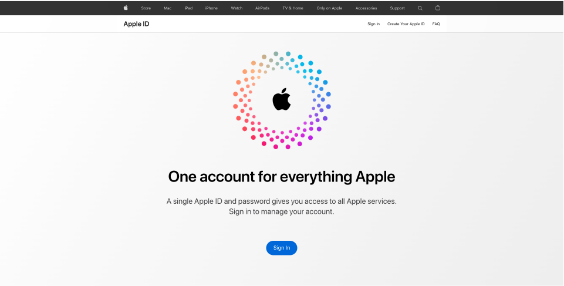

**Step 1:** Go to the [Apple ID account website](https://appleid.apple.com/#!\&page=signin)&#x20;




**Step 2:** Enter the email address associated with your Apple ID



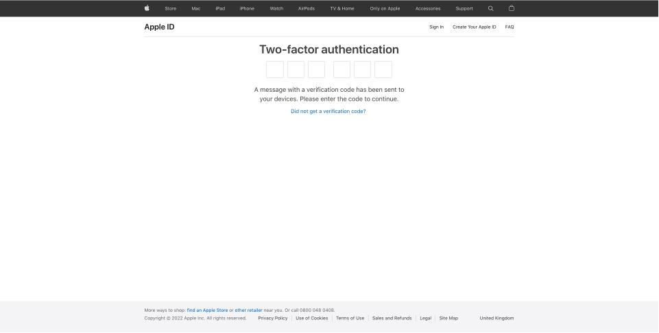

**Step 3:** If prompted, enter your 6 digit authentication code




**Step 4:** Once signed in, click on the **App-specific passwords** link, highlighted above.



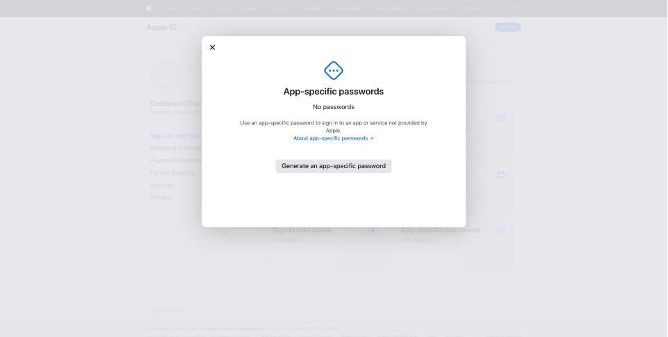

**Step 5:** If this is your first time to create an app-specific password click on the button that says "Generate an app-specific password"



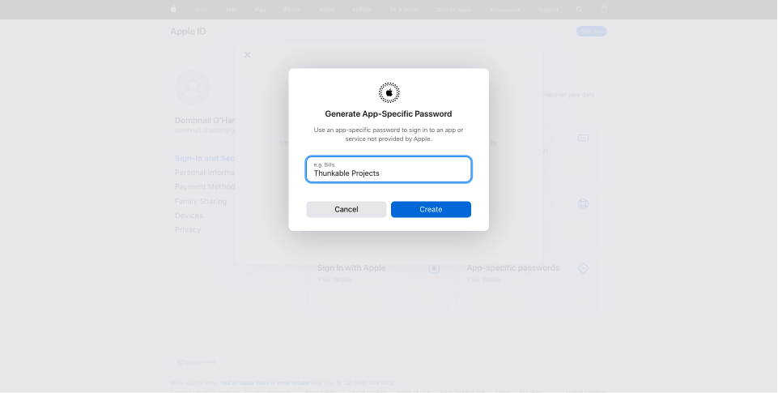

**Step 6:** Give your password a meaningful name so you will be able to recognise it later. Please note that you can use the same app-specific password for all your Thunkable projects. It's not necessary to create a new one every time your want to publish a new project. &#x20;



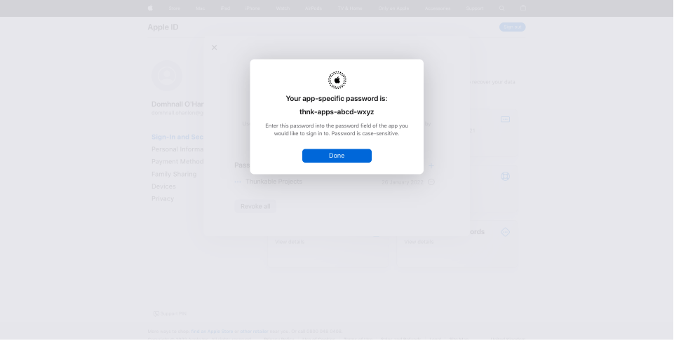

**Step 7:** Your app-specific password consists of four 4-letter phrases. You will not be able to retrieve this password once you click **Done** so make sure you save it some place safe.



#### Changing an App-specific password

To change an app-specific password, you will need to revoke your old password and generate a new password using the steps above. \
\
To revoke an app-specific password:

1. Sign into your [Apple ID account page](https://appleid.apple.com/#!\&page=signin)
2. In the **Security** section, click **Edit**
3. Go to the **App-Specific Passwords** section and click **View History**
4. Click the ⓧ next to an individual password to revoke it, or click 'Revoke All' to revoke all of your app-specific passwords

### Register an App ID on App Store Connect

Every app published on the App Store must have a unique name. For example, there can only ever be one app called `Thunkable Sample App`.  You can **Register your App ID** to reserve the name you want!

Go to the [**Apple Developer website**](https://developer.apple.com/account) to register a new App ID. Click through the tabs below to see each screen in the ID creation process.

Step 6 in the tabs below shows you where to find your App Name, Team ID, and Bundle ID.

* **App Name:** The App Name must be unique to the App Store and is what appears next to the app icon when it is downloaded on a user's phone.
* **Team ID:**  A unique account identifier that is linked to your Apple Developer Program membership. Apple will automatically create this for you, and it can be used for every app you publish.
* **Bundle ID:** Also unique to your app, but not visible to your app users. Otherwise, a single Explicit App ID should work. Apple recommends reversing your domain name to create your bundle ID i.e. _com.yourDomainName.yourAppName_ to avoid conflicts with other apps.
  * _Note: Starting June 16, 2020, uploading apps to the App Store requires an explicit bundle ID. Wildcard bundle IDs are no longer available when creating app records._




Open your Apple Developer account page and choose the **Certificates, IDs & Profiles** option from the menu on the left hand side of the screen.




From the menu on the left, click on the **Identifiers** menu item




Click on the blue **+** icon to add a new ID to your account.




Choose **App IDs** from the list of options and then click on the blue **Continue** button to go to the next screen.




For the app **Description** enter the name you want to give your app and for the **Bundle ID** enter the bundle ID from your Thunkable project settings. Click **Continue** to review these details.




Once you are happy with these detail, click **Register** to confirm your app ID.




This new app ID is added to your list of app IDs.&#x20;



### Create an App Listing on App Store Connect

Once you have registered an App ID, you can **create an app listing on App Store Connect**. This is where you will manage your submission to the App Store.

Go to the [App Store Connect website](https://appstoreconnect.apple.com/login) and follow the steps below to create your App Store listing with the App Name and Bundle ID you registered earlier.



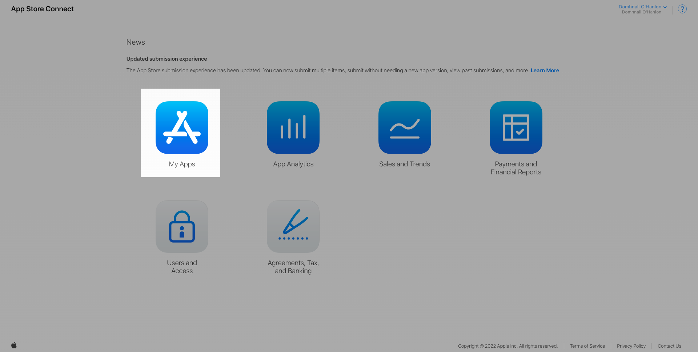

Click on the **My Apps** button to begin.



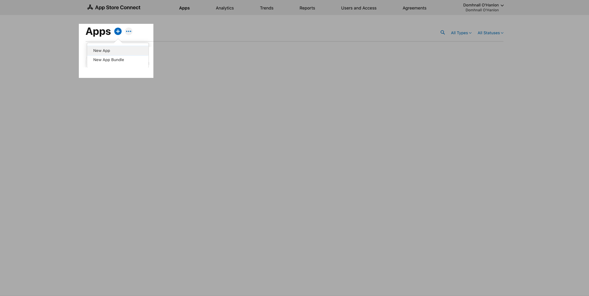

Use the blue **+** button to begin creating a **New App**



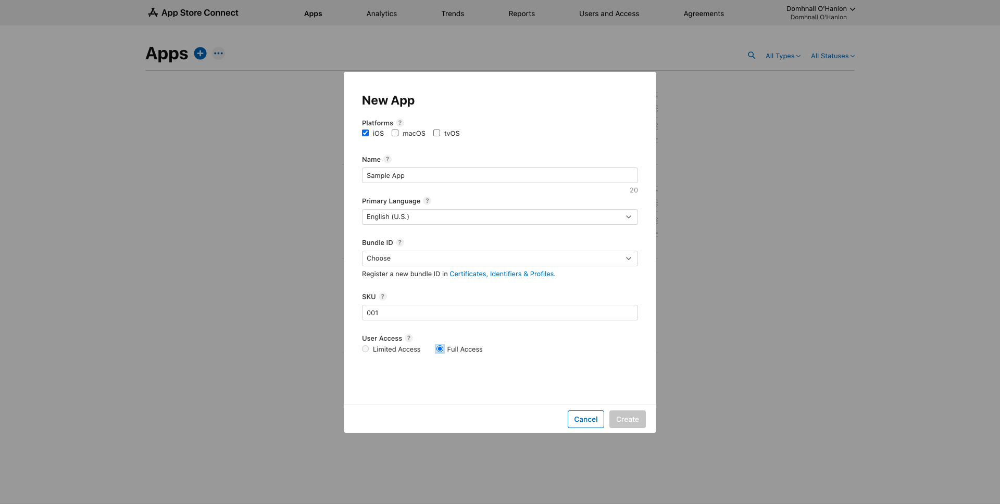

You will need to use the same **App Name** and **Bundle ID** you registered earlier. If you registered an 'Explicit App ID', you will enter it into the Bundle ID field above.



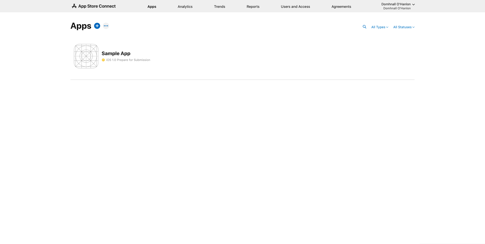

Now click on your app name to prepare your store listing



## Send a Build to App Store Connect

1. [Start the Publishing Process in Thunkable](./#start-the-publishing-process-in-thunkable)
2. [Enter your Apple Developer Account Details](./#enter-your-apple-developer-account-details)
3. [Register Your App ID](./#register-your-app-id)
4. [Enter your App Name, Team ID and Bundle ID](./#enter-your-app-name-team-id-and-bundle-id)
5. [Create a Distribution Certificate](./#create-a-distribution-certificate)
6. [Provision your App](./#provision-your-app)
7. [Enter your App-Specific Password](./#enter-your-app-specific-password)
8. [Create an App Listing on App Store Connect](./#create-an-app-listing-on-app-store-connect-1)
9. [Upload an Icon and enter your Build Number and Version Number](./#upload-an-icon-and-enter-your-build-number-and-version-number)

### Start the Publishing process in Thunkable

Thunkable enables you to send your build directly to the App Store without the need for any specialized software or hardware. To begin the process, click on the **Download/Publish** icon and choose **Publish iOS** from the drop-down menu.

A publishing dialog will pop up to guide you through the publication process. Please take a moment to read all the instructions.&#x20;

Click the **Get Started** button to proceed.&#x20;

### Enter your Apple Developer Account details

Enter the Apple ID and password that are associated with your [Apple Developer account](./#create-an-apple-developer-account). Since Two Factor Authentication (2FA) is now the default for Apple accounts, it is assumed that you have this enabled. The rest of this guide shows the steps for publishing with 2FA enabled. Click the **Next** button to proceed.

### Register Your App ID

If you did not register an App ID before getting started, now is the time to do so.&#x20;

[Read our instructions here.](./#register-an-app-id-on-app-store-connect)

### Enter your App Name, Team ID, and Bundle ID

In the next tab, you will be prompted for your **App Name, Team ID and Bundle ID**. If you are unsure of what these are, please refer [Register an App ID on App Store Connect](./#register-an-app-id-on-app-store-connect), above.&#x20;

.png>)

### Create a Distribution Certificate

Two-factor authentication helps to keep your account secure. Apple has made it mandatory for new developers to turn two-factor authentication on. If you do have 2FA turned on, you'll need to complete the following steps to confirm your identity with Apple.

#### Thunkable

In the publishing dialog, click the link that says **Click to Download CSR.** This is your Certificate Signing Request file and you will need it to generate an iOS Distribution Certificate.&#x20;


This step should only need to occur once. Although you need _a different provisioning file for each project_, _**your Account Certificate should remain the same between any projects published with Thunkable.**_ \
\
Once you issue a new certificate, that will be good for a period of 1 year from the date of creation. You should be able to publish as many apps as you want with that _**1 distribution certificate for you (the publisher)**_ and _**1 provisioning file per app (per published Thunkable project)**_\
\
A certificate is specific to the email account that was used to create the certificate. I.E. If you are helping another Thunker publish their app, you would need to log in and publish from that users account using their certificate.&#x20;


#### Apple

Go to the [Certificates page](https://developer.apple.com/account/resources/certificates/list) in your Apple Developer account to generate an iOS Distribution Certificate.&#x20;


You may already have an account certificate in your account. You can only have two certificates per account so you may need to revoke a certificate before you can create a new one.





Click on the blue **+** icon to create a new iOS distribution certificate.




Choose **iOS Distribution (App Store and Ad Hoc)** from the next list and click **Continue.**




Upload the [Certificate Signing Request](./#thunkable-2) you download from Thunkable and click **Continue** to get your certificate.




Click the blue **Download** button to save a copy of this certificate to your computer.




Back in Thunkable, click the **Upload Certificate** button and choose the `.cer` file that you have just created.&#x20;



### Provision your App

Provisioning profiles are required by Apple to install an app on a device. You need to create a `.mobileprovision` file in your Apple account and then return to Thunkable to upload this file.

#### Apple




Open up the [Profiles list](https://developer.apple.com/account/resources/profiles/list) in your Apple Developer account and click the blue **+** button to get started.&#x20;




Make sure you are creating a **Distribution** profile and that the **App Store** option (highlighted above) is selected. Click **Continue** to choose an App ID.




From the drop down menu, choose the ID for the app that you are trying to publish. Click **Continue** to go to the next page.




Choose a certificate and click **Continue.**




Finally, give your provisioning profile a meaningful name and hit the **Generate** button.




Once the provisioning profile has been generated you can then **Download** it to your computer.&#x20;




The profile has a `.mobileprovision`file type. You now need to go back to Thunkable and upload this file.&#x20;



#### Thunkable

Back in Thunkable, upload your `.mobileprovision` file and click the **Next** button to proceed.

### Enter your App-Specific Password

Paste your [app-specific password](./#create-an-app-specific-password) into the empty text box and click the **Next** button to proceed.&#x20;

### Create an App Listing on App Store Connect

If you did not create an app listing on App Store Connect before getting started, now is the time to do so.&#x20;

[Read our instructions here.](./#create-a-listing-on-the-app-store)

.png>)

### Upload an Icon and Enter your Version Number

You're almost there! Review your app icon and your Version Number.&#x20;

**App icon:** This app icon appears when a user downloads your app from the App Store. Our recommended size is 192 x 192 px. This icon must not have any transparent pixels.

**Version Number:** The version number is visible to your users when they download a new version of your app. You can opt to let Thunkable automatically increment your version numbers.

**User Tracking and Usage Description:** If your app includes  AdMob or Web Viewer components, you need to inform the user why the app is requesting permission to use data for tracking the user or the device.&#x20;

### Congratulations

You should shortly receive an email from Thunkable to let you know that your build is being sent to the App Store. There are still a number of steps that you need to complete on App Store Connect before your app can be published, but that's everything completed from the Thunkable side of things - congrats!

## Next Steps - App Store Connect

You will need to provide some information to Apple about your app before it can be reviewed and published.&#x20;

1. [Connect Your Build to your App Listing](./#connect-your-build-to-your-app-listing)
2. [App Information](./#app-information)
3. [Pricing and Availability](./#pricing-and-availability)
4. [Design assets](./#design-assets)
5. [Export Compliance](./#export-compliance)
6. [Advertising Identifier](./#advertising-identifier)
7. [Click Submit!](./#click-submit)

### Connect Your Build to Your App Listing

You should receive an email from Apple that says your app is ready in the App Store Connect website. **This may take up to an hour.**

**To view your build:**

* Go to your App Store Connect dashboard
* Select the app listing of the build you have just uploaded

You will see the app listing homepage. This page contains the tabs **App Store,** **Features** and **TestFlight**.

If your build is submitted successfully, it should appear under the TestFlight tab in this app listing homepage. [TestFlight](https://testflight.apple.com/) is a tool from Apple that allows you to test your app before it is submitted for release in the App Store.

(If there are any issues, you’ll get an email from us telling you what you’ll need to fix.)

Back in the App Store tab, scroll down to the section titled **Build** and click the button that says **Select a build before you submit your app**.&#x20;

You will see a dialog that allows you to select a build to attach to this app listing. Select your chosen build and click **Done**.

### App information

Now you can review the App Information included in your App Store tab. You can review Apple's advice on filling in your app information on [this webpage](https://developer.apple.com/app-store/product-page/).

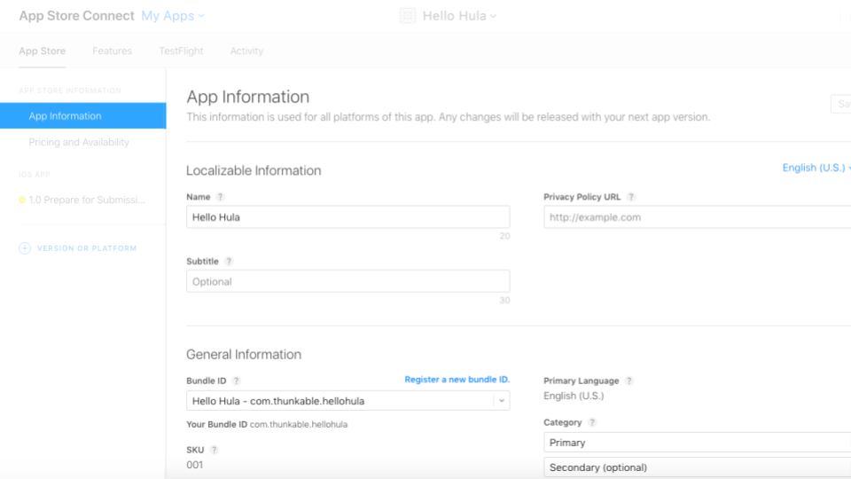

### Pricing and availability

Set a price point for your app. Apps can also be distributed for free.

### Design assets

The final section requires screenshots for both iPhone and iPad and a high resolution icon.

The high resolution icon will be featured in the App Store listing and must be 1024 x 1024 px with no transparency. To generate this icon, we recommend a tool [like this](https://makeappicon.com/).

You can see the screenshots you need in Apple's [screenshot specifications document](https://help.apple.com/app-store-connect/#/devd274dd925).


&#x20;You can create your own iOS screenshots in your browser. Learn more here: [Generate Screenshots](../generate-screenshots.md)


### Export compliance

You may need to answer a question about export compliance. Select **Yes** when asked if your app uses encryption.

### Advertising identifier

After submitting your app for review, you may be asked, "Does this app use the Advertising Identifier (IDFA)?"&#x20;

The app will still be able to be published but you will want to check the **following three boxes**:&#x20;

* [x] Attribute this app installation to a previously served advertisement
* [x] Attribute an action taken within this app to a previously served advertisement
* [x] I, YOUR\_NAME, confirm that this app, and any third party…

Note, you should **not** check the box labeled **Serve advertisements within the app**.

### Click Submit!

Now your app listing is ready for Apple to review!

## Update Your App

To update an existing App Store listing, follow the instructions on Apple's website [here](https://help.apple.com/app-store-connect/#/dev480217e79).&#x20;

For Step 6, _Upload your new build to App Store Connect,_ follow the instructions in [Send a Build to App Store Connect](./#send-a-build-to-app-store-connect).&#x20;

## Troubleshooting

**You do not see your app uploaded to App Store Connect**

* Download. One way to check if your app is build-able is to download it to your phone first. Two common download errors are:
  * You uploaded an icon that has the same name as an existing asset that you have uploaded
  * Your app icon is not an image file
* Icons. Apple additionally does not allow you to have any icons with any transparent colors. We recommend app icons to be 192 x 192 px
* Membership. To publish to the App Store, you'll need to sign up for [Apple Developer Program Membership](https://developer.apple.com/programs/). This currently costs $99 / year.
* App Store Connect. Make sure to [follow this step](../publish.md#step-③--create-a-new-app-in-itunes-connect) on creating a new app on iTunes Connect
* Certificates. If you have an existing Apple Developer Program account with 2 iOS certificates, you'll have to revoke one. Apple only allows developers to have 2 iOS certificates at a time and Thunkable creates one when it publishes to your account
* Provisioning profile. After you revoke your certificate, it is possible that one or more of your provisioning profiles will become inactive.  To publish successfully, you'll also need to delete any inactive provisioning profiles
* Login. Apple ID or password were entered incorrectly.  Since we don't store either one, there's no easy way for us to check so enter it slowly
* Apple ID and privacy terms. You must accept Apple's new Apple ID and privacy terms.
* You see a message saying "ITMS-90809: Deprecated API Usage - Apple will stop accepting submissions of apps that use UIWebView APIs". This is a warning, but you can still publish your app. See the [Web Viewer](https://docs.thunkable.com/web-viewer) documentation for more details.
* Apple account password. If you change or update the password for your Apple account password, Apple deletes your app-specific password. If you change your Apple account password, you must create a new app-specific password.
* Invalid Bundle ID. A bundle ID, or package name, is a unique identifier for your app. It can be updated in App Settings. Ensure your bundle ID follows the following rules:
  * Has at least two segments \[one or more dots].
  * Each segment must start with a letter.
  * All characters must be alphanumeric or an underscore \[a-z, A-Z, 0-9, or \_].

## Adding Push Notifications

To publish an app to the App Store that contains Push Notifications, you need to:

* send an app that does not contain Push Notifications to App Store Connect
* add push notifications to your app project ([see instructions here](../push-notifications-by-one-signal.md#ios-setup))
* send the new version of your app to App Store Connect

Between sending these two versions of your app to App Store Connect, you will need to create a new **.mobileprovision** file. Here's a quick overview of what that process looks like.

Click on _Provisioning Profiles > All_ to see your current iOS provisioning profiles. Notice that the app you just created is now **invalid** so we need to generate a new one.

Open the inactive profile and click on **Edit** to generate a new one.

Scroll to the bottom of the page and click **Generate.**

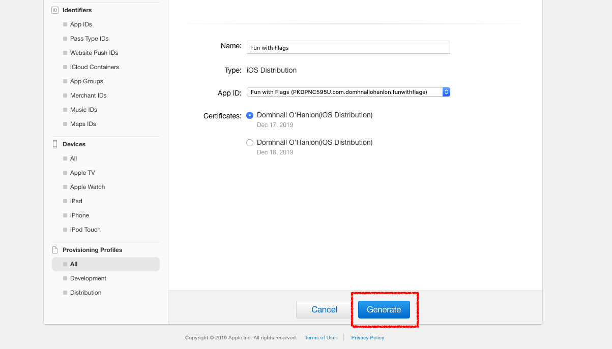

On the next screen, click the **Download** button and the .mobileprovision file will be saved to your downloads folder.

&#x20;

## Remove your app from the App Store

If you want to remove your apps from being listed in the App Store, open your app listing on [App Store Connect](https://appstoreconnect.apple.com/apps) and  follow these instructions:

1. On the “App Store” tab, click on “Pricing and Availability”&#x20;
2. Click the “Remove from Sale” radio button
3. Then click the “Save” button to unpublish your app

You can see these buttons in the screenshot below:

Please note that if your Apple Developer account expires, your apps will no longer be available for download in the App Store.

Removing your app from the Play Store will not delete it from devices which have previously downloaded the app.

