# Publish to Play Store \(Android\) with AAB


Publishing to the Play Store with an AAB file is a [PRO](https://thunkable.com//#/pricing) feature. If you have a free Thunkable account, check out [Publish to Play Store \(Android\) with APK](publish-to-play-store-android-with-apk.md)


Publishing your app to the Play Store will help your app reach 2 billion active Android devices.

## Minimum requirements

* Google Play Developer Account \($25 one-time fee\). Don't have an account? [**Sign up here**](https://play.google.com/apps/publish/signup/)


Success on Google Play starts with quality. The best apps and games have higher ratings, more installs, and more engagement. We recommend visiting the [Play Store Developer Policy Center](https://play.google.com/about/developer-content-policy/#!?modal_active=none) before you submit your app to the Play Store


## App info

To publish your app on Android, you'll need to add an `app icon`, a `name`, a `package name` and an app `version`. To find the App settings, click on the App Icon on the top left.

For recommendations on your `app icon` and `name`, [please see this guide](projects/settings.md).

### The Package Name

Each Android app that is published to the Play Store has a unique `package name`. Currently, you can enter this in the App \(Bundle\) ID field.

Your app's package name is unique to your app. We recommend reversing your domain name to create your package name i.e. _com.yourDomainName.yourAppName_ to avoid conflicts with other apps.

You can find your package name in your Project Settings under `App (Bundle) ID.`

Your package name should be all lower case. None of the segments should begin with a number. None of the segments should have an accent on the characters.


If you are only publishing to the Play Store, you do not need to enter a Team ID to publish to the Play Store \(this is for iOS only\)


### Build and Version Number

Before you download your app, make sure you set the appropriate Build and Version Number. Google Play requires each new version of your app to have a unique and sequentially higher Build and Version Number. You can also let Thunkable auto-increment \(or automatically increase\) the build and version numbers for you.

## Download your AAB file

You can download your AAB file by clicking **Publish &gt; Publish Android** 

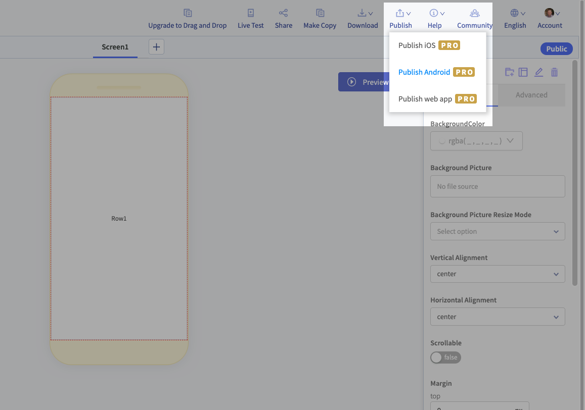

You will see a dialog asking you to enter your email address. An AAB file will be sent to you:

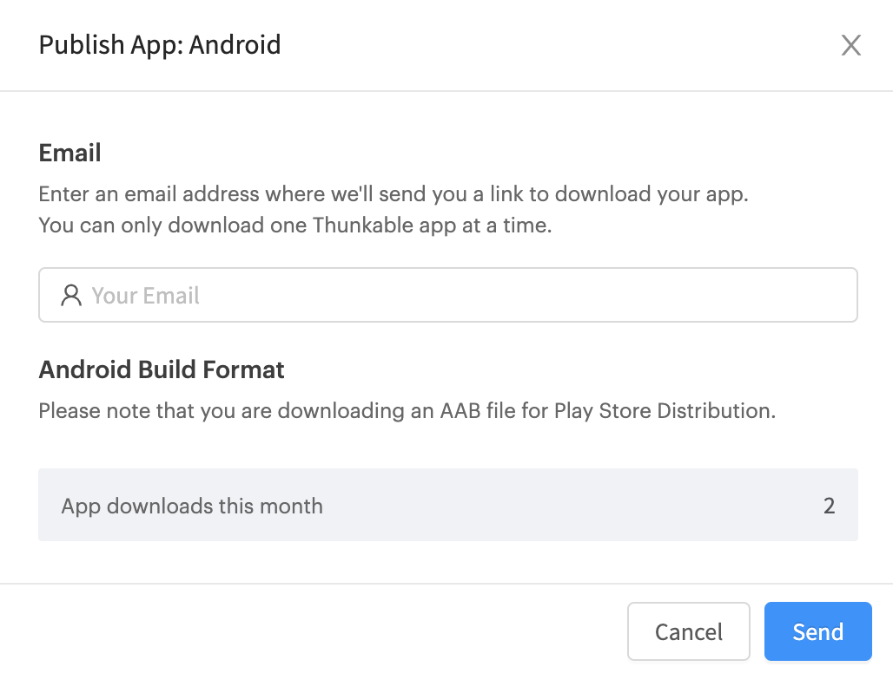


An AAB file cannot be installed on an Android device. If you want to download and install your project, please read the [Download](download.md#download-android-app) docs.


## Submit your app for review

Go to the [Google Play Console](https://play.google.com/console/) to complete these next steps.

### Create a new app on the Google Play Developer Console

Click **Create app** in your Google Play console to get started.

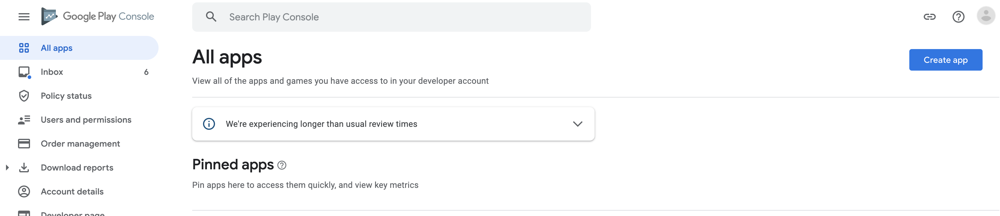

You will be asked to provide some details about your app:

* **App Name** \(Text\)
* **Default Language** \(Select from a drop-down menu\)
* If you're releasing an **App** or a **Game** \(select one\)
* If your app is **Free** or **Paid** \(select one\)

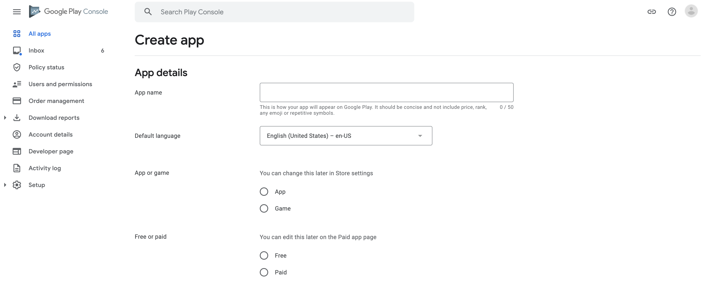

You will also be asked to confirm that your app meets the **Google Play Developer Program Policies** and to accept that your app may be subject to **US export laws**.

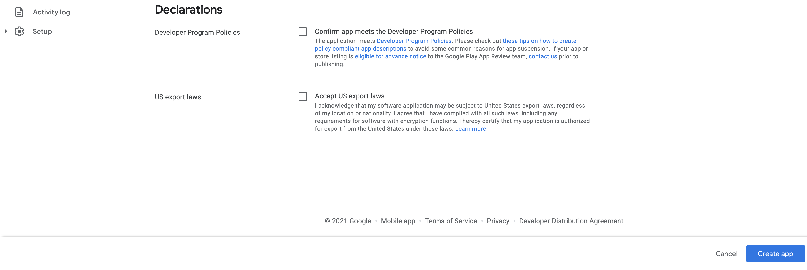

Google offers optional steps to set up internal testing for your project. You can follow the steps to set this up. We will focus on the **Set Up Your app** and **Publish Your app on Google Play** steps.

### Set Up Your App

Provide some information about your app's content.

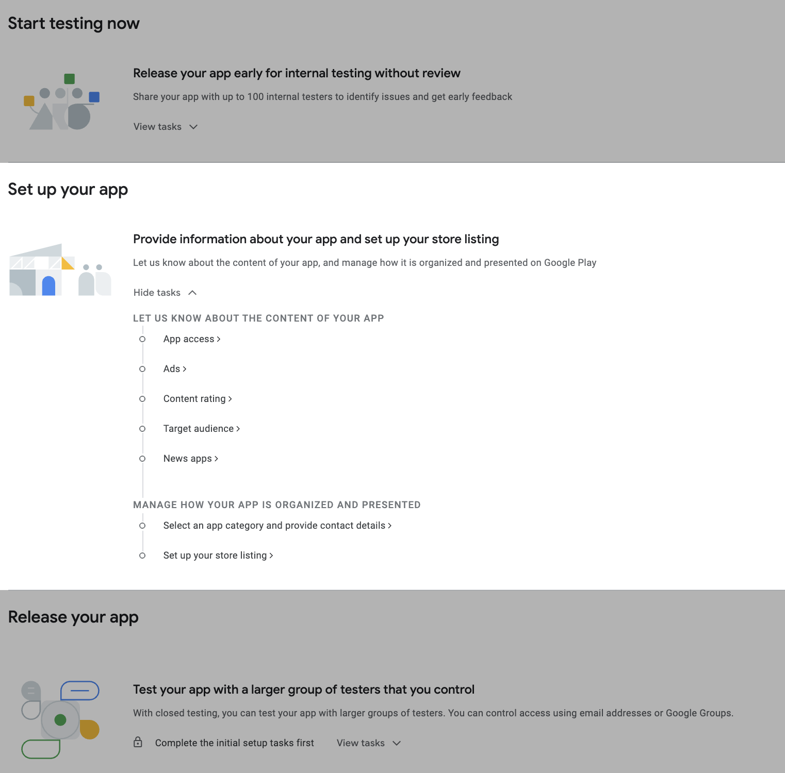

* **App access**:  is any of your app's content locked behind a paywall or login screen?
* **Ads**: does your app serve ads?
* **Content rating**: Does your app contain strong language, violence, or other sensitive material?
* **Target audience**: Is this app designed for children?
* **News apps**: Is the function of your app to provide news updates to your users?

You can also add some information for how your app should be categorized and presented in the Play Store:

* Set an **App Category**, and add **Tags** to make your app more easily searchable
* Add **Contact Details**: you must provide an email address, and you can also provide a phone number or website
* Choose whether or not your app may be marketed outside of the Google Play store

Setting up your Store Listing will require the following:

* An **App Name** to be shown the Play Store
* A **Short Description** of your app
* A **Full Description** of your app
* An **App Icon** 
  * 512 \* 512 pixels
  * Up to 1MB in size
* A **Feature Graphic**
  * 1024 \* 500 pixels
  * Up to 1MB in size
* An optional YouTube **Video** URL to demonstrate your app
* At least one **Phone Screenshot**
  * 16:9 or 9:16 aspect ratio
  * Each side between 320 and 3,840 pixels
  * Up to 8MB in size
* At least one **Tablet Screenshot**
  * 16:9 or 9:16 aspect ratio
  * Each side between 320 and 3,840 pixels
  * Up to 8MB in size

All images can be in PNG or JPEG format.

See [Sample Assets](publish-to-play-store-android.md#sample-assets) at the end of this document for examples.

### Publish Your App on Google Play

You will be asked which **countries and regions** you want your app to be available in.

Then you will be asked to **create a new release**.

#### Prepare

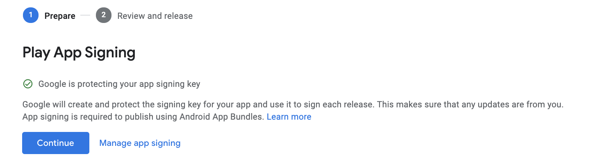

Google will offer to protect your app signing key. You can click **Continue** to allow this to proceed. You will only be asked this the first time you publish a release.

See [Manage Your Own App Signing](publish-to-play-store-android.md#manage-your-own-app-signing) below if you do not want Google to manage your app signing. 

### Upload your AAB file

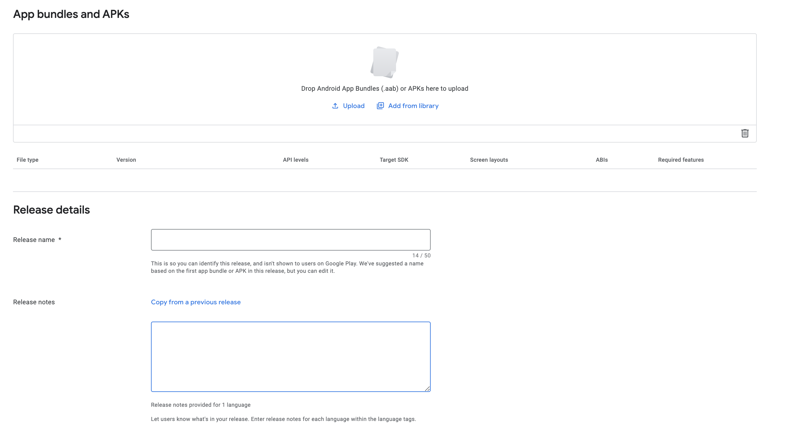

Upload your AAB file in the **App Bundles and APKs** section. This may take a few minutes.

Add a **Release Name** and **Release Notes** in the **Release Details** section.

**Review and Release**

**Errors, Warnings, and Messages** will let you know if there are any issues with your release or any information you should be aware of. **Errors** will prevent you from publishing your release. **Warnings** and **Messages** will not prevent you from publishing a release.

**New App Bundles and APKs** will show any new APK or AAB files you have added to this release.

**Release Notes** will show the release notes for this release.

Click **Start Rollout to Production** to publish your app!

Once your app has been reviewed, it will go live on the Google Play Store.

### Add a privacy policy


Apps that request access to sensitive permissions or data \(as defined in the [user data policies](https://play.google.com/about/privacy-security-deception/user-data/)\) are required by the Google Play Store to include a privacy policy. Currently all apps made on Thunkable request access to sensitive permissions or data, which means you will need to provide a privacy policy


**Congrats! You are now ready to submit to the Play Store.**

## **Updating an existing app on the Play Store**

You can view Google's instructions for updating your app [here](https://support.google.com/googleplay/android-developer/answer/9859350?hl=en). Please refer to the content that references **app bundles**, not APK files.

If you are updating an existing app on the Google Play Store, your Thunkable project will need to have:

* the same [package name](publish-to-play-store-android.md#the-package-name) as the published app
* an incremented [version number](publish-to-play-store-android.md#build-and-version-number) \(version number is higher than the version number of your published app\)
* the same [keystore](publish-to-play-store-android.md#the-keystore-private-key) as the published app

You will need need to change any app signing settings when updating a published app.

### The Keystore / Private Key

Keystores in Android are storage mechanisms for security certificates to prevent others from updating your app on the Google Play store. Your keystore contains a private key that is unique to your app. Copied apps within an account \(using the [Make Copy](make-copy.md)\) will keep the same keystore as the original app. Apps that are copied from a [Share copy](share-1.md) link will not have the same keystore.


Thunkable does not store your keystore outside of your app. If your app has been deleted, and you have not downloaded a copy of your keystore, then it is permanently lost. Please use [Google's App Signing Service ](https://support.google.com/googleplay/android-developer/answer/7384423?hl=en)so that you can update your published apps in the event that your keystore is lost.


### Exporting / importing a keystore to your app

#### Export keystore from Thunkable

If you make a copy of a Thunkable app project, the copy will have a different keystore to the original project. 

To export a keystore from a Thunkable app project, Click the name and icon of your app in upper left corner to bring up App Settings on right side as seen in 'Import keystore to Thunkable X'. Scroll all the way to the bottom of the App Settings and click Export Keystore. 

In the dialog that comes up, you will see the keystore's password and a button that says Export Keystore. You will need this password to import your keystore to other projects. You can change the password at this stage by editing the password in the text box.

Click OK to save the .keystore file to your computer.

Note: A Thunkable app project will not have a keystore until either a keystore is imported **or** the project is downloaded as an Android app for the first time

#### Import keystore to Thunkable

Select the the app that you are trying to publish as an update to the Google Play Store.

Click the name and icon of your app in upper left corner to bring up App Settings on right side.

Scroll all the way to the bottom of App Settings and click Import Keystore. **Note this will replace the existing keystore for this app so be sure you haven’t used it to publish to Google Play store before proceeding.** You can always Export it first and save it to your computer just in case.

Enter the password and select the .keystore file you previously saved to your computer.

Congrats! You should be able to successfully publish updates now. Note that you’ll need to repeat the steps every time you want to update an app that was originally built as a different project as every app has their own keystore.

## Remove your app from the Play Store

To make your app unavailable for download on the Play Store, open your app listing on the [Google Play Console](https://play.google.com/console) and do the following:

1. Scroll down to “Release” and click on “Setup” 
2. Then “Advanced Settings”. 
3. Click the “Unpublished” radio button 
4. Then click “Save” to unpublish your app.

You can see the relevant areas below:

Removing your app from the Play Store will not delete it from devices which have previously downloaded the app.

## Sample Assets

### App Icon

### Feature Graphic

### Phone/Tablet Screenshots

## Manage Your Own App Signing

If you don't want Google to manage your App Signing, you can do so yourself. This is not necessary.

### In Thunkable:

#### Download your Keystore Zip

You will need to download your Keystore Zip. This is a compressed version of your app's Android Keystore. 

You can download this from your project settings under **Keystore Zip**:

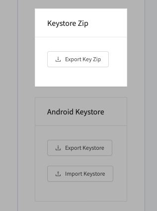


We recommend creating a new folder on your computer. Download your AAB file and your Keystore Zip to this new folder. That way the correct AAB file and Keystore Zip will be together!


### In the Play Store:

Click **Manage App Signing:**

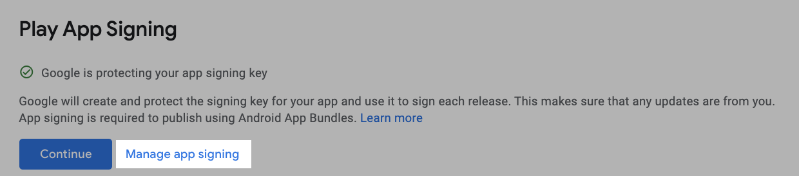

Click **Export and upload a key from Java keystore:**

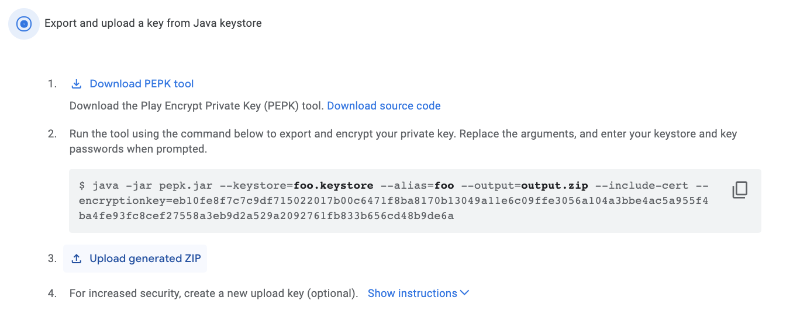

You can skip straight to **Step 3: Upload generated ZIP** and ****Upload the [Keystore ZIP you downloaded from your project settings.](publish-to-play-store-android.md#download-your-bundle-key-zip)

Click **Continue.**

Continue following the instructions in this document from [Upload your AAB file](publish-to-play-store-android.md#upload-your-aab-file).

