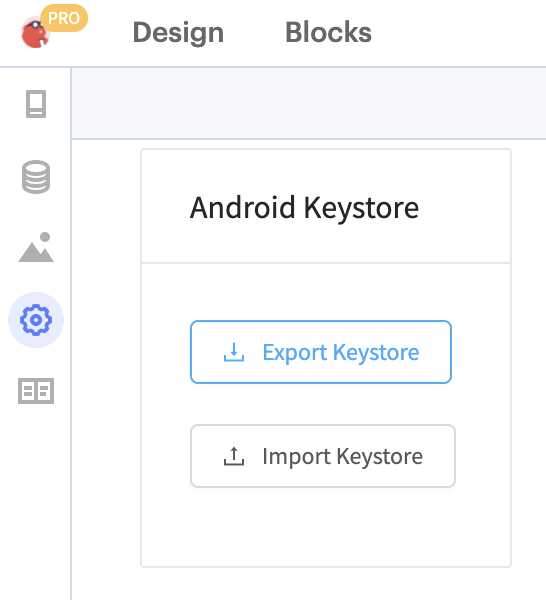
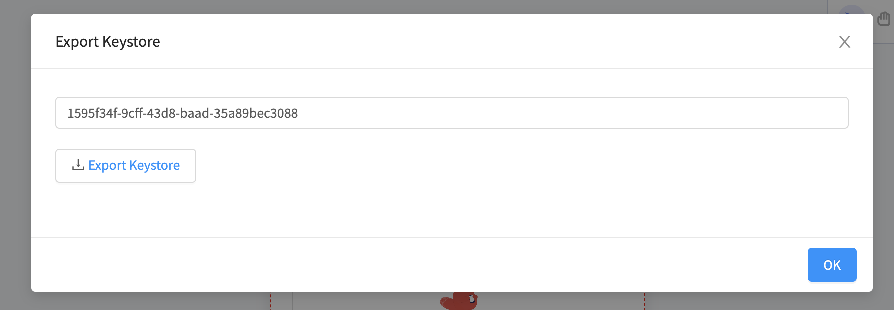
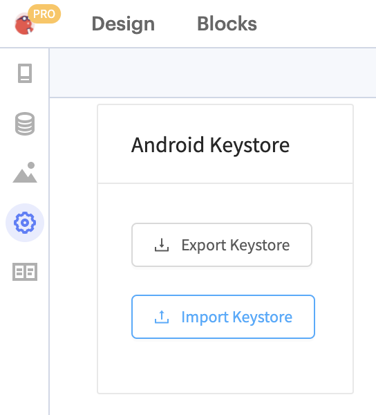
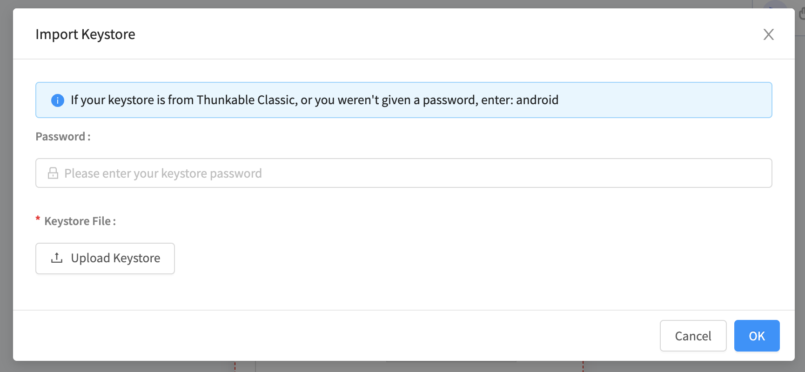

# Publish to Play Store (Android) with AAB

Success on Google Play starts with quality. The best apps and games have higher ratings, more installs, and more engagement. We recommend visiting the [Play Store Developer Policy Center](https://play.google.com/about/developer-content-policy/#!?modal\_active=none) before you submit your app to the Play Store.

Publishing to the Google Play Store requires a Google Play Developer Account (approximately $25 USD one-time fee). Don't have an account? [Sign up here](https://play.google.com/apps/publish/signup/).


All Android apps built with Thunkable are built with Android API 31 and target Android 12.


## AAB vs APK

When you download an app from Thunkable you receive an email with an **APK file** that you download directly to your Android device.

When you publish an Android app you receive an email with an **AAB file** for you to upload to the Google Play Store.&#x20;

## Required Assets

We recommend you compile the following assets before embarking on the publishing journey.

* **App Information**
  * \[Text] App Name\
    To be shown in the Play Store.
  * \[Text] A Short Description of your app
  * \[Text] A Full Description of your app
* **App Icon**
  * \[Image] 512 x 512 pixels
  * Up to 1MB in size
* **Feature Graphic**
  * \[Image] 1024 x 500 pixels
  * Up to 1MB in size
* **Phone Screenshots**
  * \[Images] 16:9 or 9:16 aspect ratio
  * Each side between 320 and 3,840 pixels
  * Up to 8MB in size

## App Settings

To publish your app on Android, you'll need to add of access the following in your Thunkable project's App Settings:

* App Name - see here for best practices: [App Settings](project-settings.md)
* Icon - see here for best practices: [App Settings](project-settings.md)
* [Package Name](publish-to-play-store-android.md#package-name) (referred to as App (Bundle) ID in Thunkable)&#x20;
* [Android Version](publish-to-play-store-android.md#android-version)

### Package Name

Every new Thunkable project is automatically given a unique App (Bundle) ID. For the purposes of publishing to the Play Store, this is refered to as your app's **package name**. &#x20;

To locate your package name:

1. Open your Thunkable project.
2. Navigate to the **Design tab**.
3. Click the **Settings** gear icon in the sidebar.
4.  Copy the content of the **App (Bundle) ID** field. This is your package name. \
    \

    

    <figure><figcaption></figcaption></figure>

    

You'll notice that Thunkable adheres to the following naming convention to avoid conflicts with other apps: com.yourDomainName.yourAppName. It is all lower case letters, none of the segments begin with a number, and there are no characteres with accents.

### Android Version

Google Play requires each new version of your app to have a unique and sequentially higher Version Name and Version Code. You can let Thunkable auto-increment (or automatically increase) the version data for you.

<figure><figcaption></figcaption></figure>

## Download your Android App Bundle (AAB) file

The Apple and Android publishing processes are quite different. To publish with Apple, you complete the process in the Thunkable publishing wizard and the app file is sent directly to your Apple TestFlight. To publish with Android, you receive an email from Thunkable with your app's AAB file, which you download and then upload to the Google Play Store.


An AAB file cannot be installed on an Android device. If you want to download and install your project, please read the [Download](download.md#download-android-app) docs.


To download your Android App Bundle (AAB) file:

1. Within your Thunkable project, click the **Publish and Download** icon.
2. Select **Publish Android** from the drop-down menu.\
   \
   \

3. A publishing modal is provided to guide you through the publication process.&#x20;
4. Enter the **email address** you want the app download link sent to.&#x20;
5.  Click **Send**. \

    

    <figure><figcaption></figcaption></figure>

    

6. In approximately 30 minutes, you will receive your AAB file to the email address you provided.&#x20;
7. When you receive the email, download the AAB file to your computer. Note: If you use Google Chrome, your browser settings may prevent you from downloading your AAB file. Simply open the email in Firefox or Safari to download your AAB file.

## Submit your app for review

### Create a new app on the Google Play Console

1. Sign-in to your [**Google Play Console**](https://play.google.com/console/) account.
2. Click **Create app** in the upper right.
3. Complete the requested **app details** fields. Note: The App Name is how your app will appear on Google Play.&#x20;
4. Complete the required **declarations**.
5. Click **Create app**.

### App Dashboard

While you're getting set up, the Google Play Console Dashboard shows you what you need to do to get your app up and running. This includes recommendations on how to manage, test, and promote your app. Once you've completed a task, return to the Google Play Console Dashboard to explore what else you need can do.

We'll focus on the the following steps:

* Set up your app&#x20;
* Publish Your app on Google Play

### Set up your app

In this section, you'll share with Google the content of your app, and manage how it is organized and presented on Google Play.

1. Click **View tasks** in the Set up your app section to see the tasks you must complete.&#x20;
2. Click on a task.&#x20;
3. Complete the required fields.
4. Click **Save**.
5. Click **Dashboard** above the task name in the upper left.
6. Repeat with the remaining tasks in the list.


Apps that request access to sensitive permissions or data (as defined in the [user data policies](https://play.google.com/about/privacy-security-deception/user-data/)) are required by the Google Play Store to include a privacy policy. All apps made on Thunkable request access to sensitive permissions or data, which means you will need to provide a privacy policy.


### Main store listing

1. Click **Main store listing** under the Grow heading in the sidebar.
2. Complete the required fields and upload the required assets. See here for additional guidance: [Add preview assets to showcase your app](https://support.google.com/googleplay/android-developer/answer/9866151).
3. Click **Save**.

### Create and publish a release

1. Return to the Google Play Console **Dashboard**.
2. Click **View tasks** in the Create and publish a release section to see the tasks you must complete.&#x20;
3. Click the **Select countries** task.&#x20;
4. Identify the countries you want your app to be available in.
5. Click **Create a new release**.
6. Upload the AAB file into the **App bundles** section. Instructions for downloading your AAB are available here: [Download your Android App Bundle (AAB) file](publish-to-play-store-android.md#download-your-android-app-bundle-aab-file).
7. Add a **Release name** so you can identify this release. It isn't shown to users on Google Play.
8. Add **Release notes**. Let users know what's in your release.
9. Click **Next**.

### **Errors, warnings and messages**

If there are any issues with your release or any information you should be aware of, you will be notified in the Errors, warnings and messages section.

* **Errors** will prevent you from publishing your release.&#x20;
* **Warnings** will not prevent you from publishing a release.
* **Messages** will not prevent you from publishing a release.

Once you have addressed the necessary issues, click **Next**.

#### Prepare

Google will offer to protect your app signing key. You can click **Continue** to allow this to proceed. You will only be asked this the first time you publish a release.

See [Manage Your Own App Signing](publish-to-play-store-android.md#manage-your-own-app-signing) below if you do not want Google to manage your app signing.&#x20;

Click **Start Rollout to Production** to publish your app!

Once your app has been reviewed, it will go live on the Google Play Store.

## **Updating an existing app on the Play Store**

You can view Google's instructions for updating your app [here](https://support.google.com/googleplay/android-developer/answer/9859350?hl=en). Please refer to the content that references **app bundles**, not APK files.

If you are updating an existing app on the Google Play Store, your Thunkable project will need to have:

* the same [package name](publish-to-play-store-android.md#the-package-name) as the published app
* an incremented [version number](publish-to-play-store-android.md#build-and-version-number) (version number is higher than the version number of your published app)
* the same [keystore](publish-to-play-store-android.md#the-keystore-private-key) as the published app

You will need need to change any app signing settings when updating a published app.

### The Keystore / Signing Key

Keystores in Android are storage mechanisms for security certificates to prevent others from updating your app on the Google Play store. Your keystore contains a private key that is unique to your app.&#x20;

Duplicated apps within an account ([Duplicate Your Project](make-copy.md)) maintain the same keystore as the original app. Apps copied from a [Share](share-1.md) link do not have the same keystore.


You must save your Android keystore and password somewhere safe. Google will not provide it for you if you lose it.


If your app was deleted, and you have not downloaded a copy of your keystore, it is permanently lost. We strongly recommend you use [Google's App Signing Service ](https://support.google.com/googleplay/android-developer/answer/7384423?hl=en)so that you can update your published apps if your keystore is lost.

### Exporting / importing a keystore to your app

#### Export keystore from a Thunkable project


A Thunkable project will not have a keystore until either a keystore is imported **or** the project is downloaded as an Android app for the first time.


If you make a copy of a Thunkable project, the copy will have a different keystore to the original project.&#x20;

To export a keystore from a Thunkable project:

* Click the gear icon of on the left hand side of your Design tab your app in upper left corner to bring up App Settings
* Scroll to Android Keystore and click **Export Keystore**

#### Alias and Password

In the dialog that comes up, you will see the keystore's password and a button that says Export Keystore. You will need this password to import your keystore to other projects. You can change the password at this stage by editing the password in the text box.

The keystore alias will be **androidkey**

Click OK to save the .keystore file to your computer.

#### Import keystore to Thunkable


Importing a keystore to a Thunkable project will override its existing keystore. Make sure you don't need this project's keystore to publish an update to your app before continuing!


To import a keystore to a Thunkable project:

* Click the gear icon of on the left hand side of your Design tab your app in upper left corner to bring up App Settings
* Scroll to Android Keystore and click **Import Keystore**

Enter the password and select the .keystore file you previously saved to your computer into the Import Keystore dialog.

## Remove your app from the Play Store

To make your app unavailable for download on the Play Store, open your app listing on the [Google Play Console](https://play.google.com/console) and do the following:

1. Scroll down to “Release” and click on “Setup”&#x20;
2. Then “Advanced Settings”.&#x20;
3. Click the “Unpublished” radio button&#x20;
4. Then click “Save” to unpublish your app.

You can see the relevant areas below:

Removing your app from the Play Store will not delete it from devices which have previously downloaded the app.

## Sample Assets

### App Icon

### Feature Graphic

### Phone/Tablet Screenshots

## Manage Your Own App Signing

If you don't want Google to manage your App Signing, you can do so yourself. This is not necessary.

### In Thunkable:

#### Download your Keystore Zip

You will need to download your Keystore Zip. This is a compressed version of your app's Android Keystore.&#x20;

You can download this from your project settings under **Keystore Zip**:


We recommend creating a new folder on your computer. Download your AAB file and your Keystore Zip to this new folder. That way, the correct AAB file and Keystore Zip will be together.


### In the Play Store:

Click **Manage App Signing:**

Click **Export and upload a key from Java keystore:**

You can skip straight to **Step 3: Upload generated ZIP** and Upload the [Keystore ZIP you downloaded from your project settings.](publish-to-play-store-android.md#download-your-bundle-key-zip)

Click **Continue.**

Continue following the instructions in this document from [Upload your AAB file](publish-to-play-store-android.md#upload-your-aab-file).
