# Publish to Play Store \(Android\)

Publishing your app to the Play Store is a relatively straightforward process and will help your app reach 2 billion active Android devices.


Success on Google Play starts with quality. The best apps and games have higher ratings, more installs, and more engagement. We recommend visiting the [Play Store Developer Policy Center](https://play.google.com/about/developer-content-policy/#!?modal_active=none) before you submit your app to the Play Store


* [Minimum requirements](publish-to-play-store-android.md#minimum-requirements)
* [App info](publish-to-play-store-android.md#app-info)
* [Download your Android app](publish-to-play-store-android.md#download-your-android-app)
* [Submit your app for review](publish-to-play-store-android.md#submit-your-app-for-review)
* [Updating an existing app on the Play Store](publish-to-play-store-android.md#updating-an-existing-app-on-the-play-store)
* [Remove your app from the Play Store](publish-to-play-store-android.md#remove-your-app-from-the-play-store)

## Minimum requirements

* Google Play Developer Account \($25 one-time fee\). Don't have an account? [**Sign up here**](https://play.google.com/apps/publish/signup/)

## App info

To publish your app on Android, you'll need to add an `app icon`, a `name`, a `package name` and an app `version`. To find the App settings, click on the App Icon on the top left.

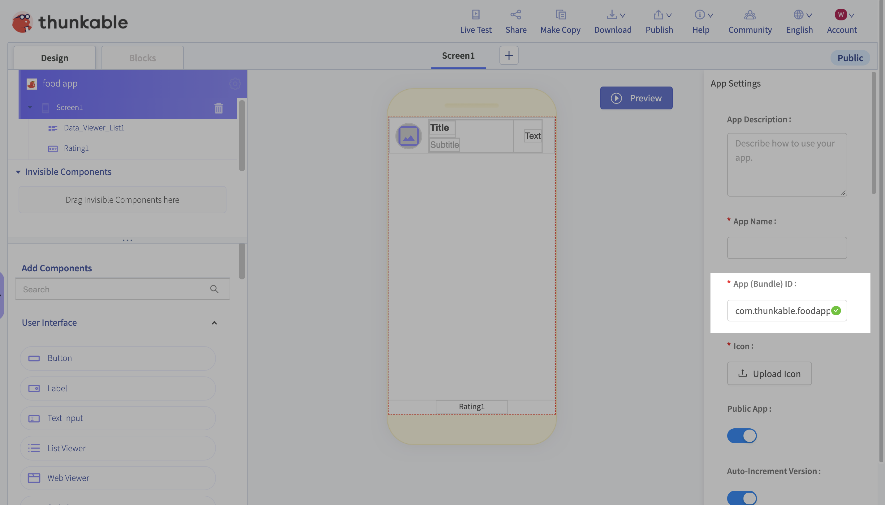

For recommendations on your `app icon` and `name`, [please see this guide](projects/settings.md).

### The Package Name

Each Android app that is published to the Play Store has a unique `package name`. Currently, you can enter this in the App \(Bundle\) ID field.

Your app's package name is unique to your app. We recommend reversing your domain name to create your package name i.e. _com.yourDomainName.yourAppName_ to avoid conflicts with other apps.

You can find your package name in your Project Settings under `App (Bundle) ID.`

Your package name should be all lower case. None of the segments should begin with a number. None of the segments should have an accent on the characters.


If you are only publishing to the Play Store, you do not need to enter a Team ID to publish to the Play Store \(this is for iOS only\)


### Build and Version Number

Before you download your app, make sure you set the appropriate Build and Version Number. Google Play requires each new version of your app to have a unique and sequentially higher Build and Version Number. You can also let Thunkable auto-increment \(or automatically increase\) the build and version numbers for you.

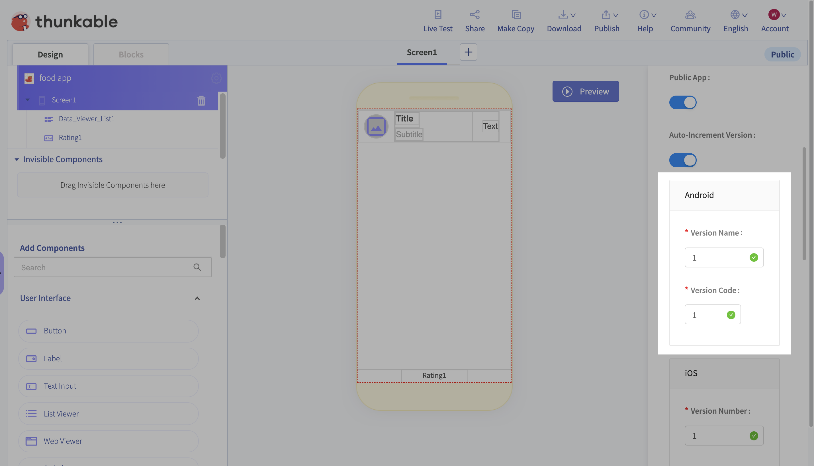

## Download your Android app

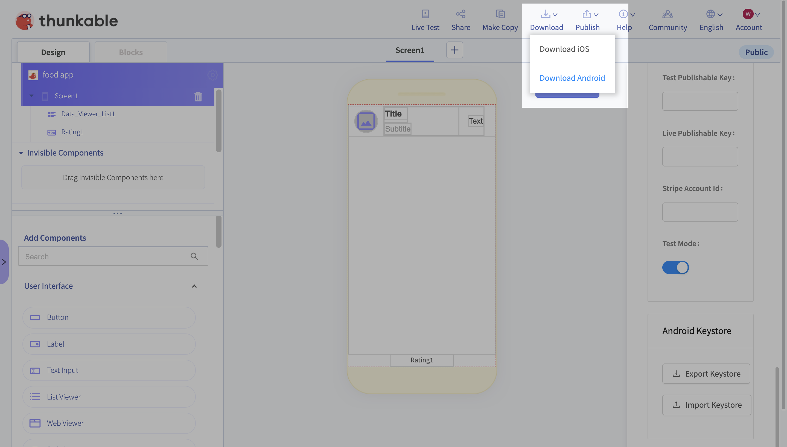

## Submit your app for review

### Create a new app on the Google Play Developer Console

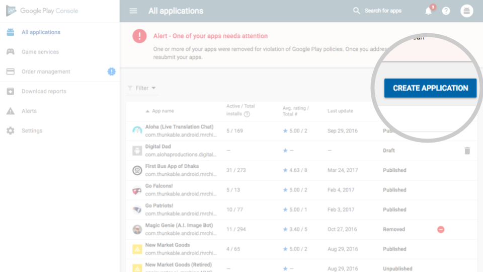

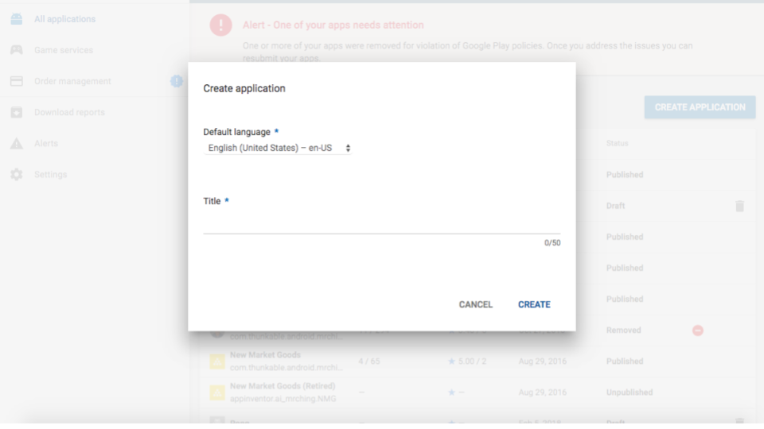

Next, create a new release. This is where you'll upload the latest version of your app \(.apk\)

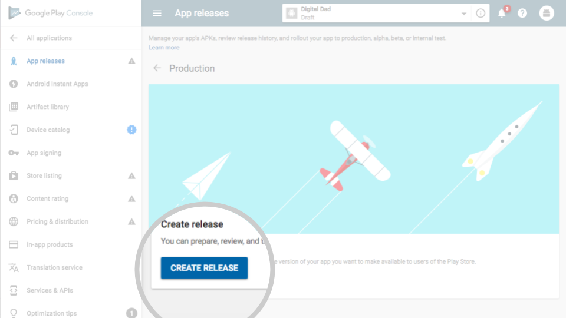


Enable [Google Play App signing](https://support.google.com/googleplay/android-developer/answer/7384423?hl=en). This is an optional program but we recommend it for most use cases.


### Update your Play store listing

To complete your Play Store listing, you will have to fill out a content rating questionnaire and set pricing and availability. In addition you will need to add a minimum of 4 design assets - two screenshots, a higher resolution icon \(512 x 512 px\) and a feature graphic \(1024 x 500 px\) that shows up on the Play Store app.

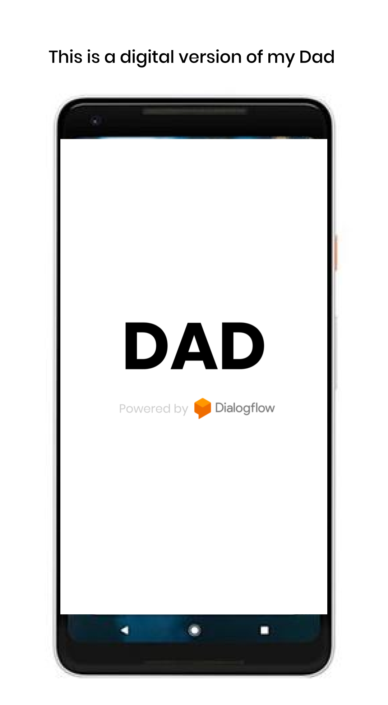

### Add a privacy policy


Apps that request access to sensitive permissions or data \(as defined in the [user data policies](https://play.google.com/about/privacy-security-deception/user-data/)\) are required by the Google Play Store to include a privacy policy. Currently all apps made on Thunkable request access to sensitive permissions or data, which means you will need to provide a privacy policy


**Congrats! You are now ready to submit to the Play Store.**

## **Updating an existing app on the Play Store**

You can view Google's instructions for updating your app [here](https://support.google.com/googleplay/android-developer/answer/9859350?hl=en).

If you updating an existing app on the Google Play Store, your app will need to have:

* the same [package name](publish-to-play-store-android.md#the-package-name) as the published app
* an incremented [version number](publish-to-play-store-android.md#build-and-version-number) \(version number is higher than the version number of your published app\)
* the same [keystore](publish-to-play-store-android.md#the-keystore-private-key) as the published app

### The Keystore / Private Key

Keystores in Android are storage mechanisms for security certificates to prevent others from updating your app on the Google Play store. Your keystore contains a private key that is unique to your app. Copied apps within an account \(using the [Make Copy](make-copy.md)\) will keep the same keystore as the original app. Apps that are copied from a [Share copy](share-1.md) link will not have the same keystore.


Thunkable does not store your keystore outside of your app. If your app has been deleted, and you have not downloaded a copy of your keystore, then it is permanently lost. Please use [Google's App Signing Service ](https://support.google.com/googleplay/android-developer/answer/7384423?hl=en)so that you can update your published apps in the event that your keystore is lost.


### Exporting / importing a keystore to your app

#### Export keystore from Thunkable X

If you make a copy of a Thunkable X app project, the copy will have a different keystore to the original project. 

To export a keystore from a Thunkable X app project, Click the name and icon of your app in upper left corner to bring up App Settings on right side as seen in 'Import keystore to Thunkable X'. Scroll all the way to the bottom of the App Settings and click Export Keystore. 

In the dialog that comes up, you will see the keystore's password and a button that says Export Keystore. You will need this password to import your keystore to other projects. You can change the password at this stage by editing the password in the text box.

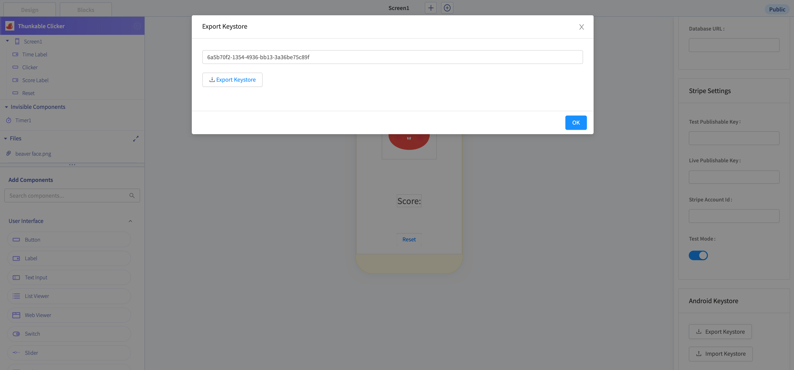

Click OK to save the .keystore file to your computer.

Note: A Thunkable X app project will not have a keystore until either a keystore is imported **or** the project is downloaded as an Android app for the first time

#### Import keystore to Thunkable X

On the Thunkable Cross Platform \([x.thunkable.com](http://x.thunkable.com/)\), select the the app that you are trying to publish as an update to the Google Play Store.

Click the name and icon of your app in upper left corner to bring up App Settings on right side.

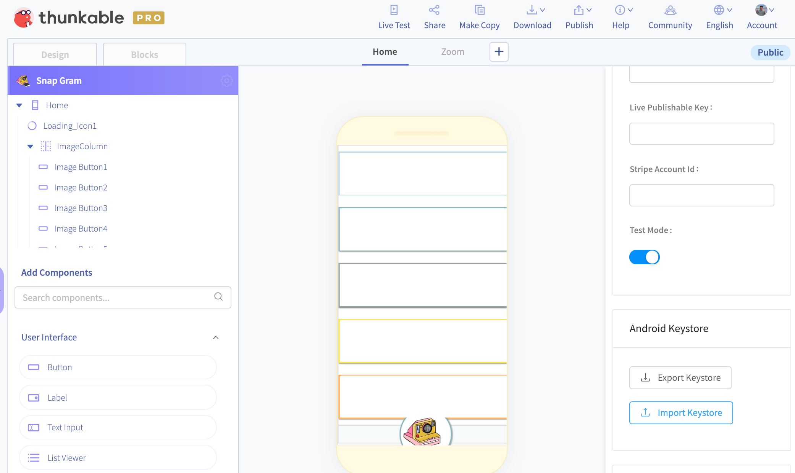

Scroll all the way to the bottom of App Settings and click Import Keystore. **Note this will replace the existing keystore for this app so be sure you haven’t used it to publish to Google Play store before proceeding.** You can always Export it first and save it to your computer just in case.

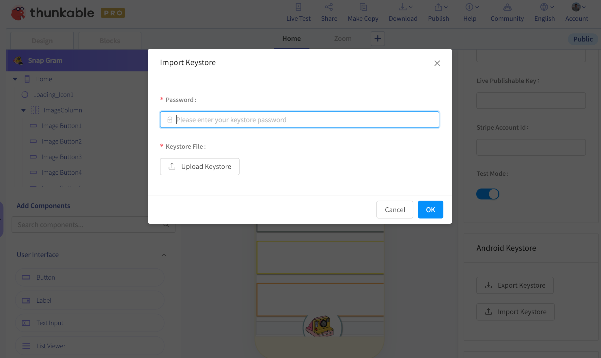

Enter the password and select the .keystore file you previously saved to your computer.

Congrats! You should be able to successfully publish updates now. Note that you’ll need to repeat the steps every time you want to update an app that was originally built as a different project as every app has their own keystore.

## Remove your app from the Play Store

To make your app unavailable for download on the Play Store, open your app listing on the [Google Play Console](https://play.google.com/console) and do the following:

1. Scroll down to “Release” and click on “Setup” 
2. Then “Advanced Settings”. 
3. Click the “Unpublished” radio button 
4. Then click “Save” to unpublish your app.

You can see the relevant areas below:

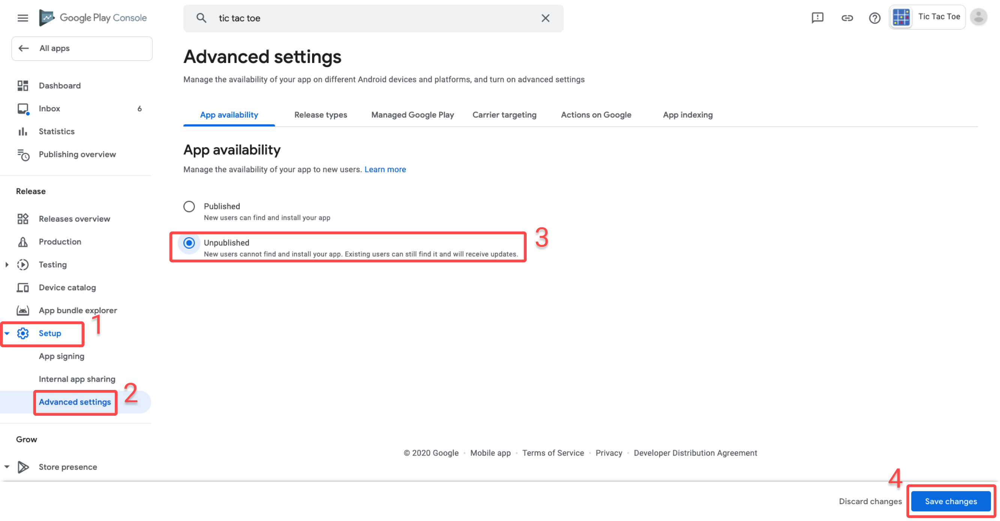

Removing your app from the Play Store will not delete it from devices which have previously downloaded the app.

