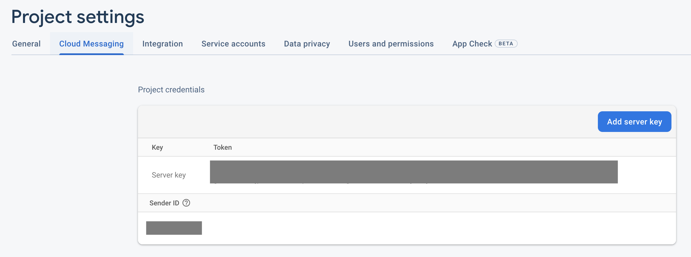
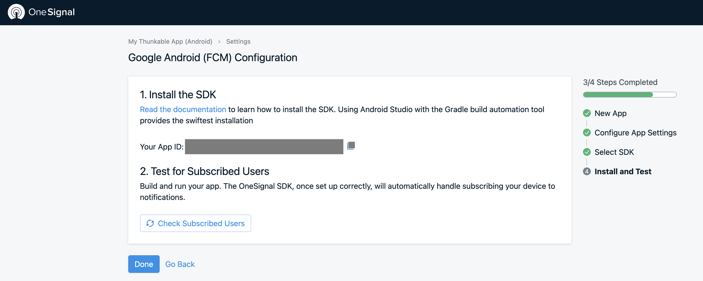

# Push Notifications by One Signal

## Push Notifications Overview

Push notifications are one of the biggest advantages that mobile apps have over  mobile websites, since they can send messages to users without the app being open.&#x20;

However, annoying notifications---those that are irrelevant and too frequent---can be dismissed or blocked easily.  We highly recommend sending notifications only when the content is relevant to the user. Examples include an e-commerce app letting the end user know about a sale, or a game app letting the user know about a new level or feature.


**Push Notifications are a**   **component.** While all Thunkers can add Push Notifications to their app projects and live test them in their apps (Android only), only Thunkers with PRO, Business or Enterprise accounts can download and publish apps with Push Notifications. See our [pricing page](https://thunkable.com/#/pricing) for more details.


## Adding a Push Notifications component to your app

To add or edit a Push Notifications component to your app :

* Go to your Blocks tab
* Click the ⚙ icon next to the `Push Notifications` drawer

You will see a dialog with options to enter an [Android app ID](push-notifications-by-one-signal.md#android-setup) or an [iOS app ID](push-notifications-by-one-signal.md#ios-setup) for your Push Notifications component. You can learn how to get these IDs in the rest of this document.

## Properties

|      Property Name      | Description                                                                            | Data Type  |
| :---------------------: | -------------------------------------------------------------------------------------- | ---------- |
|      Android App ID     | App ID from One Signal for Android devices                                             | Text       |
|        iOS App ID       | App ID from One Signal for iOS devices                                                 | Text       |
| Geolocation Permissions | Toggle whether to show your end users a request to share their location with OneSignal | True/False |

### Geolocation Permissions

OneSignal allows you to push messages to users in certain locations. You will need permission from your end users to register their location to use this feature. \
You can toggle whether you request geolocation permissions from your end users in the Push Notifications settings panel.

## Sign up with One Signal

One Signal is a free service that supports unlimited devices and notifications. You can learn more about their features on the OneSignal [pricing page](https://onesignal.com/pricing)

* Go to [One Signal](https://onesignal.com/) and sign up for an account

After you have signed up, click Add App:

Enter your app name, then proceed with [setting up for Android](push-notifications-by-one-signal.md#android-setup) or [setting up for iOS](push-notifications-by-one-signal.md#ios-setup):

After adding your app, OneSignal will ask you to select a platform. Below, we have created guides for both Android and iOS.

## Android Setup

Setting up push notifications for Android is relatively straightforward. Here's a quick overview of the steps, followed by a more detailed walk-through.

1. [Select Your Platform](push-notifications-by-one-signal.md#1-choose-the-android-platform)
2. [Configure Your Platform](push-notifications-by-one-signal.md#2-set-up-a-firebase-project)
3. [Select Your SDK](push-notifications-by-one-signal.md#3-select-your-sdk)
4. [Install Your SDK](push-notifications-by-one-signal.md#5-install-your-sdk)

### 1. Select Your Platform

After you have added an app and given it a name, select the Google Android option.

Click `Next: Configure Your Platform`

### 2. Configure Your Platform

For this next step, you will need a [Firebase](https://firebase.google.com/) account.&#x20;

For instructions on how to set up a Firebase account, please click [here](https://docs.thunkable.com/realtime-db#set-up-your-own-firebase-account).

Open a Firebase project to tie your Push Notifications to.

Click on the gear icon beside Project Overview and select **Project settings**.

.png>)

Go to the `Cloud Messaging` tab and get your Server Key and Sender ID:

Go back to the **One Signal** platform.

Copy and paste the Firebase Server Key and the Firebase Sender ID sections into One Signal.

Click `Save & Continue`

### 3. Select Your SDK

The last thing you need to do in OneSignal is choose your target SDK. Select **Native Android** and click `Save & Continue.`

### 4. Install Your SDK

Copy the alpha numeric code that OneSignal generates called **Your App ID** in the image below.

On Thunkable, open the Push Notifications dialog and paste this ID into the Android App ID field.

 (1) (1).png>)

Click the Live Test button. Once the app is on your phone, go back to One Signal.&#x20;

Click the "Check Subscribed Users" button.

If you are live testing or have downloaded your Android app, you should see a congratulations message. Click "DONE".

Select the "Messages" option and then select "New Push". You will now be able to create push notifications and send them to your app users.

## &#x20;iOS Setup

Setting up push notifications involves a few more steps on iOS than on Android, but every step is covered in detail below.&#x20;

1. [Select Platform](push-notifications-by-one-signal.md#1-select-platform)
2. [Configure Platform](push-notifications-by-one-signal.md#2-configure-platform)
3. [Select SDK](push-notifications-by-one-signal.md#3-select-sdk)
4. [Install SDK](push-notifications-by-one-signal.md#4-install-sdk)

### 1. Select Platform

Get started by creating a new app. You need to do this even if your Thunkable project is intended for both iOS and Android.&#x20;

Enter a name and choose **Apple iOS** as your platform.

Click `Next: Configure Your Platform`

### 2. Configure Platform

OneSignal have provided [extensive documentation](https://documentation.onesignal.com/docs/generate-an-ios-push-certificate) on how to find your **Production Certificate .p12 file** as well as your **Production Private Key Password**. The most important steps are outlined below.

To begin, open the [OneSignal Provisionator](https://onesignal.com/provisionator) webpage. This tool will generate a .p12 file and the accompanying password for you.

Follow the on screen instructions. Enter your Apple Developer ID and password. This portal works with 2FA enabled as well. If prompted, enter your 2FA code. Choose your team and the relevant Bundle ID and click generate. **You must be a Team Administrator to generate the files.**

You can now download the .p12, .cer and .pem files that are generated for you.


Don't forget to save your password somewhere safe!


Click on **Apple iOS**&#x20;

With that completed you can upload your .p12 file and enter the password in OneSignal. Click **Save** to proceed to the next step.

Click `Save & Continue`

### 3. Select SDK

Click on **Native iOS** to choose the SDK you wish to target. Then click **Next** to generate your App ID.

### 4. Install SDK

Copy the alpha-numeric code labeled **Your App ID** and head back to Thunkable.

On Thunkable, open the Push Notifications dialog and paste this ID into the iOS App ID field.

 (1) (1).png>)

You are now almost done. In order to now publish your app your will have to create a .mobileprovision profile. You can find details of how to do this on the ["Publish to App Store" page](publish-to-app-store-ios/#adding-push-notifications).

When you are ready to send your first push notification, select the "MESSAGES" option and then select "NEW PUSH". You will now be able to create push notifications and send them to your app users.

## Blocks

### Functions

#### User ID

This block returns the unique user ID of the device
