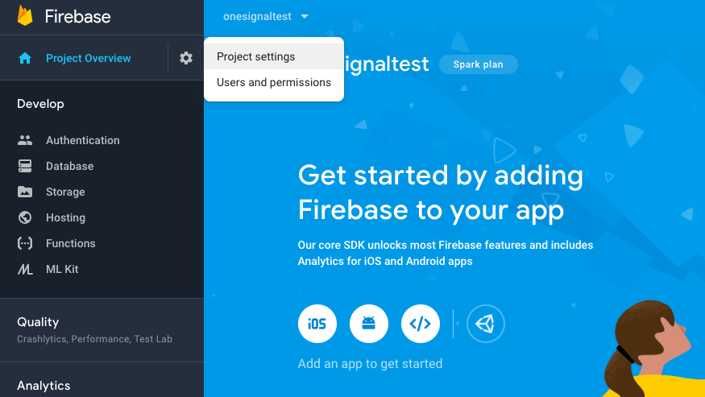

# Push Notifications by One Signal


**Push Notifications cannot be tested with the Thunkable Live app on iOS**\
You can test Push Notifications on iOS by publishing your app to TestFlight and downloading it from there.


Push notifications are one of the biggest advantages that mobile apps have over  mobile websites, since they can send messages to users without the app being open.&#x20;

However, annoying notifications---those that are irrelevant and too frequent---can be dismissed or blocked easily.  We highly recommend sending notifications only when the content is relevant to the user. Examples of this include an e-commerce app notifying users of a sale, or a game notifying users of new levels and features.


**Push Notifications are a**   **component.** While all Thunkers can add Push Notifications to their app projects and live test them in their apps (Android only), only PRO Thunkers can download and publish apps with Push Notifications.


## Properties

| Property                          | Description                                                                  | Data Type  |
| --------------------------------- | ---------------------------------------------------------------------------- | ---------- |
| Android App ID                    | App ID for Android from OneSignal                                            | Text       |
| iOS App ID                        | App ID for iOS from OneSignal                                                | Text       |
| Geolocation Enable (Android Only) | Toggle whether your end user is asked for permission to share their location | True/False |

### Geolocation Permissions

OneSignal allows you to push messages to users in certain locations. You will need permission from your end users to register their location to use this feature. \
You can toggle whether you request geolocation permissions from your end users in the Push Notifications settings panel.

## Sign up with One Signal

One Signal is a free service that supports unlimited devices and notifications. You can learn more about their features on the OneSignal [pricing page](https://onesignal.com/pricing)

* Go to [One Signal](https://onesignal.com) and sign up for an account

.png>)

After you have signed up, click Add App and enter in your app name:

.png>)

.png>)

After adding your app, OneSignal will ask you to select a platform. Below, we have created guides for both Android and iOS.

**At this time Push Notifications can only be tested on Android Devices.**

**You can add Push Notifications to iOS apps but testing can only be done after an app is published to the App Store.**&#x20;

## Android Setup

Setting up push notifications for Android is relatively straightforward. Here's a quick overview of the steps, followed by a more detailed walk-through.

1. [Select Your Platform](push-notifications-by-one-signal.md#1-choose-the-android-platform)
2. [Configure Your Platform](push-notifications-by-one-signal.md#2-set-up-a-firebase-project)
3. [Select Your SDK](push-notifications-by-one-signal.md#3-select-your-sdk)
4. [Install Your SDK](push-notifications-by-one-signal.md#5-install-your-sdk)
5. Toggle Location Permisson

### 1. Select Your Platform

After you have added an app and given it a name, select the Google Android option.

### 2. Configure Your Platform

For this next step, you will need a [Firebase](https://firebase.google.com) account.&#x20;

For instructions on how to set up a Firebase account, please click [here](https://docs.thunkable.com/realtime-db#set-up-your-own-firebase-account).

Once you are signed in with Firebase, create a new project.

.png>)

Once you have created a new project, click on the gear icon beside Project Overview and select **Project settings**.

Select the Cloud Messaging option:

.png>)

There are two things that you will need to copy and paste back into One Signal:

1. Server Key
2. Sender ID

.png>)

Go back to the **One Signal** platform.

Earlier you should have selected the Android option on One Signal, and your screen should look like this:

.png>)

Copy and paste the Firebase Server Key and the Firebase Sender ID sections into One Signal.

### 3. Select Your SDK

The last thing you need to do in OneSignal is choose your target SDK. Select **Native Android** and click next to continue.&#x20;

### 4. Install Your SDK

Copy the alpha numeric code that OneSignal generates called **Your App ID** in the image below.

On Thunkable, open the Push Notifications dialog and paste this ID into the Android App ID field.

Click the Live Test button. Once the app is on your phone, go back to One Signal. Click the "Check Subscribed Users" button.

.png>)

If you are live testing or have downloaded your Android app, you should see a congratulations message. Click "DONE".

Select the "MESSAGES" option and then select "NEW PUSH". You will now be able to create push notifications and send them to your app users.

.png>)

### Toggle Location Permission (Android Only)

OneSignal is a powerful choice of push provider. With their platform, you can setup for your users to be pushed notifications [based on their locations](https://documentation.onesignal.com/docs/location-triggered-event). This is optional, however. This also means you need to make a conscious decision as to whether or not to track your Android users geographical locations. These tracking data can be accessed via the OneSignal dashboard. \
\
This feature can be toggled on and off in the Push Notifications settings by clicking on the icon at the bottom of your design screen. \

## &#x20;iOS Setup

Setting up push notifications involves a few more steps on iOS than on Android, but every step is covered in detail below.&#x20;

1. [Select Platform](push-notifications-by-one-signal.md#1-select-platform)
2. [Configure Platform](push-notifications-by-one-signal.md#2-configure-platform)
3. [Select SDK](push-notifications-by-one-signal.md#3-select-sdk)
4. [Install SDK](push-notifications-by-one-signal.md#4-install-sdk)

### 1. Select Platform

Get started by creating a new app. You need to do this even if your Thunkable project is intended for both iOS and Android.&#x20;

After that, choose **Apple iOS** as your platform.

### 2. Configure Platform

OneSignal have provided [extensive documentation](https://documentation.onesignal.com/docs/generate-an-ios-push-certificate) on how to find your **Production Certificate .p12 file** as well as your **Production Private Key Password**. The most important steps are outlined below.

To begin, open the [OneSignal Provisionator](https://onesignal.com/provisionator) webpage. This tool will generate a .p12 file and the accompanying password for you.

Follow the on screen instructions. Enter your Apple Developer ID and password. This portal works with 2FA enabled as well. If prompted, enter your 2FA code. Choose your team and the relevant Bundle ID and click generate.&#x20;


You must be a Team Administrator to generate the files


You can now download the .p12, .cer and .pem files that are generated for you.


Don't forget to save your password somewhere safe.


Click on **Apple iOS**&#x20;

With that completed you can upload your .p12 file and enter the password in OneSignal. Click **Save** to proceed to the next step.

### 3. Select SDK

Click on **Native iOS** to choose the SDK you wish to target. Then click **Next** to generate your App ID.

### 4. Install SDK

Copy the alpha-numeric code labeled **Your App ID** and head back to Thunkable.

On Thunkable, open the Push Notifications dialog and paste this ID into the iOS App ID field.

You are now almost done. In order to now publish your app your will have to create a .mobileprovision profile. You can find details of how to do this on the ["Publish to App Store" page](publish-to-app-store-ios/#adding-push-notifications).

When you are ready to send your first push notification, select the "MESSAGES" option and then select "NEW PUSH". You will now be able to create push notifications and send them to your app users.

.png>)

## Blocks

### Functions

#### User ID

This block returns the unique user ID of the device

## Push Notification Properties

|         Property Name         | iOS | Android   |
| :---------------------------: | --- | --------- |
| Toggle Geolocation Permission | n/a | available |

### Toggle Geolocation Permissions

With the power of OneSignal comes the ability to push messages to users in certain geographical locations. This is optional, however. This also means you need to choose between tracking or not tracking users geographical locations. These data can be accessed via the OneSignal dashboard.&#x20;

.png>)
