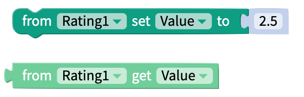
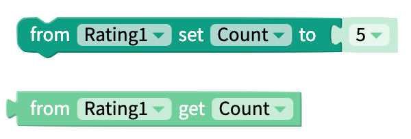
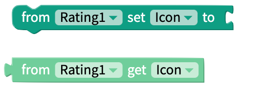
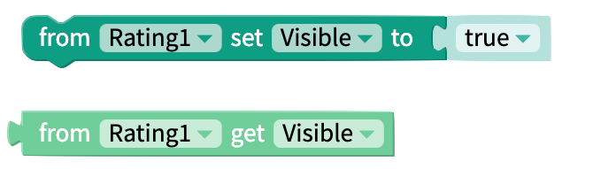
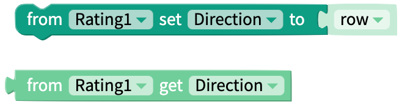
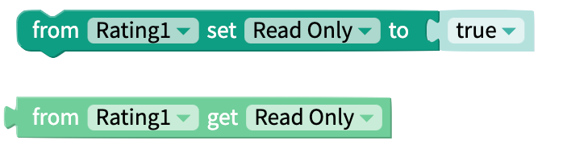
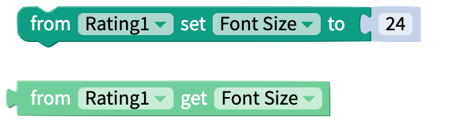
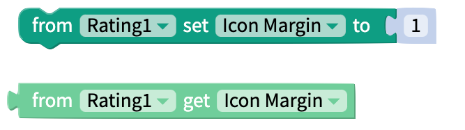
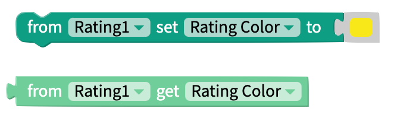
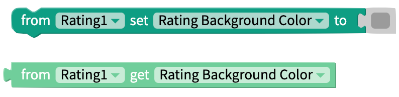

# Rating

The Rating component is a visible component which can be used to display the rating of a product or content in your app, and allow the user to leave their own rating.

A Rating component is made up of 5-10 _icons_. An icon can be filled, partially filled, or empty, as seen below:

## Properties

### Value

Initial value displayed on the Rating component. Can be any number between 0 and the maximum value, including decimals.

#### Blocks

### Count

Maximum rating that can be given. Can be an integer between 5 and 10, selected from a drop-down menu.

#### Blocks

### Image

#### Pick One

You can select an image from the list available. All of the image options are suitable for any platform. You can preview the image options [here](https://icons.expo.fyi/).

#### Custom

You can upload your own images to be displayed for filled and empty icons.

#### Blocks

### Visible

Toggle whether your Rating component is visible.

#### Blocks

### Direction

Select how the Rating component is displayed: as a **row** \(left-right\), **row-reverse** \(right-left\), **column** \(top-bottom\), or **column-reverse** \(bottom-top\).

#### Blocks

### Read Only

Toggle whether the user can edit the value displayed on the Rating component. If read-only is true, the value cannot be edited. If read-only is false, the value can be edited.

#### Blocks

### Font Size

Change the size of the icons that make up the Rating component.

#### Blocks

### Icon Margin

Change the size of the margin between the icons of the Rating component.

#### Blocks

### Rating Color

Select the color of a filled icon.

#### Blocks

### Background Color

Select the color of an unfilled icon.

#### Blocks

## Event Blocks

### On Rate

This block fires when a user enters a rating in the Rating component.

