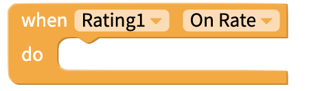
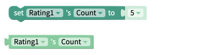
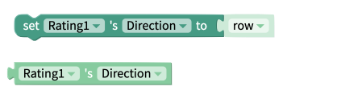
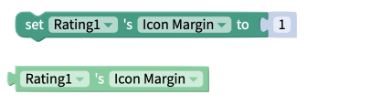
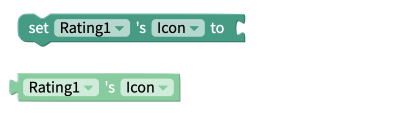
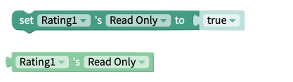
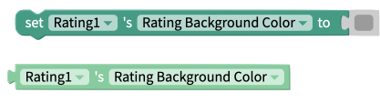
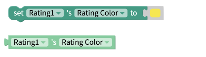

# Rating

## Rating Overview

The Rating component is a visible component which can be used to display the rating of a product or content in your app, and allow the user to leave their own rating.

A Rating component is made up of 5-10 _icons_. An icon can be filled, partially filled, or empty, as seen below:

## Properties

### Rating

| Property | Description | Data Type |
| :--- | :--- | :--- |
| Value | Initial value of your rating | Number |
| Count | Max value of your rating | Number between 5 and 10 |
| Image | Shape of the icons in your Rating component | Select from menu |
| Read Only | Toggle whether or not the user can edit the rating | True/False |
| Rating Color | Color of filled-in icons to reflect the current rating | Color |
| Background Color | Color of unfilled icons | Color |

There are two ways to set an Image for your Rating component:

#### Select from Menu

Thunkable provides a menu of pre-set icons from Expo that you can choose from. [Preview these icons here.](https://icons.expo.fyi/)

#### Custom Image

If you set the Image property to Custom Image, you will be able use your own images as icons for the Rating component. 

Selecting Custom Image will show two new properties:

| Property | Description | Data Type |
| :--- | :--- | :--- |
| Filled Image | Images to reflect 'filled-in' icons to reflect the current rating | Image file name |
| Empty Image | Images to reflect 'unfilled' icons | Image file name |

You can upload your images as [assets](assets.md) to your project, or provide URLs that point to your chosen images.

These URLs must end in a file extension, such as .jpg or .png.

### Layout

| Property | Description | Data Type |
| :--- | :--- | :--- |
| X | Location of top left corner of Rating component on X-axis, where the left hand side is X=0 | Number |
| Y | Location of top left corner of Rating component on Y-axis, where the top side is Y=0 | Number |
| Height | Height of Rating component in pixels | Number |
| Width | Width of Rating component in pixels | Number |
| Visible | Set whether the Rating component is visible | True/False |

## Blocks

### Events

#### On Rate

This block fires when a user enters a rating in the Rating component.

### Properties

Set and get [properties](rating.md#properties) of the Rating component

#### Count

#### Direction

Select how the Rating component is displayed: as a **row** \(left-right\), **row-reverse** \(right-left\), **column** \(top-bottom\), or **column-reverse** \(bottom-top\).

#### Font Size

Change the size of the icons that make up the Rating component.

### 

#### Height 

#### Icon Margin 

Get or change the size of the margin between the icons of the Rating component.

#### Icon

You can select an image from the list available. All of the image options are suitable for any platform. You can preview the image options [here](https://icons.expo.fyi/).

You can upload your own images to be displayed for filled and empty icons.

#### Read Only

#### Rating Background Color

#### Rating Color

#### Value

#### Visible

#### Width 

#### X 

#### Y

