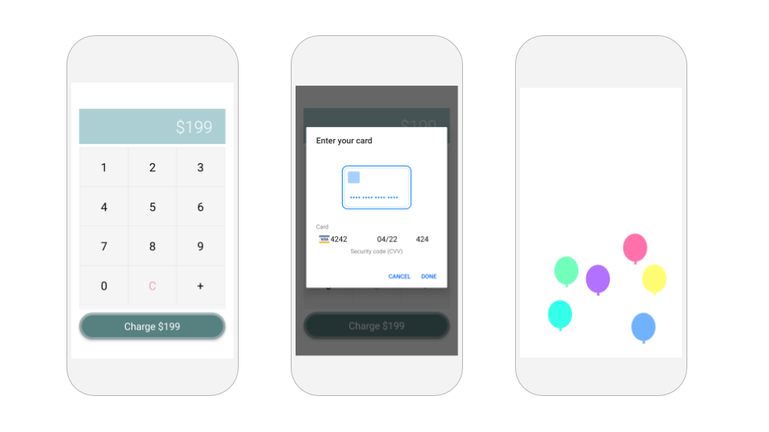

# Sample Apps

Thunkable is building the world's largest gallery of open sourced apps to help inspire you and save you time.

Below are a few of our favorites with more to come. Feel free to customize them for your own use and share them with `#MadewithThunkable`!

## New & Exciting 

This section is reserved for apps that we think are breaking ground in either app design, technology or in a new problem space being addressed. 

### Presidential Leaning 

#### \*\*\*\*[**Preview**](https://x.thunkable.com/projectPage/5ce8607cfc142a9350a1af18) **\|** [**Customize**](http://bit.ly/2F9YOpb) **\|** [**See Inside**](https://x.thunkable.com/projects/5ce8607cfc142a9350a1af18/openProject/designer)\*\*\*\*

What if polling was done by app \(instead of telephone poll\)? Ahead of the US presidential elections, this simple polling app tracks how the leading candidates are resonating with anyone who has the app. Each app user is limited to one vote per day, and the app saves each voter's preference from one day to the next. The results refreshes itself every day powered by [cloud variables](variables.md#for-cloud-variables-updating-when-the-cloud-database-changes) and a [free private Firebase real-time database](realtime-db.md#create-your-free-firebase-project-and-account) and data over time is logged in a [spreadsheet](spreadsheet.md) powered by Airtable.

`#firebase` `#realtimedb` `#cloudvariables` `#spreadsheet` `#airtable`

### Dad Advice \(in Any Language\) 

#### \*\*\*\*[**Preview**](https://x.thunkable.com/projectPage/5cfec5e7571571b651a3274b) **\|** [**Customize**](http://bit.ly/2Zk5tF1) **\|** [**See Inside**](https://x.thunkable.com/projects/5cfec5e7571571b651a3274b/1338101c-8a9e-4e93-b7e4-46c2c61efc6c/designer)\*\*\*\*

What if you could internationalize your content into 93 different languages with little additional effort? This app takes content created by Refinery29 and automatically translates it to the user's desire language \(thanks to the [Translator](translator.md) component powered by Yandex\) and then speaks it aloud in that language \(powered by the [Text to Speech](text-to-speech.md) component\).

`#localdb` `#translator` `#yandex` `#texttospeech` `#accelerometer`

## Family & Friends 

Since mobile apps are radically easier to make with Thunkable, why not make apps just for the most important people in your life? We've started experimenting with some ways that apps have actually helped us feel closer to the ones we love. 

### Dad 

#### \*\*\*\*[**Preview**](https://x.thunkable.com/projectPage/5aac3404264501000175f715) **\|** [**Customize**](http://bit.ly/2Zky256) **\|** [**See Inside**](https://x.thunkable.com/projects/5aac3404264501000175f715/Welcome/designer) **\|** [**Download from Google Play**](https://play.google.com/store/apps/details?id=com.alohaproductions.dad)\*\*\*\*

Dad is a digital version of Albert's dad, based on a recorded interview and powered by Dialogflow's [Assistant](https://docs.thunkable.com/~/revisions/-LOOoZWLYzPlQ4m9-n_W/thunkable-cross-platform/create/components/voice/assistant) service. Thunkers must create their own Dialogflow account to customize their digital version. You can read more of the story of this app on [our blog](https://blog.thunkable.com/meet-my-dad-in-an-app-8a93ded720e0).

`#assistant` `#dialogflow` `#sound` `#timer` `#animation` `#lottie`

### Charlie Checker

#### \*\*\*\*[**Preview**](https://x.thunkable.com/projectPage/5cdc2816c1b0904ee706e43b) **\|** [**Customize**](http://bit.ly/2ZwvWiT) **\|** [**See Inside**](https://x.thunkable.com/projects/5cdc2816c1b0904ee706e43b/85b82818-576b-4c27-9e38-894610248978/designer)\*\*\*\*

For anyone who has a pet \(or child\) whose care is managed by multiple people, this app helps to coordinate regular meals, treats, walks and poops. This app is powered by a [free private Firebase Database](realtime-db.md#create-your-free-firebase-project-and-account) that syncs data quickly across devices. This app resets itself every day.

`#cloudvariables` `#firebase` `#share` 

## \(Private\) Social Media 

Social media was originally invented for people to share things with people they trust. With the evolution of popular platforms today, it's increasingly hard to simply keep our channels private enough so our conversations and photos are less filtered and bringing us all joy \(instead of FOMO\).

### Snap Gram 

#### \*\*\*\*[**Preview**](https://x.thunkable.com/projectPage/5cdf36d454cc871aaa0e4ca4) **\|** [**Customize**](http://bit.ly/2F8UmHn) **\|** [**See Inside**](https://x.thunkable.com/projects/5cdf36d454cc871aaa0e4ca4/project/properties/designer/)\*\*\*\*

This app is kind of like an Instagram and Snapchat hybrid and we've created a private version of this app that we are using daily at the Thunk Tank to help our global team feel more connected. To make your app private, simply create a [free Cloudinary image account](media-db.md#create-a-free-cloudinary-account) to keep your images within your sights and a [free private Firebase Database](realtime-db.md#create-your-free-firebase-project-and-account) to host the links to those images. You won't believe what people will share with a little bit of privacy!

`#cloudvariables` `#firebase` `#mediadb` `#cloudinary` `#camera` 

## City Living 

Cities are an increasingly popular place to live and work but navigating them can be a challenge. Here are a few apps that aspire to make that simpler.

### Translator 

#### \*\*\*\*[**Preview**](https://x.thunkable.com/projectPage/5c183d7c7bd8616f60c5a39a) **\|** [**Customize**](http://bit.ly/2XL0tMy) **\|** [**See Inside**](https://x.thunkable.com/projects/5c183d7c7bd8616f60c5a39a/Welcome/designer)\*\*\*\*

Designed for your work and holiday travel, translator is an app that translates English text and speaks it aloud into 93 languages in the world.

`#cloudvariables` `#firebase` `#mediadb` `#cloudinary` `#camera`

### SF POPOS \(Privately Owned Public Open Spaces\) 

#### \*\*\*\*[**Preview**](https://x.thunkable.com/projectPage/5ceda3ddbb4b310ae3f75587) **\|** [**Customize**](http://bit.ly/2XUROUA) **\|** [**See Inside**](https://x.thunkable.com/projects/5ceda3ddbb4b310ae3f75587/Home/designer)

This is a map of San Francisco's 78 privately owned public opened spaces \(POPOS\). POPOS are publicly accessible spaces in forms of plazas, terraces, atriums, small parks, and even snippets which are provided and maintained by private developers. In San Francisco, POPOS mostly appear in the Downtown office district area. Data is sourced from [open data from DataSF](https://data.sfgov.org/Culture-and-Recreation/Map-of-Privately-Owned-Public-Open-Spaces/kjpt-g66i) and read from [this Airtable spreadsheet](https://airtable.com/shrpmLa5AV2tqKlbz). You can learn more about SF's POPOS [here](https://sfplanning.org/privately-owned-public-open-space-and-public-art). 

`#maps` `#google` `#locationsensor` `#spreadsheet` `#airtable`

## High Performing Teams 

The highest performing teams are said to be ones full of trust, empathy and psychological safety. Here are a few apps that may help your favorite teams build these important qualities.

### Office Weather & Traffic 

#### \*\*\*\*[**Preview**](https://x.thunkable.com/projectPage/5d03c723c9b63a41476d5f9f) **\|** [**Customize**](http://bit.ly/2ZwexXz) **\|** [**See Inside**](https://x.thunkable.com/projects/5d03c723c9b63a41476d5f9f/project/properties/designer/)\*\*\*\*

Designed for teams that are spread out across different parts of the world, this simple app helps you quickly keep track of the external conditions that may be affecting your colleague's work and  mood. At the very least, it may enable you to avoid talking about the weather and onto more important things. Customize for your team by editing the information in the OfficeDB component. The app pulls the latest temperature from the Open Weather Map API and as a bonus the latest traffic from Google Maps. There is a limit of 60 calls per minute in the free tier of the Open Weather Map API.

`#webapi` `#openweathermapapi` `#googlemaps` `#localdb` `#camera`

### Work Credit 

#### \*\*\*\*[**Preview**](https://x.thunkable.com/projectPage/5ab560f9896b670001627b02) **\|** [**Customize**](http://bit.ly/2Y3J1Q0) **\|** [**See Inside**](https://x.thunkable.com/projects/5ab560f9896b670001627b02/Welcome/designer)\*\*\*\*

Work Credit is a team counting app for thankless tasks. The app shares data for the team in a private Firebase realtime database account so Thunkers looking to create one for their team will need to [set one up](https://docs.thunkable.com/x/components/data-storage/realtime-db.html#set-up). Work Credit has really transformed how our office works at Thunkable -- no longer are thankless tasks thankless. The winner each week gets to pick out our lunch destination on Friday \(which is quite an honor\)

`#cloudvariables` `#firebase`

### Mark's Guide to 1:1s 

#### \*\*\*\*[**Preview**](https://x.thunkable.com/projectPage/5cf843d788653e8a1a46bc70) **\|** [**Customize**](http://bit.ly/2XV9ZJM) **\|** [**See Inside**](https://x.thunkable.com/projects/5cf843d788653e8a1a46bc70/db39998c-08ef-4525-a997-0f90f0b1bb97/designer)\*\*\*\*

For managers out there, here's a helpful set of questions to guide your next 1:1 meeting from Mark, the beloved VP of engineering at Thunkable. For our team, this app is a great way for best practices to quickly spread throughout an organization. You can easily customize the questions by simply editing the question in the local database.

`#localdb` `#accelerometer` 

## Thriving Small Businesses 

Starting your own business is a gratifying endeavor but most new business don't make it for the long haul. Here are a few apps that can help support the businesses that you love

### New Market Goods 

#### \*\*\*\*[**Preview**](https://x.thunkable.com/projectPage/5ab08b5735d5500001e43644) **\|** [**Customize**](http://bit.ly/2XP45tD) **\|** [**See Inside**](https://x.thunkable.com/projects/5ab08b5735d5500001e43644/Intro/designer)\*\*\*\*

Simple website wrapper app with a multi-image branding screen, a social media bar that opens a deep link to a user's installed apps that works across platforms. If you are a PRO member, you can add push notifications to notify app users of ongoing sales.  Check out our free tutorial in the [Thunkable Community](https://community.thunkable.com/t/business-app-new-market-goods/32448?u=domhnall)​ to make one for the business that you love.  
****`#webviewer` `#timer` `#push notifications`

### Credit Card Reader 

#### \*\*\*\*[**Preview**](https://x.thunkable.com/projectPage/5cba08b994f2be770bdfce63) **\|** [**Customize**](http://bit.ly/2XSeowR) **\|** [**See Inside**](https://x.thunkable.com/projects/5cba08b994f2be770bdfce63/project/properties/designer/)\*\*\*\*

Simple point of sale for accepting credit cards on your mobile device powered by Stripe. Stripe + Thunkable charges a 2.9% + $0.30 per transaction for PRO members \(4.9% + $0.30 per transaction for Non-PRO members\). [Follow the instructions here](payment.md) to create and connect your Stripe account.

`#payment` `#stripe` `#timer` 

### Reimburse Me 

#### \*\*\*\*[**Preview**](https://x.thunkable.com/projectPage/5cbe4ef9c6bd9a464a5fd893) **\|** [**Customize**](http://bit.ly/2XT9zn6) **\|** [**See Inside**](https://x.thunkable.com/projects/5cbe4ef9c6bd9a464a5fd893/CompanyLogo/designer)\*\*\*\*

Simple reimbursement app that uploads receipt images to a spreadsheet powered by Airtable \([See spreadsheet here](https://airtable.com/shrOaUvxcDXr2WQzp)\). For sensitive financial data, we recommend using your own private Media DB powered by Cloudinary \(and not the default one\). You may also want to add a login to add an extra layer of security.

`#spreadsheet` `#airtable` `#mediadb` `#cloudinary` `#camera` `#photolibrary`

## Fun & Games  

Mobile games and puzzle apps are not just a great form of entertainment in those in between moments but they also great mediums for monetizing your app with ads. 

### Beaver Bingo  

#### \*\*\*\*[**Preview**](https://x.thunkable.com/projectPage/5b341e9d7e4c2919242a87f7) **\|** [**Customize**](http://bit.ly/2XVtGB7) **\|** [**See Inside**](https://x.thunkable.com/projects/5b341e9d7e4c2919242a87f7/project/properties/designer/)\*\*\*\*

Beaver Bingo is a simple puzzle app that we think is great for parties. Party goers take photos of the items in the nine boxes, which together reveals a hidden message. The app features the [Image Recognizer](https://docs.thunkable.com/~/revisions/-LOOoZWLYzPlQ4m9-n_W/thunkable-cross-platform/create/components/image/image-recognizer) component from Microsoft. No goats were harmed in the making of this app.

`#imagerecognizer` `#microsoft` `#camera` `#sound` `#timer` 

### Shake Dice  

#### \*\*\*\*[**Preview**](https://x.thunkable.com/projectPage/5cfe89503f47072fb7f22be2) **\|** [**Customize**](http://bit.ly/2XYFR0a) **\|** [**See Inside**](https://x.thunkable.com/projects/5cfe89503f47072fb7f22be2/Screen1/designer) **\|** [**Download from Google Play**](https://play.google.com/store/apps/details?id=com.alohaproductions.shakedice)\*\*\*\*

If you've ever played a board game or an RPG then you know what dice are. You also probably know easy they are to lose or misplace. With this app you can create and customize as many dice and sound effects as you like so that they're never more than a click away. There's a free tutorial in the [Thunkable Community](https://community.thunkable.com/t/game-app-rollin/32715?u=domhnall) all about how this app was made.  This app also shows an Interstitial [Ad by AdMob](admob.md) every time the dice shows 5.

`#accelerometer` `#admob`

