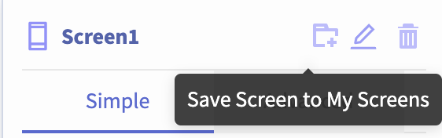
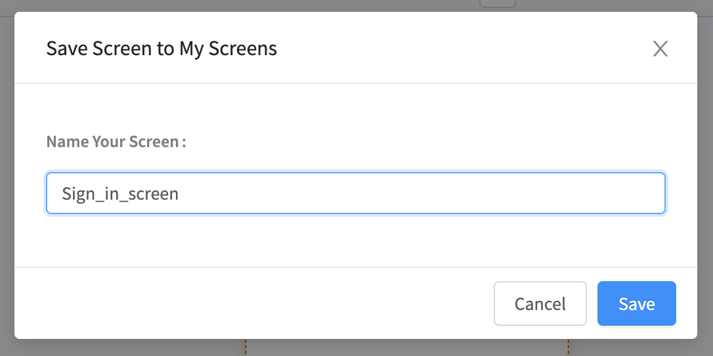
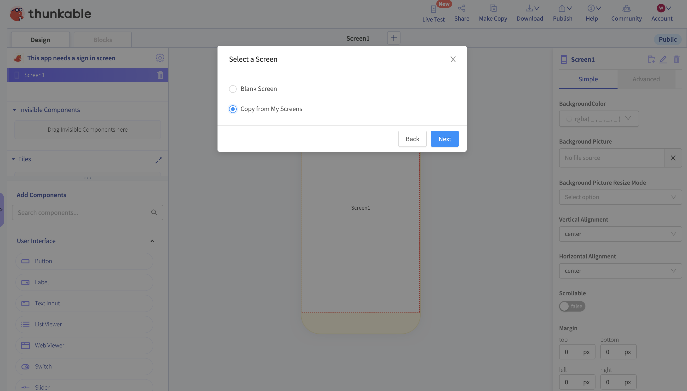
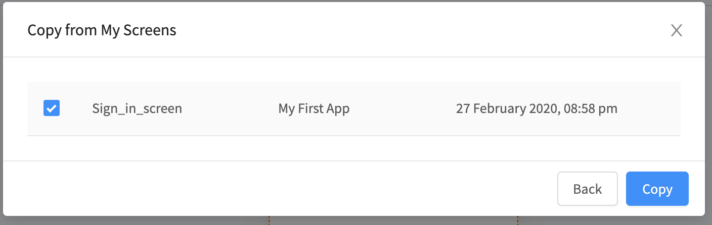

# Screen

## Video Tutorials





## Appearance and Layout

### Space Elements Horizontally

The `Horizontal Alignment` property allows you to space elements in a Screen horizontally

### Space Elements Vertically

The `Vertical Alignment` property allows you to space elements in a Screen vertically

### Add a Background Color or Picture

| Property | Description |
| :--- | :--- |
| Background Color | Default \(`none`\). Select any color using the color picker, RGBA or HEX value |
| Background Picture | You can upload a background image to your app or reference an image url e.g.`beaver-yellow.png` |

#### Background Picture Resize Mode

This determines how to resize the image when the frame doesn't match the raw image dimensions.

* Cover: Fills the entire screen without changing the height and width ratio of the image 
* Contain: The entire image will be scaled down to fit inside the screen, without changing the height and width ratio of the image 
* Stretch: The image's height will change to fill the screen length-wise 
* Repeat: Repeat the image to cover the screen. The image's height and width ratio

   will not change    

* Center: Positions the image in the middle of the frame

### Enable Scrolling

| Property | Description |
| :--- | :--- |
| Scrollable | Default \(`false`\). Indicates whether the screen is scrollable. For scrollable to work, you must also set your screen height to `fit contents`  and the components in your screen must have heights set in `absolute` pixels |

### Set Orientation

| Property | Description |
| :--- | :--- |
| Screen Orientation | Default \(`all`\). You can fix the screen orientation to `portrait` and `landscape` |

## Status Bar

### Hide \(or show\) Status Bar

| Property | Description |
| :--- | :--- |
| Show StatusBar | Default \(`true`\). If set to `false`, hides the top status bar |

### Status Bar Theme

| Property | Description |
| :--- | :--- |
| StatusBar Style | Choose between `default` , `light-content` or `dark-content` to set the theme or style of the status bar |

### Status Bar Opacity


Please Note: The `Translucent StatusBar` property will only work on Android devices at this time.


| Property | Description |
| :--- | :--- |
| Translucent StatusBar  | Default \(`false`\). Set to `true` to make the Status Bar translucent.  Android-only. |

### Status Bar Color


Please Note: The `StatusBar Color`property will only work on Android devices at this time.


| Property | Description |
| :--- | :--- |
| StatusBar Color | Default \(`0,0,0,0.53`\). Select any color using the color picker, RGBA or HEX value. Android-only. |

## Screen Blocks 

### when Screen1 Starts

| Event | Description |
| :--- | :--- |
| Starts | Fires when the Screen is **first** opened |

### when Screen1 Opens

| Event | Description |
| :--- | :--- |
| Opens | Fires **anytime** the Screen is opened |

### when Screen1 BackButtonPressed

| Event | Description |
| :--- | :--- |
| BackButtonPressed | Fires when the physical or on-screen back button is pressed. \(Android only\) |

### in Screen1 call ToggleDrawerMenu

| Function | Description |
| :--- | :--- |
| ToggleDrawerMenu | Opens or Closes the drawer menu, if available. Must be used in conjunction with the [Drawer Navigator](drawer-navigator.md) |

## Save Screen

Thunkable allows you to reuse a screen, and its associated blocks, in multiple projects with the "Save to My Screens" feature. You can find the save screen button at the top of the properties for every screen component in your app.

### Name Your Screen

It's important that when you save your screen you use a descriptive and memorable name that describes what your screen does. The example below is for a sign in screen, which is something that often get reused across multiple projects.

### Add a New Screen

Once you've saved a screen, any time you click the **`+`** button to add a new screen you will be given the option to add a blank screen or to "Copy from My Screens".

### Choose a Saved Screen

Simply choose the screen that you want to add in and click the "Copy" button to proceed.

