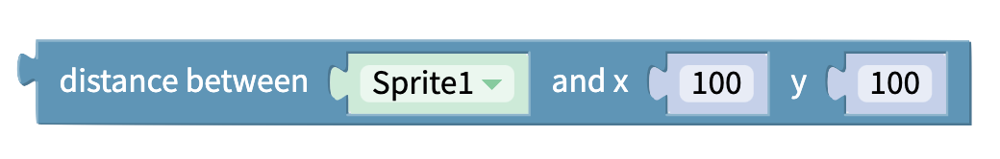

# Sensing

### Distance Between Sprite and Sprite

Get the distance between two sprites 

### Distance Between Sprite and Coordinate

Get the distance between a sprite and a point 

### Angle From Sprite to Sprite 

Get angle between sprites

### Closest Instance of Sprite Type to Sprite

Gets the closest instance of the provided sprite type to the given sprite

## 

