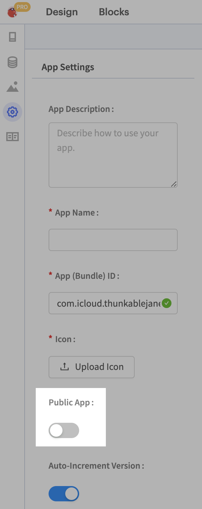

# Share your App

## Share a fully-editable copy of your app project


For security purposes, we remove personal data from your project settings such as API keys and URLs unless you specifically request to share those.


When you share a link to your project the recipient will get a copy of your UI components and your blocks. For security purposes, we remove personal data from your project settings such as API keys and URLs unless you specifically request to share those.

Please note, that if you have account information in your blocks or your UI design then this will not be removed. Only data in your project settings are removed.&#x20;

## Generate a share link

When you generate a share link, it will create a copy of your app project at the point in time you generate the link. If you update your app and want your collaborators/remixers to have the latest copy, you'll have to generate a new link.

1.  Click the **Share** icon in the top right corner of your project.\

    

    <figure><figcaption></figcaption></figure>

    

2. Click **Share App**.
3. Click to place a checkmark in the associated box if you want to share your project with API keys and passwords included.&#x20;
4.  Click **Generate Link.**\

    

    <figure><figcaption></figcaption></figure>

    

5. You will be given a share link and an expiry date. The share link will no longer work after this date.

### Share and track your links on your project page

When a user clicks on your share link, a copy of your app will automatically appear in their account. For every copy of your app that is created in a user's account, you will get credit for a share on your project page

## Share a read-only version of your app project

If you want to share a read-only version of your app project, you simply set your project to `Public` in your App Settings page and share the link of your project URL.

Users who visit the project URL link do not automatically get a copy of your app in their account but they can create an editable copy of if if they wish.
