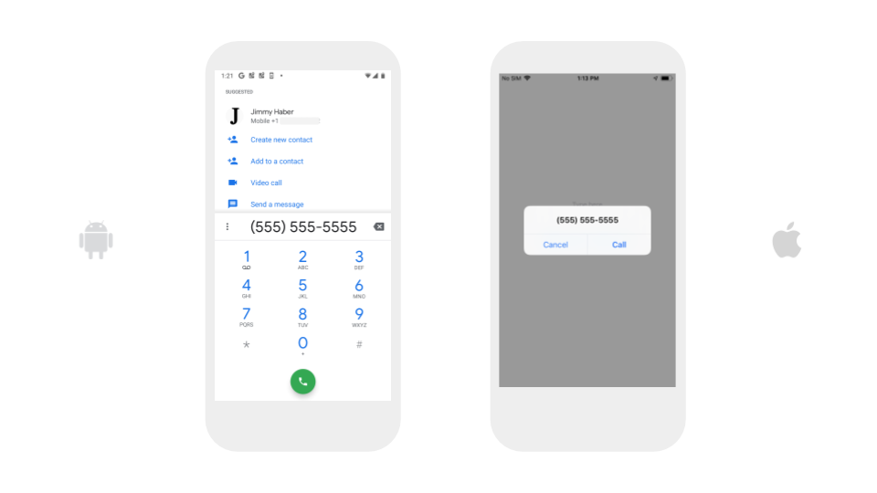

# Share

You can use the Share blocks to share media and messages with people using external apps.

## Call Phone Number

Opens your phone app with the given number ready to call. This block will not place a phone call without the app user's knowledge.

## Send Text Message

Opens your default text messaging app with the given text ready to be sent to the given number. This block will not send a text message without the app user's knowledge.

## Send an email

Opens your default email app with an email with the given subject and body ready to be sent to the given email address. This block will not send an email without the app user's knowledge.

You can send an email to multiple recipients by separating the different email addresses with a comma in the 'send email to' section of the block.


You can use HTML formatting to customize the emails you send with the Share component \(iOS only\)


## Share a Text or Image

### Share a Text

Opens a menu of apps that the app user can choose from to share the given message.

### Share an Image

Opens a menu of apps that the user can choose from to share the given image.

